# 1. Introduction

## Présentation du cours

Dans ce cours, vous allez apprendre certains principes de base de l'ingénierie logicielle (développement avec Python, 
Clean code, Unit Test / TDD, CI/CD et automatisation), du MLOps avec comme illustration la mise en place d'un modèle de 
ML simple qui sera entraîné en automatique dans le Cloud et déployé sous forme de Webservice sécurisé, toujours dans le 
Cloud. 

Toutes les précédentes notions seront explicitées et expliquées dans ce cours, ne vous inquiétez pas.

L'idée n'est pas de faire de vous le ou la meilleure tech du monde, mais de vous montrer des notions et des bonnes pratiques 
que vous rencontrerez dans n'importe quelle société voulant sérieusement sauter le pas du ML et de l'IA. 

## Tour de table

Petite bulle d'échange et de présentations pour mieux se connaître ;-)

## Présentation de la structure des cours 

Nous aurons 8 sessions de 4 heures pour un total de 32 heures de cours. C'est assez serré, nous avons beaucoup
de choses à voir ensemble et beaucoup de nouvelles notions à appréhender. Ainsi, je vous propose l'organisation des 
séances de 4 heures suivantes : 3 segments de 70 minutes entrecoupées de deux pauses de 15 minutes.

Il y aura quelques passages théoriques lors de ce cours, mais ce dernier a été pensé pour être une séance de TD géante.
Nous allons beaucoup coder et manipuler ensemble. Ce cours sera donc très "tech", très pratique.

## Règles de vie

Etant donné la densité et la teneur de ce cours de ce cours, merci d'observer une parfaite ponctualité. En effet, nous
allons coder et expérimenter ensemble. Les retards seront pénalisants pour TOUT le monde, car ils nécessiteront de faire du
rattrapage constant.

Je refuserai donc de prendre en charge TOUT retard non prévenu et non justifié.

En ce qui concerne les absences, seules les raisons impérieuses seront acceptées. Le planning ayant été défini largement
à l'avance, je n'accepterai pas l'excuse de réunions professionnelles prévues pendant le cours.

## Notations

La notation est en deux parties : 
- une note de contrôle continu
- une épreuve finale en fin de semestre, probablement un QCM

La note de contrôle continu sera déterminée selon votre assiduité et votre sérieux à ce cours. A chaque étape du développement
de notre projet, nous validerons ensemble votre avancée. Chaque jalon donnera lieu à l'attribution de points qui constituront 
votre note de CC finale. Il y aura, à certaines occasions, quelques points bonus sur des tâches d'amélioration à faire
à la maison.

## Présentation du MLOps

Pour présenter le MLOps, nous utiliserons le support de Guillaume CHERVET : [lien](https://github.com/guillaume-chervet/Les-Minutes-MLOps/blob/main/Le%20MLOps%20est%20une%20aventure%20humaine.pptx)

Nous reviendrons également sur l'étude : [Machine Learning Operations (MLOps): Overview, Definition, and Architecture](https://ieeexplore.ieee.org/document/10081336)

Dont voici une représentation complète : 

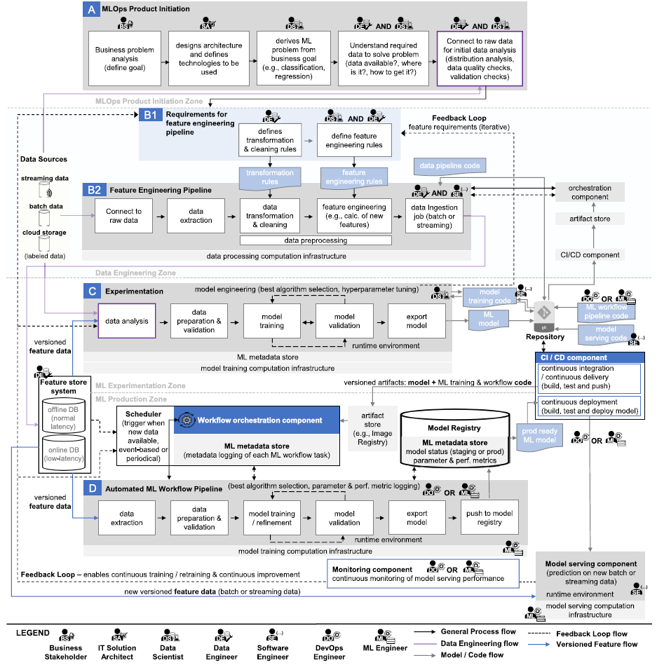

Voici une représentation simplifiée : 

**Note importante :** 
Attention, dans cette première prise en main du MlOps, nous n'aurons probablement pas l'opportunité de mettre en pratique
la dernière partie de Mesure de la performance de notre système. Nous reviendrons sur la partie théorique de cette partie,
mais nous manquerons de resources Cloud gratuites pour l'implémenter. C'est dommage, car c'est une composante **CRUCIALE**
de la bonne mise en place d'une démarche MLOps dans le monde professionnel, mais il a fallu choisir les sujets. 
Cette partie restera au mieux, théorique.

## Mise en place et présentation de l'environnement de travail

Pour les réalisations pratiques de ce cours, vous aurez besoin :
- d'un navigateur à jour (Chrome fonctionnera très bien)
- d'une adresse email valide (plutôt personnelle pour garder vos accès à la fin de votre cursus universitaire)
- d'un compte GitHub
- d'un compte Red Hat pour créer une Red Hat Developer Sandbox (un numéro de portable pour validation de compte par SMS sera nécessaire)
- de [Bruno](https://www.usebruno.com/)

### Création d'un compte GitHub

- Se connecter sur [github.com](http://www.github.com)
- Dans le champ Email address, saisir votre adresse mail et cliquer sur Sign Up for GitHub

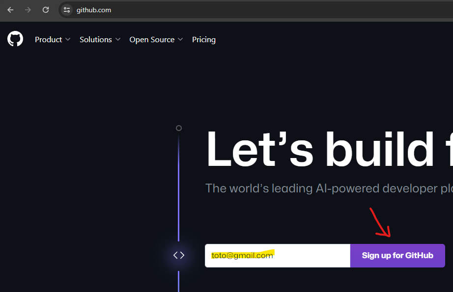

- Dans l'étape suivante, cliquez sur Continue
- Saisissez un mot de passe
- Entrez un nom d'utilisateur disponible
- Faites votre choix de préférence de notifications
- Réussissez l'énigme
- Cliquez sur Create account
- Entrez le code reçu par mail
- Répondez aux questions sur votre profil (Just me / NA / Free account)
- Vous devriez accéder à votre Dashboard

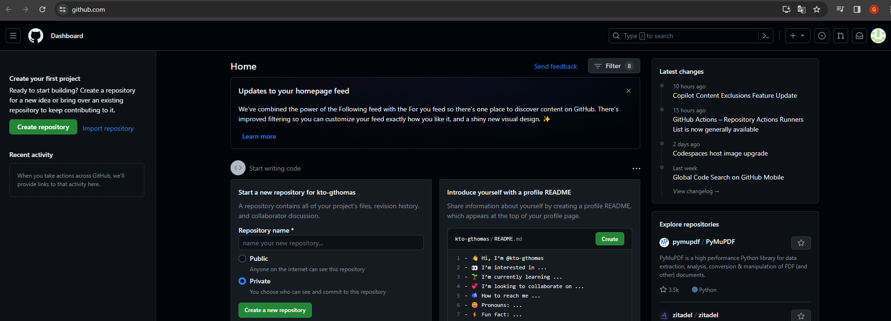

- Profitons-en pour forker le projet kto-mlops **en prenant garde de bien récupérer toutes les branches** !
- Voici le [lien](https://github.com/guillaume-thomas/kto-mlops) du repository à cloner, cliquez dessus et cliquez sur Fork (plus de détail sur Git dans le [chapitre suivant](02_git.md))

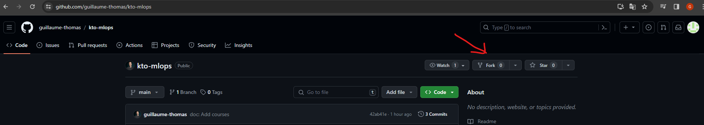

- Renommez le nom du repository en kto-mlops-2023-2024 et **décochez Copy the main branch only (!!!IMPORTANT!!!)**, puis cliquez sur Create fork

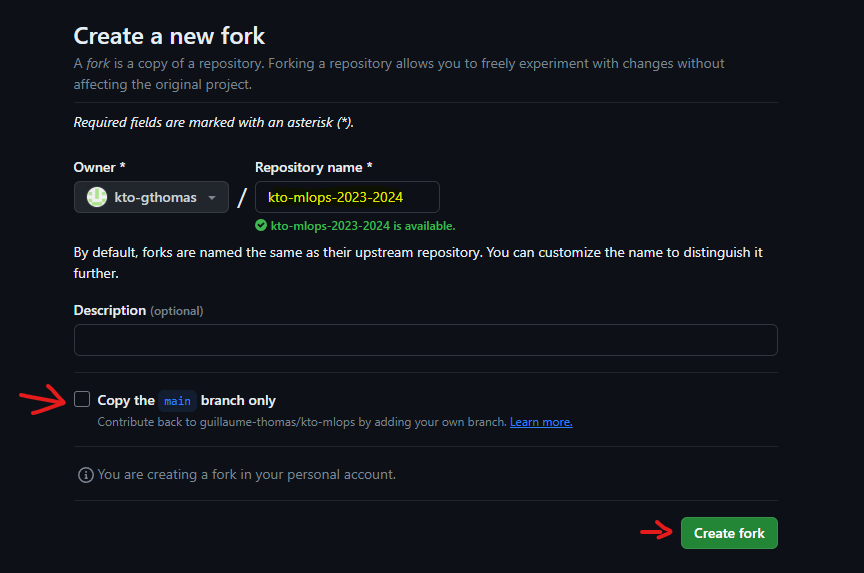

### Création de notre compte Red Hat et provisionnement de notre Red Hat Developer Sandbox

- Connectez-vous sur le site [Red Hat Developer](https://developers.redhat.com/)
- Cliquez sur Join Red Hat Developer

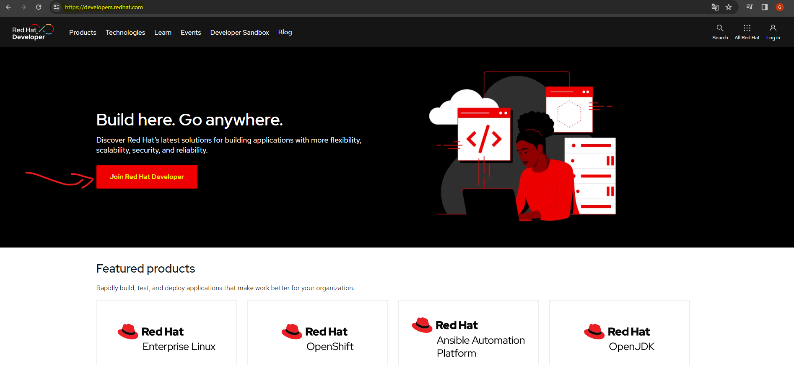

- Replissez le formulaire d'inscription et cliquez sur Create my account

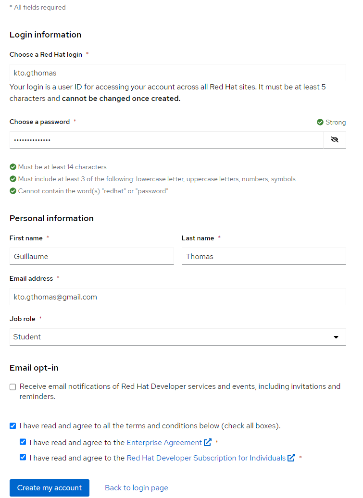

- Validez votre adresse mail

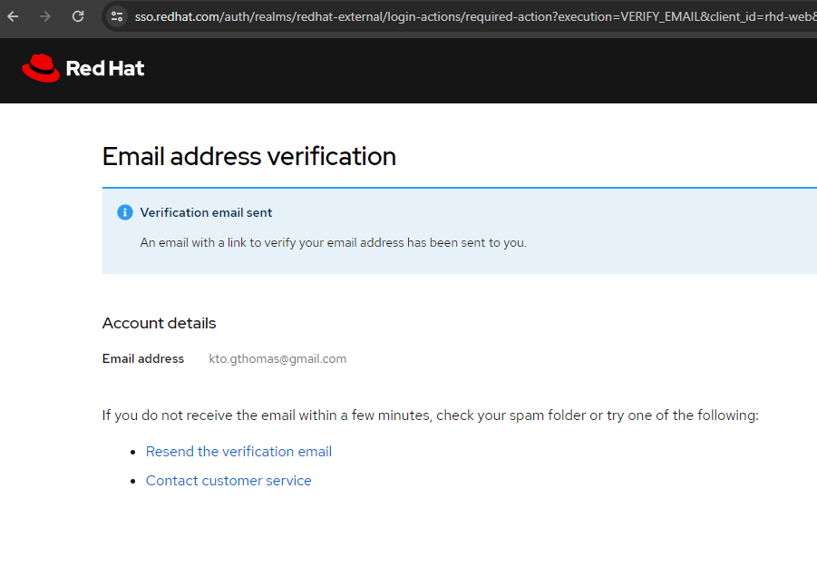

- Vous revenez authentifié sur Red Hat Developer, nous allons maintenant créer notre Developer Sandbox
- Vérifiez que vous êtes bien connecté.e
- Cliquez sur le menu Developer Sandbox et Explore the free Developer Sandbox. 

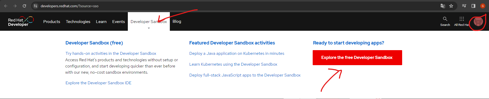

- Cliquez sur Start your sandbox for free

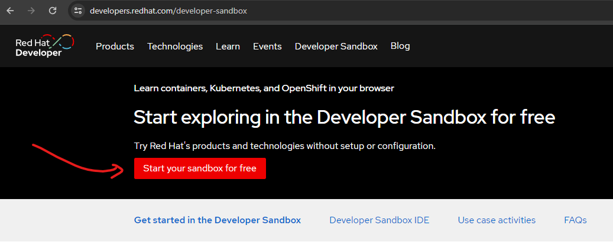

- Malheureusement, Red Hat nous demande des informations personnelles. Veuillez remplir ce formulaire
- Vous devriez arriver sur votre console Red Hat. 
- Cliquez sur Developer Sandbox et Get started 

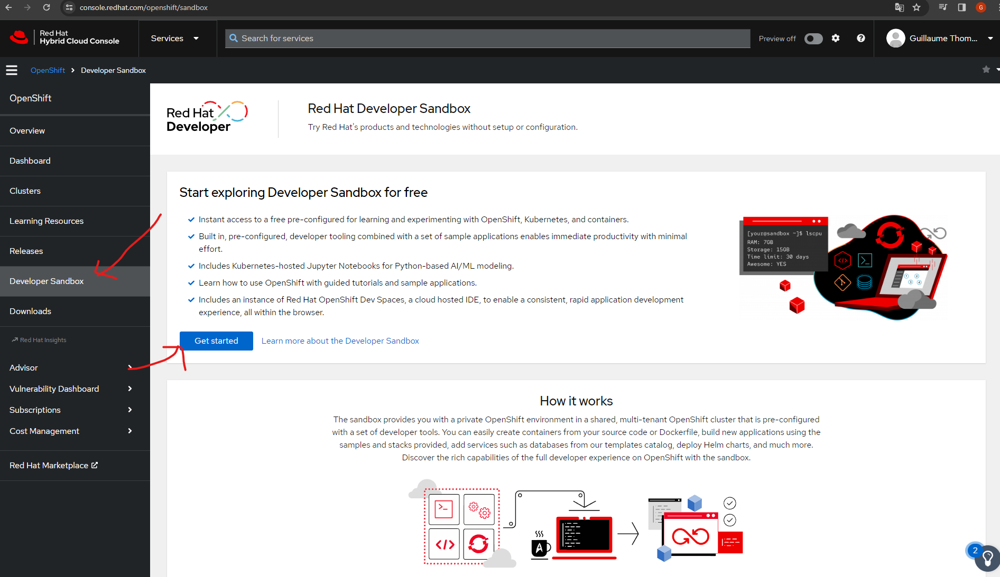

- La création de la Sandbox peut prendre un certain temps

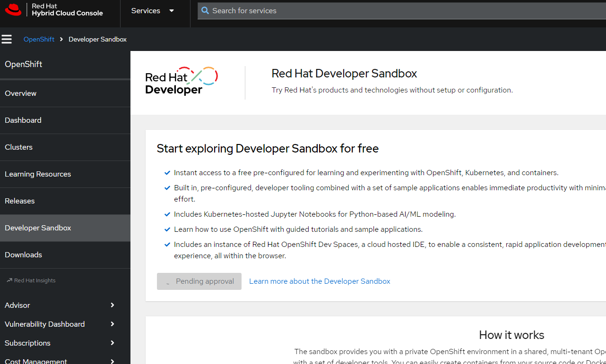

- C'est terminé, partagez avec le professeur le lien vers votre repository forké par mail, mais aussi votre compte Red Hat (évaluation)

### Installation de Bruno (sous Windows, mais doit fonctionner sur Mac et Linux)

- Rendez vous sur le site de [Bruno](https://www.usebruno.com/)
- Cliquez sur Download

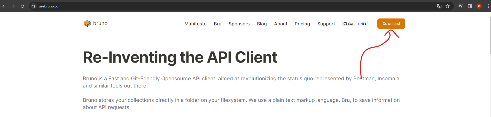

- Télécharger votre installation préférée
- Installez Bruno avec l'installeur
- Validez son fonctionnement

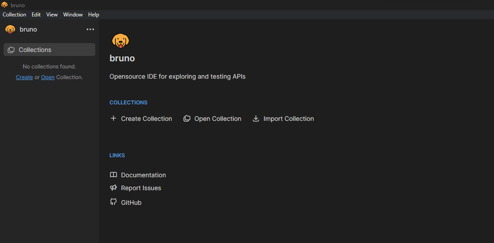

## Présentation de la cible à atteindre

Le professeur va faire démonstration de ce que l'on cherche à atteindre en fin de projet. Nous reviendrons en détail sur
le déroulé, les notions techniques, tout au long de ce cours. Ce n'est pas grave si le tout semble abstrait pour l'instant. 