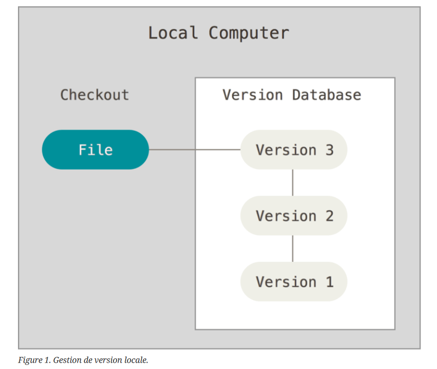
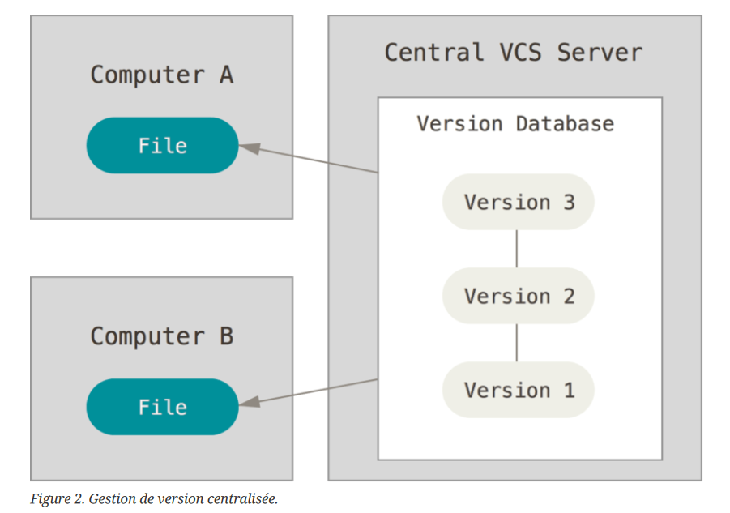
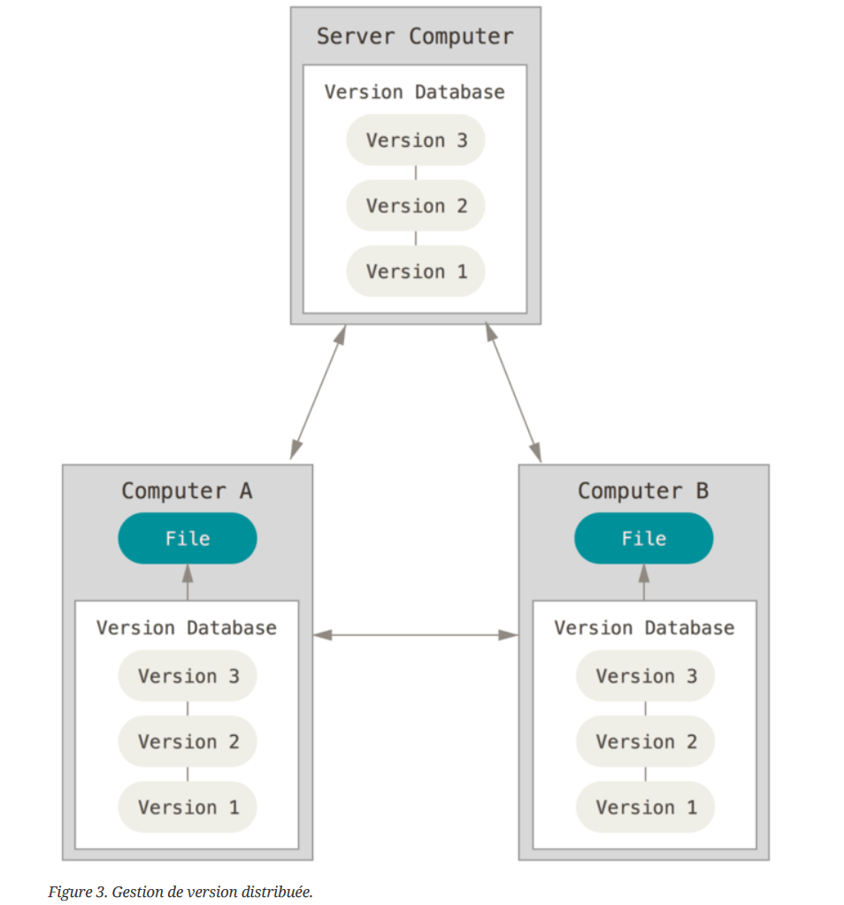
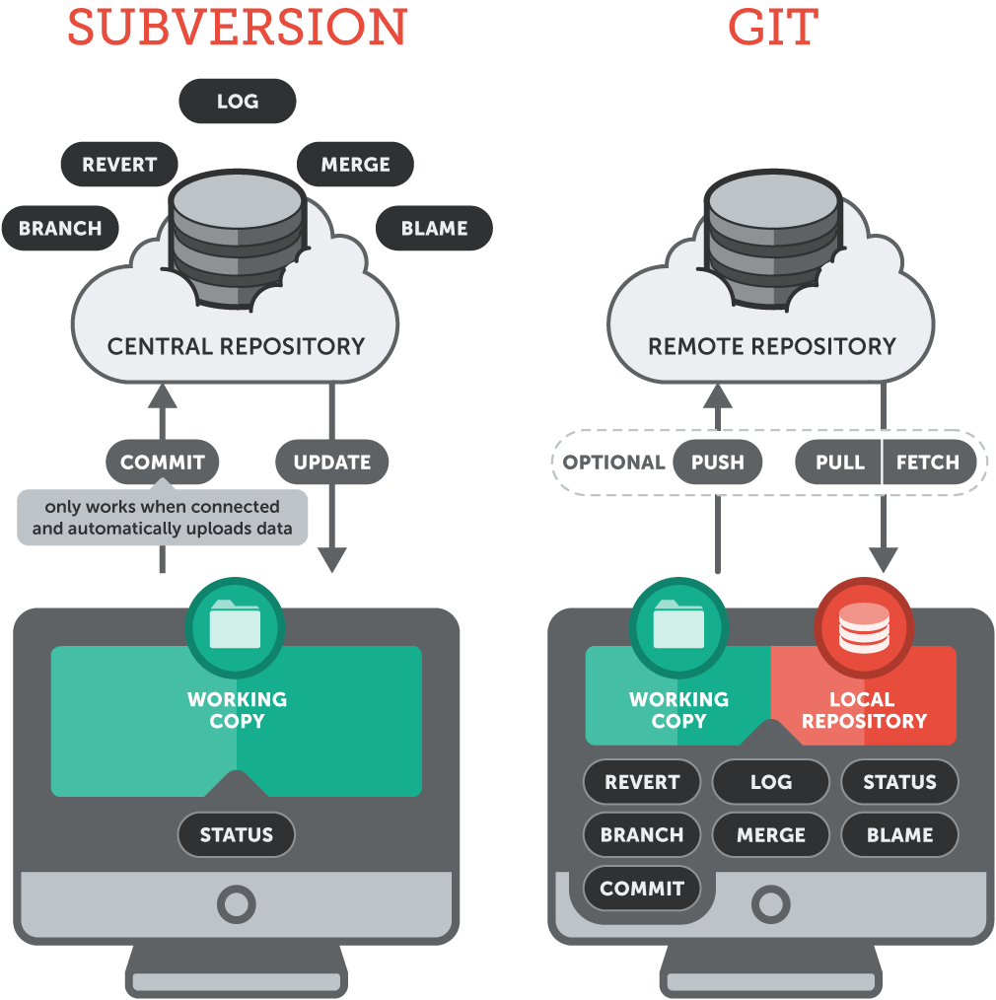
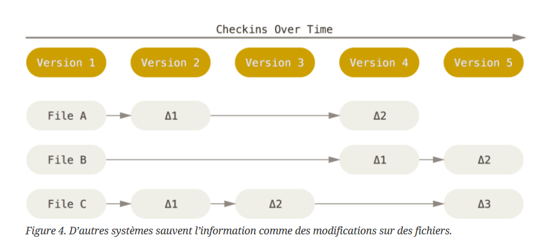
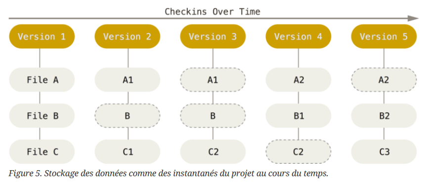
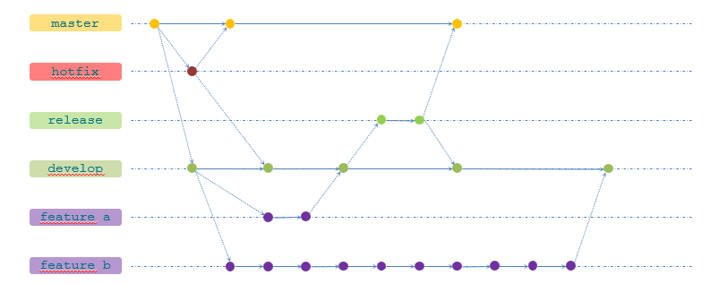
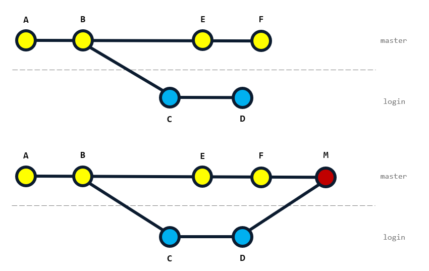
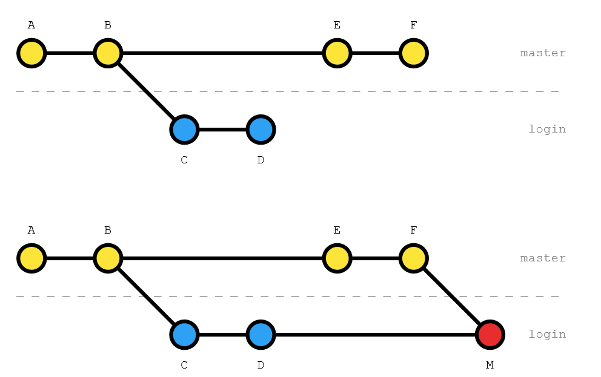
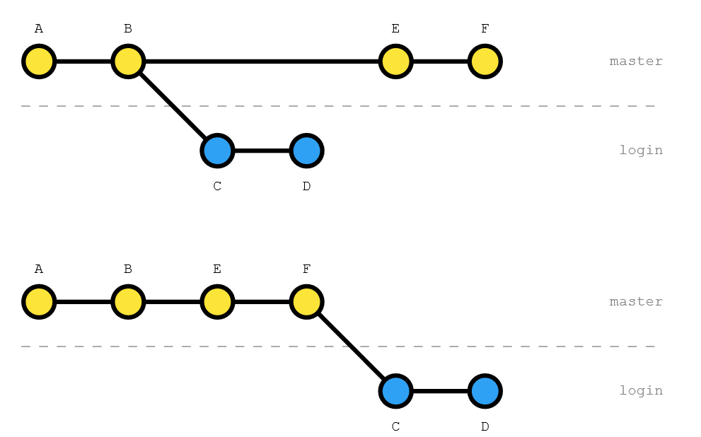

# 2. Git, GitHub, OpenSource et licencing

## Introduction

Cette partie a été développée à partir de :
- L'ouvrage de référence [Pro Git](https://git-scm.com/book/fr/v2)
- [Wikipédia](https://fr.wikipedia.org/wiki/Git)
- S'inspire grandement des supports de formation produits par la Communauté de Pratique Git d'AXA France que je remercie 
et salue chaleureusement

## Git en quelques mots ? 

Git est un logiciel de gestion de versions distribué et décentralisé. C'est un logiciel libre et gratuit, créé en 2005 par 
Linus Torvalds, auteur du noyau Linux. Git est largement utilisé aujourd'hui pour le contrôle de version dans de nombreux projets 
logiciels, y compris des projets commerciaux et en open source.

En plus d'être décentralisé, Git a été conçu avec la performance, la sécurité et la flexibilité à l'esprit. 
Il est utilisé par des dizaines de millions de personnes, sur tous les environnements (Windows, Mac, Linux). Git est 
aussi le système à la base du site web GitHub, que nous allons utiliser dans ce cours.

Il repose également sur un système de branches, pour des développements non linéaires.

## Comment collaborer et partager des fichiers ?

Illustration issue du site : https://tortoisesvn.net/docs/release/TortoiseSVN_fr/tsvn-basics-versioning.html

Un gestionnaire de version permet de répondre à cette problématique en enregistrant les différentes versions d'un ensemble
de fichiers.

## Les différences entre chaque type de gestionnaire

Les illustrations ci-dessous proviennent de l'excellent ouvrage Pro Git:

Git est, comme indiqué précédemment, un gestionnaire distribué et décentralisé. Cela veut dire que le dépôt central
n'est pas obligatoire. Il peut en effet être replacé en cas de problème.

## Les avantages du développement distribué

Chaque développeur et développeuses dispose donc de sa propre copie de travail sur sa machine locale et partage l'historique
complet des modifications faites sur le projet avec les autres personnes intervenant sur le projet.

Git se présente comme suit : 

Rappel : Chaque copie de travail du code est également un dépôt qui peut contenir l'historique complet de tous les
changements.

Travailler avec Git revient à travailler la majeure partie du temps en local. Chaque machine est bien une base de données
indépendante qui est synchronisable avec le dépot de référence, appelé communément le repository, 
partagé avec toutes les autres machines de développement.

Chaque modification se présente sous forme de commit, qui permet de faire avancer l'historique du projet. Chaque commit
est un instantané du projet. Chaque commit dispose d'un identifiant unique sous forme d'une clé de hashage.

## Les branches

Créer une branche signifie diverger de la ligne principale de développement et continuer à travailler sans impacter
cette ligne.

Le working directory représente une seule et unique branche. Il est possible de naviguer entre les branches pour porter
des modifications entre les différentes lignes de vie.

## Quelques mots sur GitHub

Présentation rapide de :
- GitHub
- GitHub Codespaces
  - **Attention, pensez à bien économiser vos ressources en éteignant votre Codespaces dès que vous ne l'utilisez plus**
Vous ne disposez "que" de 60 heures d'utilisation par mois. Vous trouverez votre consommation actuelle sur ce [lien](https://github.com/settings/billing/summary) 
- GitHub Actions

C'est quoi un Fork ?

## Comment installer Git ?

Normalement, l'application Git doit s'installer sur votre machine. Il est multi-plateforme et donc compatible avec la
plupart des systèmes d'exploitation (Windows, Mac, Linux).

Pour les besoins de ce cours, nous n'aurons pas besoin de l'installer, car vous disposez d'un GitHub Codepaces sur
lequel git est préalablement installé.

## Les commandes de base

Récupérer les modifications distantes :
- `git clone <adresse_du_repo_distant>` (copier le repository distant en local)
- `git fetch` (mise à jour de l'image locale à partir du repository distant)
- `git pull` (mise à jour de l'image locale et du working directory, donc de la branche courante)

Enregistrer une modification :
- `git status` (affichage des modifications sur le working directory)
- `git add <fichier>` (ajouter une modification dans l'index)
- `git commit -m "un message de commit"` (enregistrer l'index sous forme d'un incrément ou communément appelé, commit)
- `git push` (synchroniser ou pousser l'ensemble des incréments sur le repository distant et donc partager le travail avec toute l'équipe)

Normes de nommage des commits : https://www.conventionalcommits.org/fr/v1.0.0/

Gestion des branches :
- `git branch` (lister toutes les branches locales)
- `git remote show origin` (lister toutes les branches distantes)
- `git switch -c <nouvelle branche>` (permet de créer une nouvelle branche en local et travailler dessus)
- `git switch <branche existante>` (permet de naviguer sur une autre branche)
- `git push -u origin <nouvelle branche>` (pousser sur le repository distant la branche nouvellement créée)

Afficher l'historique:
- `git log --oneline --decorate --graph`

Pratique : 
- Créez un GitHub Codespaces à partir de votre branch main, sur votre fork personnel de kto-mlops
- Prenez connaissance de cet environnement de travail avec le professeur
- Créez une branche <votre nom>/git-exercice avec `git switch -c`
- Créez un ou plusieurs fichiers et observez les changements via `git status`
- Commitez ces fichiers avec `git add` et `git commit`
- Répétez cette opération pour obtenir deux commits
- Poussez ces commits avec `git push`
- Affichez votre historique avec `git log`, en jouant avec les différentes options pour voir leurs effets
- Partagez par mail le nom de votre fork et nouvelle branche au professeur, ainsi qu'un screenshot de votre `git log` (évaluation)

## Comment revenir en arrière ?

Plusieurs commandes : 
- `git restore <mon-fichier>` (annule les modifications faites sur le fichier pour restaurer son état au dernier commit en date (HEAD))
- `git commit --amend --no-edit` (permet de modifier HEAD en ajoutant l'index actuel)
- `git push -f` (permet de repousser le dernier commit s'il a déjà été partagé. ATTENTION, cela écrase vos précédentes modifications partagées)
- `git reset` (permet de supprimer tous les fichiers de l'index)
- `git reset --hard <hash du commit>` (permet de remettre votre working directory à un état précédent)

Pratique:
- Ajoutez une ligne dans l’un des fichiers créés précédemment, puis ajoutez cette modification à l’index via `git add`
- Ajoutez cette modification au commit précédent via `git commit --amend`, puis poussez ces changements
- Ajoutez à nouveau une ligne dans l’un des fichiers créés précédemment, cette fois sans l’ajouter à l’index
- Annulez cette modification via `git restore <nom-du-fichier>`
- Ajoutez une ligne dans l’un des fichiers créés précédemment, puis ajoutez cette modification à l’index via git add
- Observez l’ajout dans l’index via git status
- Videz l’index via `git reset`
- Observez à nouveau le résultat
- Supprimez cette modification via `git reset --hard`

## Merger

Il est possible de combiner les modifications faites entre deux branches différentes.

Il y a plusieurs types de merge avec Git. Voici le merge par défaut sur GitHub : 

Pour merger une branche dans la branche courante, utilisez la commande `git merge <nom de la branche à merger>`

Attention aux conflits ! Il existe des moyens de les corriger, mais nous ne les aborderons pas dans ce cours.

## Modifier l'historique (commandes avancées)

Nous n'irons pas plus avant sur ces commandes avancées, mais en voici malgré tout un petit inventaire : 
- `git stash` et ses dérivés pour mettre de côté des modifications sans avoir à les mettre dans un commit (et les remettre dans votre working directory)
- `git rebase` pour redéfinir un point de départ d'une branche par rapport à une autre sans merge
- `git rebase -i` permet de redéfinir en profondeur l'historique d'une branche

Exemple de merge :

Différence avec rebase : 

## Bonnes pratiques

Voici un petit éventail de bonnes pratiques :
- Respectez les règles de nommage des commits (rappel https://www.conventionalcommits.org/fr/v1.0.0/)
- Respectez et partagez un GitFlow précis avec votre équipe (gitflow, githubflow, ect...)
- Protégez vos branches principales avec des Pull Requests

## L'Open Source

En résumé, un logiciel open source est un code conçu pour être accessible au public : n’importe qui peut voir, 
modifier et distribuer le code à sa convenance. Ce type de logiciel est développé de manière collaborative et 
décentralisée, par une communauté, et repose sur l’examen par les pairs. Un logiciel open source est souvent moins 
cher (ce qui ne veut pas dire gratuit), plus flexible et profite d’une longévité supérieure par rapport à ses équivalents propriétaires.

Sources : https://www.redhat.com/fr/topics/open-source/what-is-open-source

## Les points d'attention sur le Licensing

### Qu'est-ce qu'une license ?

Il existe plus de 80 variantes de licences open source, mais elles entrent généralement dans l’une des deux catégories 
principales : le copyleft et le permissif.
- Copyleft : C’est un type de licence dans lequel le code dérivé du code open source original hérite de ses conditions 
de licence. Les licences open source copyleft les plus populaires, sont, par ordre de restriction : 
AGPL, GPL, LGPL, EPL et Mozilla.
- Permissif : Ce type de licence offre une plus grande liberté de réutilisation, de modification et de distribution.

Voici quelques exemples de licences open source couramment utilisées :
- Licences publiques générales GPL ou GNU GPL : Ces licences sont conçues pour garantir la liberté de partager et de modifier les versions du logiciel et garantir qu’il reste libre pour tous ses utilisateurs.
- Licence MIT : C’est une licence permissive qui est compatible avec de nombreuses autres licences, sans être une licence copyleft. Elle permet une utilisation illimitée et donne la possibilité de réutiliser le code sous une licence différente.
- Licence BSD : C’est une autre licence permissive qui est très flexible, permettant la redistribution et la modification du code source.

**Il est important de noter que chaque licence open source a ses propres conditions et restrictions juridiques, selon 
le type de licence open source appliqué. Il est donc crucial de respecter les termes des licences des logiciels open source.**

Comme vu précédemment, un logiciel open source **n'est pas forcément gratuit**. Il est régi par une license qui peut induire un coût
de license en cas d'usage commercial.

Sources : https://snyk.io/fr/learn/open-source-licenses/

### Prenons l'exemple de MuPDF 

MuPDF est un logiciel qui est disponible sous deux types de licences : 
une licence open source AGPL et une licence commerciale.

La licence AGPL est une licence de copyleft qui garantit que le logiciel reste libre pour tous ses utilisateurs. 
Si vous utilisez MuPDF sous la licence AGPL, vous devez utiliser uniquement la version AGPL et respecter les 
exigences de partage du code source de l’AGPL.

D’autre part, si vous utilisez MuPDF sous une de leurs licences commerciales, vous devez utiliser uniquement leur 
version commerciale et respecter les termes de leur licence commerciale. De plus, si vous achetez un support 
pour leur version commerciale, vous ne devez pas demander de support pour la version AGPL.

Il est important de noter que MuPDF est entièrement contrôlé par son éditeur. Par conséquent, toute utilisation commerciale 
de MuPDF nécessite une licence commerciale de ce dernier. Il n’existe pas de version “domaine public” de MuPDF.

En résumé, MuPDF ne peut pas être vendu sans licence, car il est protégé par ces licences. 
Toute utilisation commerciale de MuPDF nécessite une licence commerciale.

Sources : https://mupdf.com/licensing/index.html

