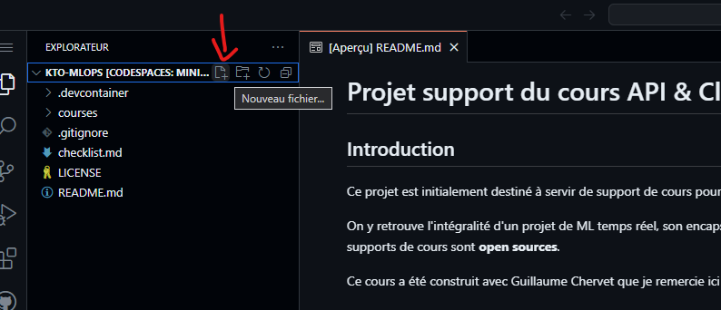
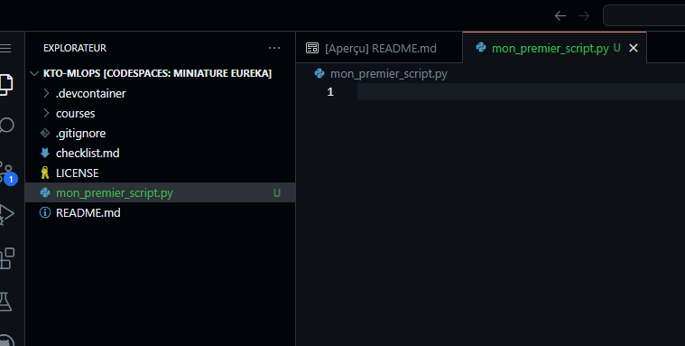

# 3. Python, Unit Test & Clean code
    
## Bases de Python

### C'est quoi Python ?

Python est un langage de programmation interprété, cela veut dire votre code, sous forme de script, sera lu et exécuté par un
interpréteur préalablement installé sur votre machine. 

L'interpréteur est multi-plateforme, il est donc compatible avec les systèmes d'exploitation les plus courants (Windows, Mac,
 Linux).

C'est un langage qui est très utilisé en tant que langage de script pour automatiser certaines tâches. Je l'avais personnellement
beaucoup vu utilisé par des ingénieurs système et réseau. Il dispose désormais d'une vaste bibliothèque de modules 
permettant de développer des solutions de modélisation mathématique, d'IA et donc de ML. 

### Comment l'installer ?

Si vous souhaitez exécuter du code Python, il faut donc installer un interpréteur sur votre machine. Nous n'aurons pas
besoin de le faire pour ce cours, car nous disposons d'un interpréteur Python, dans sa dernière révision 3.11, préalablement
installé dans notre Codespaces. Dans certains environnements, il sera nécessaire d'ajouter le chemin de notre interpréteur 
dans la variable d'environnement PATH, afin de bénéficier de la commande `python`.

### Les variables d'environnement

Une variable d'environnement est une valeur dynamique qui peut influencer le comportement d'un programme ou d'un système 
d'exploitation. Elle peut contenir des informations importantes comme des chemins d'accès (comme PATH) ou des paramètres de 
configuration (nous les utiliserons beaucoup dans ce cours). Les programmes peuvent utiliser ces variables pour adapter leur comportement en fonction de 
l'environnement dans lequel ils sont exécutés, ce qui les rend très utiles pour la configuration et la personnalisation des programmes.

La variable PATH est commune dans la plupart des systèmes d'exploitation. Elle contient l'ensemble des chemins vers les exécutables 
que l'on cherche à lancer via une commande de terminal (comme l'exécutable de l'interpréteur Python, par exemple).

Pour afficher une variable d'environnement dans Codespaces (qui est un système Linux), vous pouvez utiliser `echo` : 
```bash
echo $PATH
```

Pour affecter une valeur dans une variable d'environnement, vous pouvez utiliser `export` :
```bash
export MA_JOLIE_VARIABLE="coucou"
echo $MA_JOLIE_VARIABLE
export MA_JOLIE_VARIABLE=$MA_JOLIE_VARIABLE" ça va ?"
echo $MA_JOLIE_VARIABLE
```

Attention, la commande `export` ne fonctionne que pour la session en cours dans votre terminal. En d'autres termes, si vous fermez votre terminal, 
l'état de votre variable est perdu. Pour garder de manière permanente votre valeur, il faut l'ajouter dans .bashrc : 

```bash
echo 'export MA_JOLIE_VARIABLE="coucou"' >> ~/.bashrc
```

Faites le test avec le professeur ! 
- Exportez la variable MA_JOLIE_VARIABLE dans un terminal **sans** la sauvegarder.
- Essayez de l'afficher
- Fermez le terminal et ouvrez-en un nouveau
- Essayez d'afficher MA_JOLIE_VARIABLE
- Refaites un export dans .bashrc
- Fermez le terminal et ouvrez-en un nouveau
- Essayez d'afficher MA_JOLIE_VARIABLE

### Les commandes Python

Les commandes par défaut pour Python sont :
- `python` : permet, en fonction des paramètres donnés à la commande, de lancer un interpréteur en ligne de commande, 
ou d'exécuter un script ou un module Python
- `pip` : Pip est le gestionnaire de packages par défaut pour Python. Il nous permet d'installer et de gérer des 
bibliothèques tiers qui ne sont pas incluses dans la bibliothèque standard de Python 
(que j'appellerai par convention ici, dépendances) directement sur notre interpréteur ou dans un 
environnement virtuel (exemple venv). Une fois vos librairies installées, vous pouvez les ajouter à votre
code via le mot clé `import`. Les librairies sont, **par défaut**, téléchargées à partir du référentiel public [PyPi](https://pypi.org/)

Testez ces commandes avec le professeur !

```bash
python
```
```python
print('coucou')
```
Quittez l'interpréteur avec :
```python
exit()
```

Testez maintenant l'import d'un module dont la bibliothèque n'a pas été installée par pip.
Pour commencer, listez toutes les dépendances installées sur votre système avec 
```bash
pip freeze
```
Maintenant, lancez votre interpréteur et tentez d'importer le module `aiohttp`
```bash
python
```
```python
import aiohttp
```
Un message d'erreur apparaît.

Installez une librairie avec `pip` : 
```bash
pip install aiohttp==3.9.1
```
Relancez l'interpréteur et retentez l'import du module : 
```bash
python
```
```python
import aiohttp
```

Vous n'avez plus de message d'erreur !

Notez ici que nous avons installé strictement la version 3.9.1. Vous pouvez également choisir d'installer la toute 
dernière version à date présente dans PyPi en ne spécifiant pas de version : 
```bash
pip install aiohttp
```
Vous pouvez également choisir d'installer la dernière révision de la version 3.9 à date :
```bash
pip install aiohttp~=3.9.0
```

Attardons-nous un peu maintenant sur les dépendances transitives : 

Dans le contexte du développement de logiciels, une dépendance transitive est une dépendance indirecte d'un 
module ou d'une bibliothèque du projet principal. Cela signifie que le projet principal dépend directement d'une 
bibliothèque A, qui elle-même dépend de la bibliothèque B. Dans ce cas, B est une dépendance transitive du projet. 
Bien que le projet principal ne dépende pas directement de B, il ne peut pas fonctionner sans A, qui elle-même dépend 
de B pour fonctionner. 

Il est donc important de gérer les dépendances transitives pour s'assurer que toutes les 
bibliothèques et tous les modules requis sont inclus dans le projet, afin que celui-ci fonctionne de manière fiable.

Et ça tombe très bien, `pip` le gère pour nous ! Comme vous pouvez le constater en faisant de nouveau la commande
`pip freeze`, toutes les dépendances utiles à notre librairie `aiohttp` ont bien été téléchargées et installées.

Constatez par vous-même ! ;)

### Points d'attention sur la gestion des dépendances et des versions de Python

Attention, dans le cas où vous souhaiteriez utiliser des versions de Python différentes, ou même des dépendances différentes 
en fonction de vos projets : sans utilisation de solutions de management d'environnements et de dépendances Python, 
telles qu'[Anaconda](https://www.anaconda.com/) / [Miniconda](https://docs.conda.io/projects/miniconda/en/latest/) (attention à la license) 
ou encore [pyenv](https://github.com/pyenv/pyenv), vous devrez gérer les différentes versions d'interpréteurs à la main, ce qui peut se révéler pénible et fastidieux.

Certains IDE, tels qu'[IntelliJ](https://www.jetbrains.com/idea/) / PyCharm, permettent également de choisir l'interpréteur à utiliser pour votre projet et vous permettent également de créer des
environnements virtuels (venv) pour facilement compartimenter vos dépendances. Vous pouvez aussi créer vos environnements virtuels à la main via le module
python [venv](https://docs.python.org/fr/3/library/venv.html).

Encore une fois, le risque sera limité pour ce cours, car nous travaillerons dans un environnement Codespaces dédié à notre projet. La version de Python
est fixée et toutes les dépendances installées pour notre interpréteur seront dédiées au projet.

### Notre premier script

Il est bien entendu que nous n'allons pas coder l'intégralité de notre projet en ligne de commande directement dans 
l'interpréteur. Pour garder trace et organiser notre code, nous allons créer des scripts python. Ce sont des fichiers qui portent 
l'extension `.py` et qui contiendront vos codes Python. Vous pouvez structurer vos projets dans des répertoires. Il est possible 
d'utiliser le contenu d'un script (notamment ses fonctions) dans un autre avec l'instruction `import` que nous avons vu précédemment.

Créons notre premier script :
- Vérifiez que vous êtes bien dans votre branche personnelle créée dans le module précédent sur [Git](02_git.md)
- Créer un nouveau fichier `mon_premier_script.py` à la racine de votre projet à l'aide du VSCode inclut avec Codespaces





- Ajoutez une premier ligne à votre script : 
```python
message = "C'est mon premier script !!!"
print(message)
```
- Exécutez votre script avec la commande `python`
```bash
python mon_premier_script.py 
```

Bravo !!! Vous avez exécuté le code contenu dans votre script python !

Dans ce script, vous avez créé une variable `message` de type chaîne de caractères (ou `str`).

Python est un langage de programmation fortement typé, ce qui signifie que chaque variable ou objet en Python possède 
un type de données. Voici quelques-uns des types de données les plus courants en Python :

- `int` : entiers signés, qui représentent des nombres entiers positifs et négatifs.
- `float` : nombres à virgule flottante, qui représentent des nombres réels (attention cependant à sa précision relative !!!).
- `str` : chaînes de caractères, qui représentent une séquence de caractères Unicode.
- `bool` : booléens, qui peuvent être `True` ou `False`.
- `list` : listes, qui sont des séquences ordonnées d'éléments de n'importe quel type. Une liste peut se parcourir
- `tuple` : tuples, qui sont des séquences ordonnées d'éléments immuables (c'est-à-dire qu'on ne peut pas les modifier).
- `dict` : dictionnaires, qui sont des collections d'éléments associatifs indexés par des clés uniques (ensemble de clés / valeurs). Nous 
pouvons donc facilement accéder

Cependant, Python dispose de nombreux autres types de données intégrés et il est également possible de créer ses 
propres types de données en utilisant des classes (voir la partie sur l'[orienté objet](#lorienté-objet--class-vs-dict)).
De nombreux types sont disponibles dans des librairies tiers, comme les [`Dataframe` de `pandas`](https://pandas.pydata.org/docs/reference/api/pandas.DataFrame.html).

Attention, Python est suffisamment souple pour permettre à une variable de changer de type en cours de route.

Exemple, ajoutez dans votre script : 

```python
je_change_de_type = 1
print(type(je_change_de_type))
je_change_de_type = "coucou"
print(type(je_change_de_type))
```
Exécutez votre script avec :
```bash
python mon_premier_script.py 
```

### Les instructions basiques de Python

Il y a pleins d'instructions différentes en Python. Nous n'allons pas toutes les voir ici, mais nous en verrons les plus courantes :

- `print()` : affiche un message ou une valeur à l'écran.
- `if ... else ...` : permet l'exécution conditionnelle d'un bloc de code en fonction du résultat d'une expression booléenne.
- `for ... in ...` : permet de parcourir une séquence (comme une liste ou un tuple) et d'exécuter un bloc de code pour chaque élément de la séquence.
- `while ...` : exécute un bloc de code tant qu'une certaine expression booléenne est vraie. **!!! A utiliser avec prudence !!!** 
- `def ...` : permet de définir une fonction (plus de détail [ci-après](#créer-des-fonctions)).
- `return ...` : renvoie une valeur à partir d'une fonction.
- `import ...` : importe un module dans votre code Python.
- `try ... except ...` : permet de gérer les erreurs et les exceptions dans votre code Python.
- `class ...` : permet de définir une classe, qui peut représenter un objet ou un concept spécifique dans votre 
programme (voir la partie sur l'[orienté objet](#lorienté-objet--class-vs-dict)). 

Testons certaines de ces instructions dans notre premier script : 
```python
prenoms = ["Guillaume", "Gilles", "Juliette", "Antoine", "François", "Cassandre"]
more_than_seven = 0 
for prenom in prenoms:
    if len(prenom) > 7:
        more_than_seven += 1
        print("Prenom supérieur à 7 : " + prenom)
    else:
        print("Prenom inférieur ou égal à 7 : " + prenom)
print("Nombre de prénoms supérieurs à 7 : " + str(more_than_seven))
```

Commentons ce code ensemble.

### Créer des fonctions

En Python, une fonction sert à plusieurs choses :

1. **Organiser et structurer le code** : Une fonction est un bloc de code qui effectue une tâche spécifique. En 
regroupant ce code en une fonction, on peut l'appeler à plusieurs reprises sans avoir à réécrire le même code. 
Cela rend le code plus lisible et plus facile à gérer.

2. **Réutilisation du code** : Une fois qu'une fonction est définie, elle peut être utilisée à plusieurs reprises 
dans le programme. Cela permet d'éviter la duplication du code et facilite les modifications éventuelles.

3. **Abstraction** : L'utilisateur d'une fonction n'a pas besoin de comprendre le détail de son implémentation
pour l'utiliser. Par exemple, nous utilisons la fonction `print()` en Python sans avoir besoin de comprendre comment
elle affiche du texte à l'écran.

Voici un exemple simple d'une fonction en Python : 

```python
def saluer(nom: str) -> str:
    return "Bonjour " + nom

print(saluer("Alice"))  # Affiche : Bonjour Alice
```

Dans cet exemple, `saluer` est une fonction qui prend un paramètre `nom` et renvoie une chaîne de caractères qui est 
une salutation pour `nom`. 

Sources : 
- Fonctions en Python — Cours Python. https://courspython.com/fonctions.html.
- Qu'est-ce qu'une fonction dans python. https://www.nicelydev.com/python/fonction.
- 6- Les fonctions en langage Python – Très Facile. https://www.tresfacile.net/les-fonctions-en-langage-python/.

Modifions ensemble le code qui affiche les prénoms en fonction de leur nombre de lettres, à l'aide des fonctions:

```python
"""
Count names with more than seven letters
"""
def names(prenoms):
    more_than_seven = 0
    for prenom in prenoms:
        if len(prenom) > 7:
            more_than_seven += 1
            print("Prenom supérieur à 7 : " + prenom)
        else:
            print("Prenom inférieur ou égal à 7 : " + prenom)
    return more_than_seven

prenoms = ["Guillaume", "Gilles", "Juliette", "Antoine", "François", "Cassandre"]
print("Nombre de prénoms supérieurs à 7 : " + str(names(prenoms=prenoms)))
```

Commentons ce code ensemble.

### L'orienté objet : class VS dict

Nous ne ferons pas ici un cours complet sur l'orienté objet. Retenez juste qu'il est possible (et souvent souhaitable) 
de développer des classes en Python.

Une classe est une structure de programmation qui permet de définir un objet personnalisé.

Une classe est constituée de fonctions de membres, appelées "méthodes", et de variables de membres, appelées 
"attributs". Les méthodes sont des fonctions qui définissent le comportement de la classe, et les attributs 
sont des variables qui permettent de stocker des données à l'intérieur de la classe.

Une fois qu'une classe a été définie, vous pouvez créer des instances de cette classe, appelées "objets". 
Les objets sont des instances uniques de la classe, avec leurs propres attributs et méthodes.

Nous ne nous attarderons pas ici sur le principe d'héritage, très important en orienté objet, car nous ne l'exploiterons pas
directement dans ce cours. Vous pouvez aller vous renseigner sur ce sujet si cela vous intéresse.

Retenez néanmoins que, quand vous devez stocker de la donnée, évitez de recourir aux dictionnaires au maximum. En effet,
avec une classe, vous pouvez spécifier des types stricts pour les attributs, ce qui rend votre code plus robuste et 
plus lisible. Les dictionnaires, quant à eux, peuvent contenir des valeurs de types différents pour chaque clé,
ce qui peut entraîner des erreurs difficiles à déboguer.

## Les tests unitaires et TDD

Les tests unitaires sont extrêmement importants en Python et dans tous les langages de programmation. Voici quelques 
raisons pour lesquelles les tests unitaires sont importants :
- **Détection précoce des erreurs** : les tests unitaires permettent d'identifier et de corriger les erreurs avant 
de déployer le code en production. Les tests unitaires peuvent détecter les erreurs avant même que le programme ne 
 soit exécuté, ce qui permet de gagner du temps et d'éviter des erreurs coûteuses.
- **Documentation** : les tests unitaires sont une forme de documentation pour votre code. En écrivant des tests 
unitaires pour chaque fonction ou méthode, vous documentez comment cette fonction ou méthode est censée fonctionner, 
ce qui facilite la compréhension et la maintenance du code.
- **Facilité de maintenance** : les tests unitaires permettent de voir rapidement si une modification dans le code a 
cassé quelque chose qui fonctionnait précédemment. Cela permet de corriger rapidement les erreurs sans altérer 
d'autres parties du code.
- **Refactoring** : les tests unitaires facilitent le refactoring, c'est-à-dire la modification de code qui ne 
change pas le comportement attendu du programme. En faisant des tests unitaires de votre code, vous pouvez 
effectuer des modifications en toute confiance, car les tests unitaires vous assureront que le code continue de 
fonctionner comme prévu.

En somme, les tests unitaires sont essentiels pour garantir que votre code fonctionne correctement, pour en faciliter 
la maintenance et pour vous donner plus de confiance en vos modifications. En Python, ces tests peuvent être réalisés à 
l'aide de modules tels que `unittest`, `pytest` ou encore `nose`.

Dans ce cours, nous allons utiliser `unittest`.

Créons un test unitaire pour notre fonction `names` précédemment créé dans notre premier script :

```python
import unittest

"""
Count names with more than seven letters
"""
def names(prenoms):
    more_than_seven = 0
    for prenom in prenoms:
        if len(prenom) > 7:
            more_than_seven += 1
            print("Prenom supérieur à 7 : " + prenom)
        else:
            print("Prenom inférieur ou égal à 7 : " + prenom)
    return more_than_seven

class TestNamesMethod(unittest.TestCase):
     def test_names(self):
        prenoms = ["Guillaume", "Gilles", "Juliette", "Antoine", "François", "Cassandre"]
        more_than_seven = names(prenoms=prenoms)
        self.assertEqual(more_than_seven, 4)

if __name__ == '__main__':
    unittest.main()
```

Discutons de ce code ensemble.

Enfin, terminons avec la pratique du Test Driven Development (TDD). Son principe est d'écrire les tests avant d'implémenter
votre solution. Cela garantit que le code produit est fonctionnel et répond au besoin initial. Nous ne pratiquerons pas
forcément de TDD durant ce cours, mais son utilisation est vivement recommandé. 

## Clean code, les principes fondamentaux

Voici quelques principes de clean code simples:
- Commentaires : les utiliser avec parcimonie. Le code doit être clair.
- Garder des noms de variables et de méthodes les plus parlants possibles :
    - Eviter les variables à une lettre
    - Mettre des actions dans les noms de méthodes
    - Dans le cas de python, snake case pour les noms de variables et méthodes
- Les nombres magiques sont à proscrire
- Eviter les grosses fonctionnalités, avec trop d'imbrications profondes
- Ne pas dupliquer le code
- Bonus pour Python : **TOUJOURS** spécifier les types des paramètres en entrée d'une fonction et du retour 
de celle-ci
- Deuxième bonus pour Python : Préférez structurer vos données dans des classes plutôt que dans des dictionnaires  

Un bon code est **TOUJOURS** testé unitairement, principe du TDD à observer de préférence.

### Petit exercice d'évaluation

En suivant les consignes de Clean code vu précédemment, corrigez la fonction `names` définie ensemble dans la 
partie [Créer des fonctions](#créer-des-fonctions). Une fois ceci fait, commitez le fichier "mon_premier_script.py" et 
poussez-le sur votre branche. Communiquez au professeur par mail le nom de votre branche, une fois que vous aurez poussé ladite 
modification.

**N'OUBLIEZ PAS** : Exécutez votre test unitaire pour bien vous assurer que votre refactoring ou clean code, n'ait
pas compromis le bon fonctionnement de votre fonction. Cela fera partie de la notation. Le test unitaire **DOIT TOUJOURS**
être passant (statut OK).
