# 4. Scoping, Data préparation et Annotations

ENFIN !!! Après cette loooooooooooongue introduction et loooooooooooongue présentation des concepts de base du 
développement logiciel, nous pouvons commencer à parler MLOps !

Pour rappel, voici une vision simplifiée des différentes étapes à observer :


Dans ce chapitre, nous allons travailler sur la partie Scoping et Data.

Pour bien démarrer, vérifiez que vous n'avez aucune modification en cours sur votre working directory avec `git status`.
Si c'est le cas, annulez toutes vos modifications avec `git reset --hard HEAD`. Supprimez potentiellement les fichiers
non indexés.
Changez maintenant de branche avec `git switch step01`.
Créez désormais une branche avec votre nom : `git switch -c votrenom/step01`

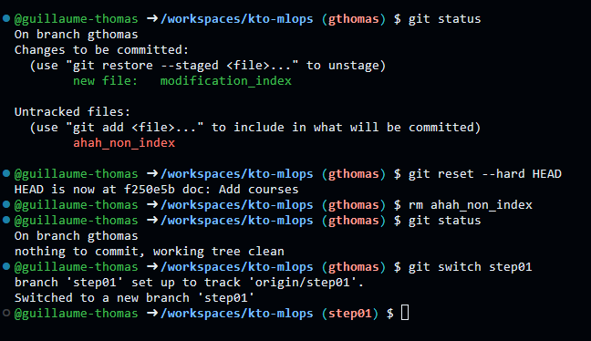

Prenez maintenant connaissance de la structure du projet avec le professeur

## Présentation du projet

Nous allons créer un Webservice de classification de Chiens et de Chats. Ce service doit déterminer de manière précise
si les images données en entrée représentent des chats, des chiens ou autre chose.
Cette classification doit se faire en temps réel ! Le client n'aime pas les traitements batch qu'il juge d'un autre temps.
Et puis, si l'on est capable de traiter un flux d'image en temps réel, nous serons parfaitement capables de le faire
en batch ;-)

## Présentation du dataset

C'est là que ça devient particulier ... le dataset fourni par le client est sous forme de fichiers PDF. Ces fichiers
comportent plusieurs pages avec une image par page représentant : un chat, un chien, ou autre chose. Autre particularité,
S'il y a plusieurs images, la première et la dernière sont les mêmes.

Exceptionnellement, le dataset est fourni et est stocké dans le repository git de notre projet. 
Ce n'est pas une bonne pratique, mais pour simplifier la prise en main de ce cours, nous avons fait ce choix.

Il serait préférable d'utiliser une solution de stockage et de versioning de la donnée brute [dédiée](#versioning-de-la-donnée-et-stockage). 

Analysez avec le professeur ce dataset.

## Préparation de la donnée

Nous n'allons pas avoir le choix, il va falloir préparer la donnée. Il ne faut des images pour entraîner notre modèle
et non pas des pdfs. Il va falloir développer un script d'extraction pour récupérer les images de chaque page. 

Parce que ce projet reste un projet de cours, nous allons utiliser librement la librairie pymupdf.

**N'OUBLIEZ PAS** : MuPdf ne peut être utilisé tel quel dans un projet commercialisé.

Pour ce faire, nous allons ajouter la librairie dans le fichier `label/requirements.txt` : 
```
pymupdf==1.23.8
```

En Python, le fichier `requirements.txt` est utilisé pour spécifier les dépendances du projet Python.
Le fichier `requirements.txt` contient donc une liste de ces packages tierces, avec leur version spécifique.

Cela permet aux autres personnes qui souhaitent utiliser ou contribuer à votre projet de facilement installer toutes
les dépendances en une seule fois, en exécutant simplement la commande `pip install -r requirements.txt`.
C'est une pratique courante et recommandée pour tous les projets Python.

Lancez l'installation de la librairie avec la commande :
```bash
pip install -r ./cats_dogs_other/label/requirements.txt
```

Créez maintenant un script `extraction.py` dans le repertoire `cats_dogs_other/label`

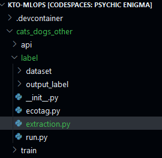

Et dans ce script, copiez / collez le code suivant : 

```python
from dataclasses import dataclass
from io import BytesIO
from pathlib import Path

import fitz
from fitz import Pixmap


def convert_pixmap_to_rgb(pixmap) -> Pixmap:
    """Convert to rgb in order to write on png"""
    # check if it is already on rgb
    if pixmap.n < 4:
        return pixmap
    else:
        return fitz.Pixmap(fitz.csRGB, pixmap)


@dataclass
class ExtractImagesResult:
    number_files_input: int
    number_images_output: int


def extract_images(pdfs_directory_path: str, images_directory_path: str) -> ExtractImagesResult:
    pdfs = [p for p in Path(pdfs_directory_path).iterdir() if p.is_file()]
    Path(images_directory_path).mkdir(parents=True, exist_ok=True)
    number_images_output = 0
    for pdf_path in pdfs:
        with open(pdf_path, "rb") as pdf_stream:
            pdf_bytes = pdf_stream.read()
        with fitz.open(stream=pdf_bytes, filetype="pdf") as document:
            number_pages = len(document) - 1
            for index in range(number_pages):
                images = document.get_page_images(index)
                for index_image, image in enumerate(images):
                    xref = image[0]
                    image_pix = fitz.Pixmap(document, xref)
                    image_bytes_io = BytesIO(convert_pixmap_to_rgb(image_pix).tobytes())
                    filename = "{0}_page{1}_index{2}.png".format(pdf_path.stem, str(index), str(index_image))
                    number_images_output = number_images_output + 1
                    with open(Path(images_directory_path) / filename, "wb") as file_stream:
                        file_stream.write(image_bytes_io.getbuffer())

    return ExtractImagesResult(number_files_input=len(pdfs), number_images_output=number_images_output)
```

Commentons ce code ensemble. Prenons le temps de l'améliorer également. Il pose plusieurs problèmes. Je vous propose de d'abord, 
faire un test unitaire et identifier les problèmes, proposer une résolution et nettoyer ce code. Cette partie est facultative. 
Ce code fonctionne à peu près tel quel.

Voici une proposition de test unitaire. Dans le répertoire `label/tests`, créez un script `test_extraction.py` dans lequel 
vous pouvez mettre le code suivant : 
```python
import shutil
import unittest
from pathlib import Path

from cats_dogs_other.label.extraction import extract_images

BASE_PATH = Path(__file__).resolve().parent
output_directory = BASE_PATH / "output"
input_directory = BASE_PATH / "input"


class TestExtraction(unittest.TestCase):

    def test_pdfs_images_should_be_extracted(self):
        if output_directory.is_dir():
            shutil.rmtree(str(output_directory))
        result = extract_images(str(input_directory), str(output_directory))
        expected_number_files_input = 3
        self.assertEqual(expected_number_files_input, result.number_files_input)
        expected_number_images_output = 4
        self.assertEqual(expected_number_images_output, result.number_images_output)
        shutil.rmtree(str(output_directory))


if __name__ == "__main__":
    unittest.main()

```

Maintenant, exécutez ce test avec la commande : 
```bash
python -m unittest cats_dogs_other.label.tests.test_extraction
```

Que constatez-vous ? Comment rétablir la situation ?


Nous avons maintenant, une mini-librairie qui va nous permettre d'extraire toutes les images d'un répertoire et de
les copier dans un autre en png.

Mettons-la maintenant en œuvre ! Pour ce faire, nous allons l'utiliser dans le script déjà existant `run.py`.
Nous discuterons de ce script un peu plus tard.

Pour l'instant, il ne contient que ce code : 

```python

if __name__ == "__main__":
    # Faire le code ici
    print('')
```

A la place du code déjà présent, inséré le code suivant :

```python

if __name__ == "__main__":
    # Préparation du dataset
    raw_folder = "cats_dogs_other/label/dataset/_raw"
    postprocess_folder = "cats_dogs_other/label/dataset/extract"
    if not os.path.isdir(postprocess_folder) or not os.listdir(postprocess_folder):
        res = extract_images(raw_folder, postprocess_folder)
        print("files input = " + str(res.number_files_input))
        print("files output = " + str(res.number_images_output))
```

Comme vous pouvez le voir, votre éditeur vous prévient que quelque chose ne va pas. En effet, `os` et `extract_images` sont 
soulignés : 

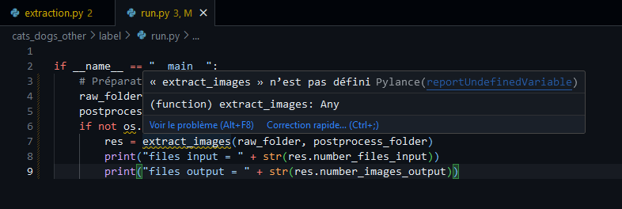

Cela veut dire qu'il manque des imports dans votre script : os et extract_images. Corrigez ce soucis en ajoutant les lignes
suivantes : 
```python
import os
from extraction import extract_images


if __name__ == "__main__":
    # Préparation du dataset
```

Notez que votre IDE peut vous aider à faire ces imports. Faites le test avec le professeur !

Commentons rapidement le code présent dans `run.py`.

Exécutons maintenant le code une première fois avec la commande suivante : 
```bash
python cats_dogs_other/label/run.py
```

Comme vous pouvez le voir, nous avions 40 pdfs en entrée et avons extrait 192 images png.

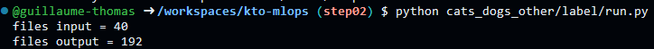

Notez que le traitement ne se fera qu'une seule fois, car nous avons ajouté une condition sur la présence ou non de fichier
dans le fichier de destination `label/extract`, désormais non vide : 

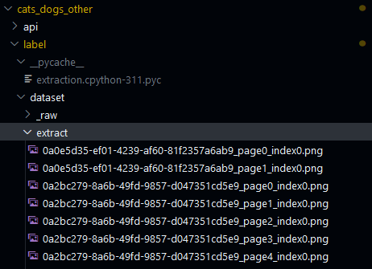

Maintenant, annotons ces images ! Pour ce faire, nous allons utiliser ecotag.

## Présentation et installation d'ecotag

Ecotag est une solution d'annotation sécurisée et open source, proposée initialement par Axa France. 
Nous allons l'utiliser ici pour
classifier nos images et en extraire les annotations. C'est une application Web dont voici quelques clichés que nous allons
commenter : 

Page d'authentification :

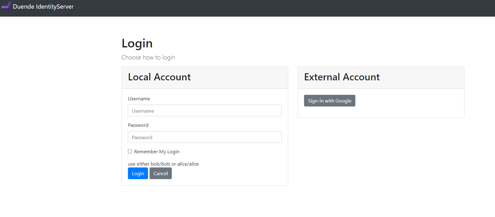

Menu principal : 


Gestion des équipes d'annotation (gestion des droits d'accès aux projets et datasets) : 

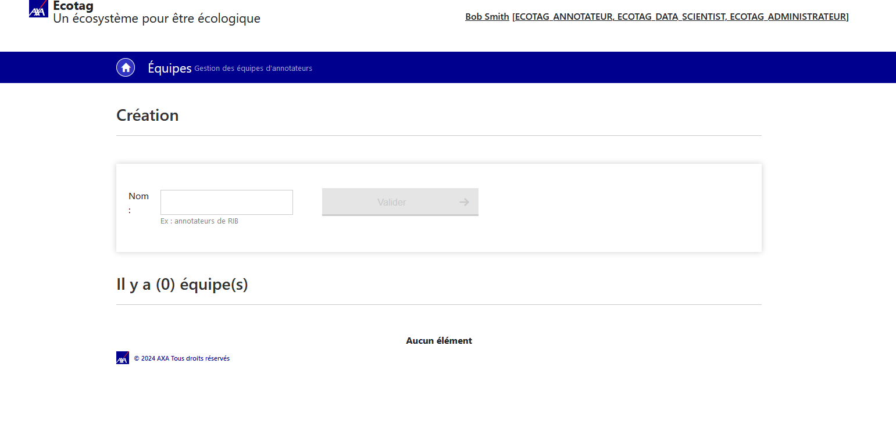

Gestion des datasets :

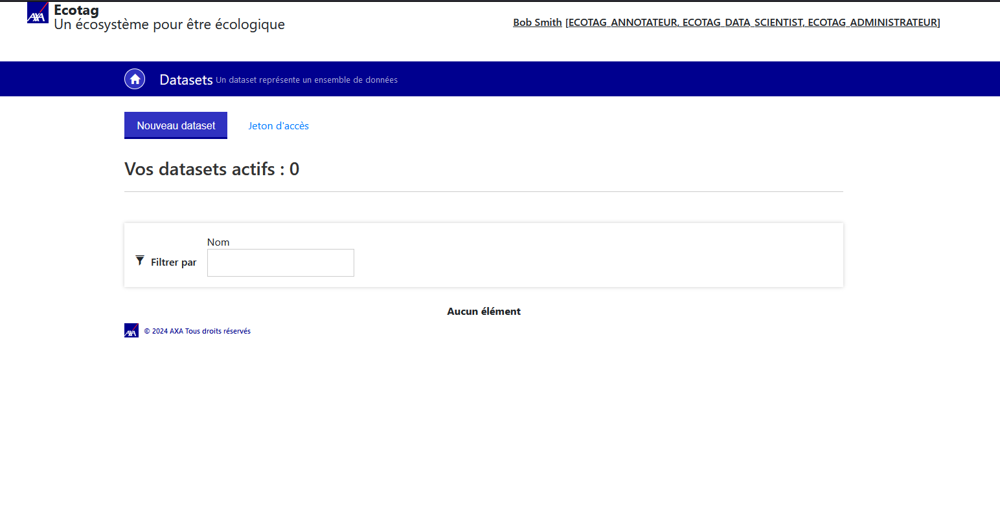

Gestion des projets :

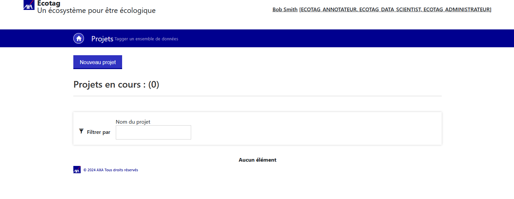

Vous trouverez une demo en ligne d'ecotag [ici](https://axaguildev-ecotag.azurewebsites.net)

L'installation de la solution dans notre environnement
codespace va s'avérer malheureusement assez technique. Simplifier cette mise en place serait une belle évolution à 
apporter à l'outil. N'hésitez pas à vous lancer si le cœur vous en dit :)

Vous trouverez le code source d'ecotag [ici](https://github.com/AxaFrance/ecotag)

Allez, c'est parti ! Soyez bien attentif à ce qui va suivre ;)

Il n'est pas utile de retenir cette partie.

Pour commencer, nous allons cloner le repository d'ecotag, car nous allons avoir besoin de builder le code source.
Dans votre terminal, jouez les commandes suivantes : 
```bash
cd ./cats_dogs_other/label
git clone https://github.com/AxaGuilDEv/ecotag.git
cd ./ecotag
```

Désormais, vous avez un répertoire ecotag affiché en gris. Cela veut dire qu'il est ignoré par git et ne sera jamais
ajouté à l'index depuis votre working directory (regardez dans le fichier `.gitignore`) :

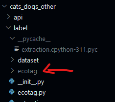

Maintenant, notez bien l'url de votre codespace ! Nous allons en avoir besoin pour le mettre dans le code d'ecotag en dur (snif).
Exemple ici : https://psychic-enigma-q65jwpvv4673j49.github.dev/

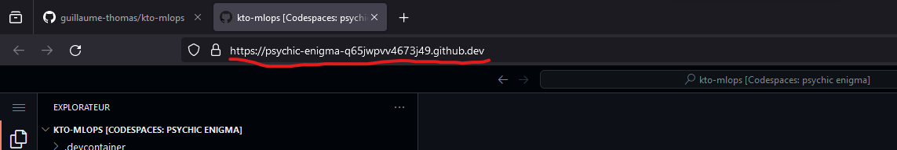

Ajoutez dans votre url, juste avant `.github.dev/` la chaîne suivante : `-5010.app`. Vous obtiendrez donc l'url définitive :
https://psychic-enigma-q65jwpvv4673j49-5010.app.github.dev/

Notez bien cette url. Attention, il faut bien utiliser les informations de **VOTRE** codespace, sinon cela ne fonctionnera
pas.

Maintenant, continuons. Dans le ficher `ecotag/deocker-compose.yml`, retirez les commentaires lignes 19, 20 et 21 et 
supprimez la ligne 18. Vous devez avoir votre yaml ressemblant à ça :
```yaml
ecotag:
  build:
    context: .
    dockerfile: ./Dockerfile
  environment:
    ASPNETCORE_ENVIRONMENT: Docker
```
Exemple imagé avant : 

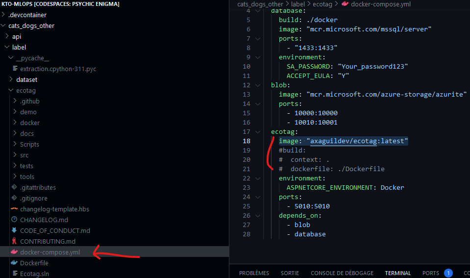

Exemple imagé après :

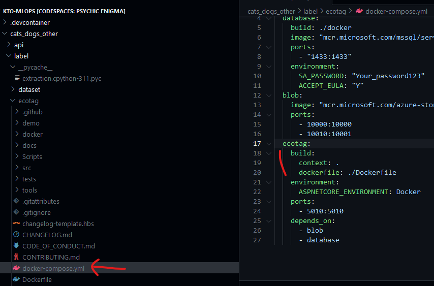

Remplacer http://localhost:5010/ par votre url de codespace (https://psychic-enigma-q65jwpvv4673j49-5010.app.github.dev/), dans le fichier 
`ecotag/src/Ecotag/ClientApp/public/environment.docker.json`
Exemple :
```json
{
  "apiUrl": "https://psychic-enigma-q65jwpvv4673j49-5010.app.github.dev/api/server/{path}",
  "baseUrl": "",
  "oidc": {
    "mode": "Default",
    "configuration": {
      "client_id": "interactive.public",
      "redirect_uri": "https://psychic-enigma-q65jwpvv4673j49-5010.app.github.dev/authentication/callback",
      "silent_redirect_uri": "https://psychic-enigma-q65jwpvv4673j49-5010.app.github.dev/authentication/silent-callback",
      "scope": "openid profile email api offline_access",
      "authority": "https://demo.duendesoftware.com",
      "service_worker_relative_url": "/OidcServiceWorker.js",
      "service_worker_only": true,
      "token_renew_mode": "access_token_invalid"
    }
  },
  "telemetry": {
    "instrumentationKey": "",
    "logLevel": "DEBUG",
    "active": false
  },
  "datasets": {
    "isBlobTransferActive": false,
    "reserveHttpCallInParallel": 2,
    "reserveBeforeEndIndex": 10
  }
}

```
Exemple imagé : 

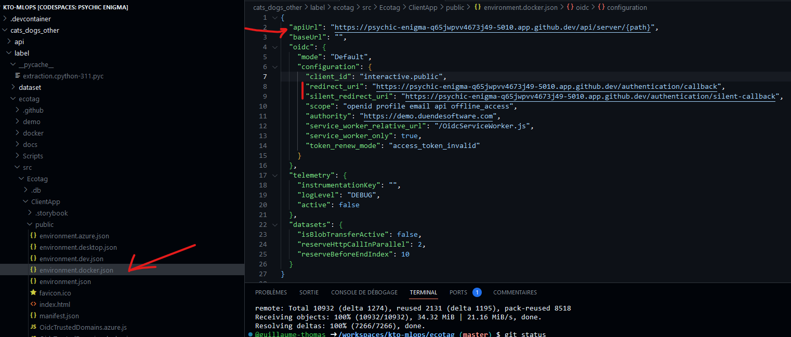

Ajouter également cette url dans le fichier `ecotag/src/Ecotag/ClientApp/public/OidcTrustedDomains.docker.js` comme suit,
dans `default` et `access_token` : 
```js
// Add here trusted domains, access tokens will be send to
const trustedDomains = {
    default: ["http://localhost:5010", "https://demo.duendesoftware.com", "https://psychic-enigma-q65jwpvv4673j49-5010.app.github.dev"],
    access_token: { domains : ["http://localhost:5010", "https://demo.duendesoftware.com", "https://psychic-enigma-q65jwpvv4673j49-5010.app.github.dev"], showAccessToken: true }
};
```
Et enfin, dans le fichier `ecotag/src/Ecotag/Server/StartupServer.cs`, remplacer les lignes suivantes 212 à 224 par 
les lignes suivantes :
```
if (!string.IsNullOrEmpty(corsSettings.Origins))
            services.AddCors(options =>
            {
                options.AddPolicy("CorsPolicy",
                    builder =>
                    {
                        builder
                            .WithOrigins("*")
                            .AllowAnyMethod()
                            .AllowAnyHeader()
                            //.AllowCredentials()
                            .SetPreflightMaxAge(TimeSpan.FromSeconds(2520));
                    });
            });
```
Et voilà ! C'est terminé ! Maintenant, jouez les commandes suivantes dans le dossier `cats_dogs_other/label/ecotag`
```bash
docker compose up -d
cd ../../..
```

Cela va prendre un certain temps (attendez-vous à un bon quart d'heure), pendant ce laps de temps, 
mettons en place la création de notre projet dans ecotag. Comme vous pouvez le voir, il existe un script 
`ecotag.py` dans votre répertoire `label`. Ce script permet de créer notre
équipe, notre dataset et notre projet dans ecotag, en utilisant l'API REST fournie avec la solution. Nous n'allons
pas nous étendre sur ce qu'est une "API REST" maintenant, nous verrons ça plus tard. Retenez juste que ce script va
contrôler à distance notre instance d'ecotag :) Vous pouvez donc parfaitement automatiser la création de vos
 datasets et projets avec ecotag ! (y)

Regardons rapidement le code ensemble.

Bien, maintenant, nous allons agrémenter notre script `run.py` qui pour l'instant, ne sert qu'à extraire les images de 
nos données brutes. Nous allons également utiliser `run.py` pour créer notre projet ecotag.

Pour cela, ajoutez les lignes suivantes à la suite de notre code existant : 
```python
    # Initialisation du projet ecotag
    api_url = 'http://localhost:5010/api/server'
    api_information = ApiInformation(api_url=api_url, jwt_token=jwt_token)

    dataset = Dataset(dataset_name='cats_dogs_others',
                      dataset_type='Image',
                      team_name='cats_dogs_others',
                      directory=postprocess_folder,
                      classification='Public')
    loop = get_event_loop()
    loop.run_until_complete(create_dataset(dataset, api_information))

    project = Project(project_name='cats_dogs_others',
                      dataset_name=dataset.dataset_name,
                      team_name='cats_dogs_others',
                      annotationType='ImageClassifier',
                      labels=[Label(name='cat', color='#FF0000', id="0"), Label(name='dog', color='#00FF00', id="1"), Label(name='other', color='#0000FF', id="2")])

    loop.run_until_complete(create_project(project, api_information))
```

Attention, n'oubliez pas d'ajouter les imports : 
```python
import os
from asyncio import get_event_loop

from extraction import extract_images
from ecotag import ApiInformation, Dataset, create_dataset, Project, Label, create_project
```

Cela donne donc au final : 
```python
import os
from asyncio import get_event_loop

from extraction import extract_images
from ecotag import ApiInformation, Dataset, create_dataset, Project, Label, create_project


if __name__ == "__main__":
    # Préparation du dataset
    raw_folder = "cats_dogs_other/label/dataset/_raw"
    postprocess_folder = "cats_dogs_other/label/dataset/extract"
    if not os.path.isdir(postprocess_folder) or not os.listdir(postprocess_folder):
        res = extract_images(raw_folder, postprocess_folder)
        print("files input = " + str(res.number_files_input))
        print("files output = " + str(res.number_images_output))
    
    # Initialisation du projet ecotag
    api_url = 'http://localhost:5010/api/server'
    api_information = ApiInformation(api_url=api_url, jwt_token=jwt_token)

    dataset = Dataset(dataset_name='cats_dogs_others',
                      dataset_type='Image',
                      team_name='cats_dogs_others',
                      directory=postprocess_folder,
                      classification='Public')
    loop = get_event_loop()
    loop.run_until_complete(create_dataset(dataset, api_information))

    project = Project(project_name='cats_dogs_others',
                      dataset_name=dataset.dataset_name,
                      team_name='cats_dogs_others',
                      annotationType='ImageClassifier',
                      labels=[Label(name='cat', color='#FF0000', id="0"), Label(name='dog', color='#00FF00', id="1"), Label(name='other', color='#0000FF', id="2")])

    loop.run_until_complete(create_project(project, api_information))
```

Comme vous pouvez le voir, il reste un avertissement sur `jwt_token`. Il s'agit d'un jeton d'authentification 
(nous en reparlerons plus tard, ne vous en faites pas ;)) et cette
variable n'a jamais été associée à une valeur, ce qui pose ici notre problème. Profitons-en pour ajouter cette valeur 
en argument de notre script. Oui, c'est une nouveauté !! Afin d'éviter de mettre cette valeur "en dur" dans notre script,
nous allons plutôt faire en sorte que cette valeur soit passée en argument de la commande python !

Par exemple, ça donnerait un truc comme ça :
```bash
python cats_dogs_other/label/run.py --jwt_token=mon_beau_jeton
```
C'est tout de même mieux. Par définition, un jeton est amené à expirer souvent (encore une fois, nous en reparlerons),
donc plutôt de modifier sa valeur dans le code, nous le ferons dans notre commande d'appel.

Pour mettre ce dispositif en place, nous allons utiliser la librairie `argparse` : 

```python
import argparse

parser = argparse.ArgumentParser("labelling")
parser.add_argument("--jwt_token", type=str)

args = parser.parse_args()
jwt_token = args.jwt_token
```

Notez que nous pouvons spécifier le type de notre argument, ce qui est très pratique et permet de respecter nos consignes 
de Clean code. Désormais, notre script `run.py` doit ressembler à ça : 
```python
import argparse
import os
from asyncio import get_event_loop

from extraction import extract_images
from ecotag import ApiInformation, Dataset, create_dataset, Project, Label, create_project

parser = argparse.ArgumentParser("labelling")
parser.add_argument("--jwt_token", type=str)

args = parser.parse_args()
jwt_token = args.jwt_token

if __name__ == "__main__":
    # Préparation du dataset
    raw_folder = "cats_dogs_other/label/dataset/_raw"
    postprocess_folder = "cats_dogs_other/label/dataset/extract"
    if not os.path.isdir(postprocess_folder) or not os.listdir(postprocess_folder):
        res = extract_images(raw_folder, postprocess_folder)
        print("files input = " + str(res.number_files_input))
        print("files output = " + str(res.number_images_output))
    
    # Initialisation du projet ecotag
    api_url = 'http://localhost:5010/api/server'
    api_information = ApiInformation(api_url=api_url, jwt_token=jwt_token)

    dataset = Dataset(dataset_name='cats_dogs_others',
                      dataset_type='Image',
                      team_name='cats_dogs_others',
                      directory=postprocess_folder,
                      classification='Public')
    loop = get_event_loop()
    loop.run_until_complete(create_dataset(dataset, api_information))

    project = Project(project_name='cats_dogs_others',
                      dataset_name=dataset.dataset_name,
                      team_name='cats_dogs_others',
                      annotationType='ImageClassifier',
                      labels=[Label(name='cat', color='#FF0000', id="0"), Label(name='dog', color='#00FF00', id="1"), Label(name='other', color='#0000FF', id="2")])

    loop.run_until_complete(create_project(project, api_information))
```

Maintenant, vérifions que tout fonctionne bien. Ecotag doit en effet être correctement démarré. Pour le vérifier,
utilisons la commande :
```bash
docker ps -a
```
Cela donne ceci :

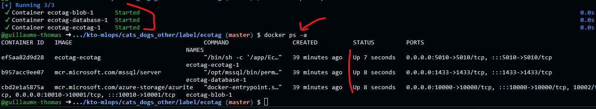

Notez que dans la partie basse de votre codespace, à côté de l'onglet **TERMINAL**, se trouve un onglet **PORTS** avec une
puce de notifications :

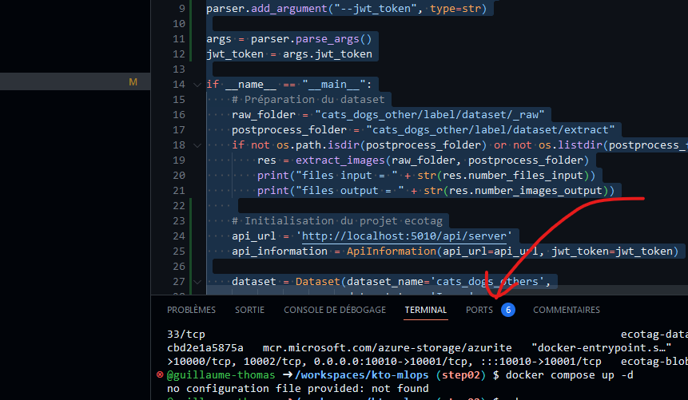

Cela signifie que vous avez des webservices qui tournent dans votre codespace et en l'occurence, normalement, ecotag.
Pour lancer l'application Web, cliquez sur PORTS et identifier dans la liste l'url qui écoute sur le port 5010. Faites un
clic droit sur cette ligne et sélectionner l'action contextuelle `Ouvrir dans un navigateur` : 

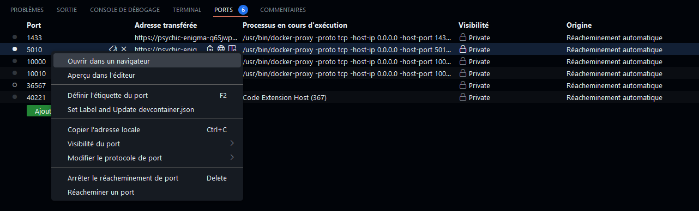

Vous arrivez sur une page de connection. C'est parce qu'ecotag est une application sécurisée (normal, nous travaillons avec
de la donnée). Utilisez les identifiants de test pour ce cours : bob / bob.

Et voilà ! Ecotag fonctionne ! Bravo ! Parcourons ensemble les différentes sections de cette application et allons
chercher notre jeton d'authentification pour créer notre projet avec `run.py`.

Pour le trouver, rendez-vous dans la page de gestion des datasets et cliquez sur le lien bleu : Jeton d'accès


Vous arrivez sur une page contenant le jeton, copiez le et enfin, collez le dans la commande suivante. Attention, vérifiez 
bien que vous vous trouvez à la racine du projet et non pas `label/ecotag` !!
```bash
cd /workspaces/kto-mlops/
python cats_dogs_other/label/run.py --jwt_token=collez_votre_jeton_ici
```
Puis, lancer l'initialisation du projet ecotag en exécutant cette commande ! C'est terminé, nous pouvons annoter ! Youpi !

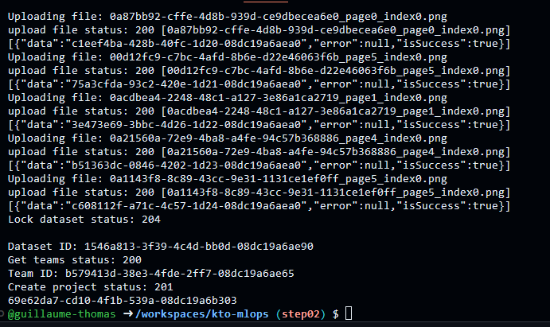

Notez que normalement, vous avez déjà ajouté à la main la dépendance aiohttp dans le module précédent. Si ce n'est pas le cas
et que vous avez l'erreur suivante : 

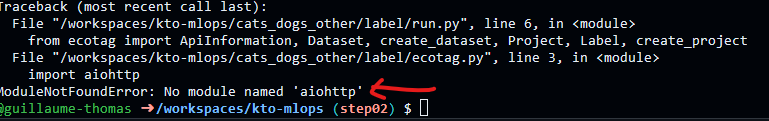

Faites l'installation de cette dépendance avec la commande
```bash
pip install aiohttp==3.9.1
```
OU MIEUX ! Ajoutez cette dépendance dans `label/requirements.txt` et relancez la commande d'installation de ce fichier !  

Désormais, rejouez votre commande précédente ;)

Désormais, vous devriez avoir ceci :


## Annotations des images

Il est maintenant temps d'annoter notre dataset ! Pour ce faire, rendez-vous sur la page d'accueil de votre ecotag et
allez dans le menu Projets. Vous devriez voir un projet cats_dogs_other dont le statut est En cours.

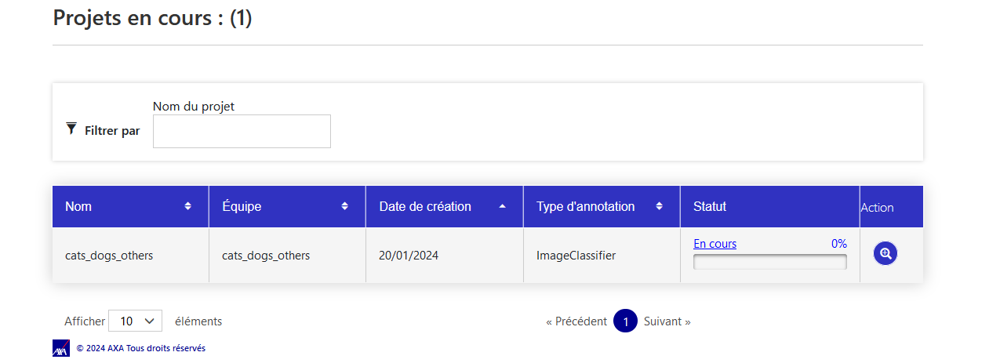

Comme vous pouvez le voir, vous avez le pourcentage de complétion de votre projet qui est indiqué. Il est ici à 0%.
Il s'agit d'un projet de type classification d'image. Faisons un détour par les menus Datasets et Equipes. Dataset d'abord :

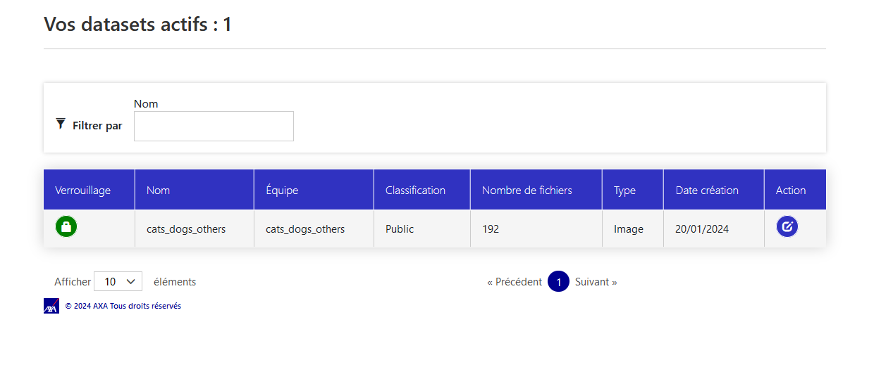

Nous constatons ici que le Dataset est Vérouillé. Cela veut dire que nous ne pouvons plus le modifier. C'est normal,
étant donné qu'un projet d'annotation a été créé, nous partons du principe que ce Dataset est en cours d'annotation.
Il ne doit donc pas changer ... Enfin, parlons de l'équipe : 

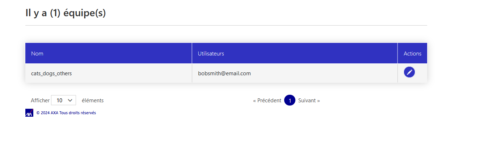

Cette équipe n'a qu'un seul utilisateur, vous, Bob ! Vous pouvez ajouter d'autres utilisateurs identifiés dans l'équipe.
Seuls les membres de cette équipe peuvent annoter dans notre projet.

Revenons donc sur notre projet en cliquant sur la loupe se trouvant dans la colonne actions : 


Nous arrivons sur cette page : 

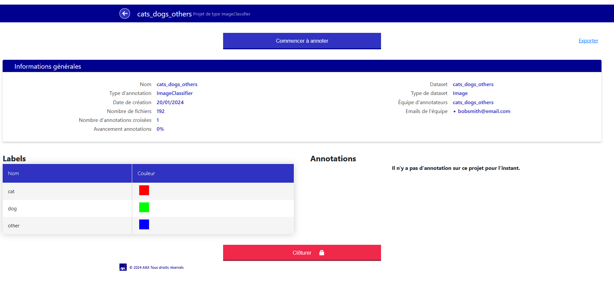

Nous retrouvons ici toutes les informations utiles à notre projet, dont un récapitulatif de nos labels (cat, dog, other),
les emails des annotateurs, l'avancement ect... Pour commencer à annoter, cliquez sur Commencer à annoter ;)

Les images peuvent paraître grosses. Vous disposez d'outil graphique pour revoir l'aspect de la page, dont la taille de l'image.
N'hésitez pas à l'ajuster à votre goût !

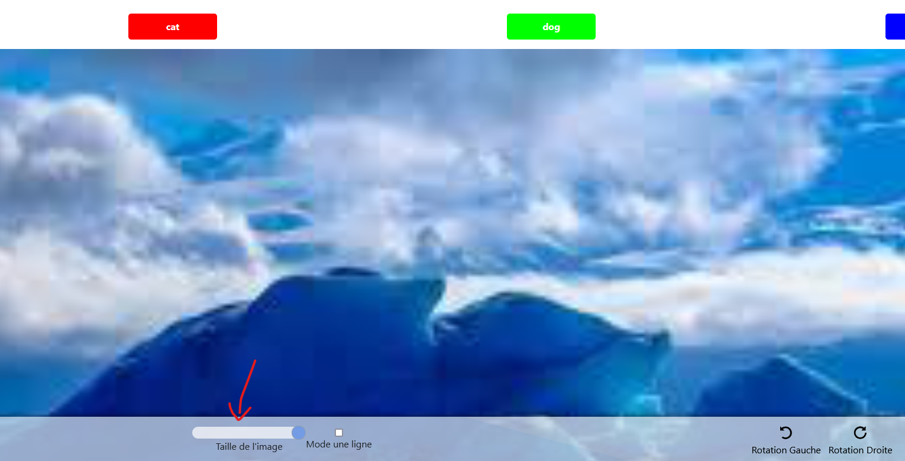

Pendant votre exercice d'annotation, vous devriez tomber sur quelques surprises ... Parlons-en rapidement !

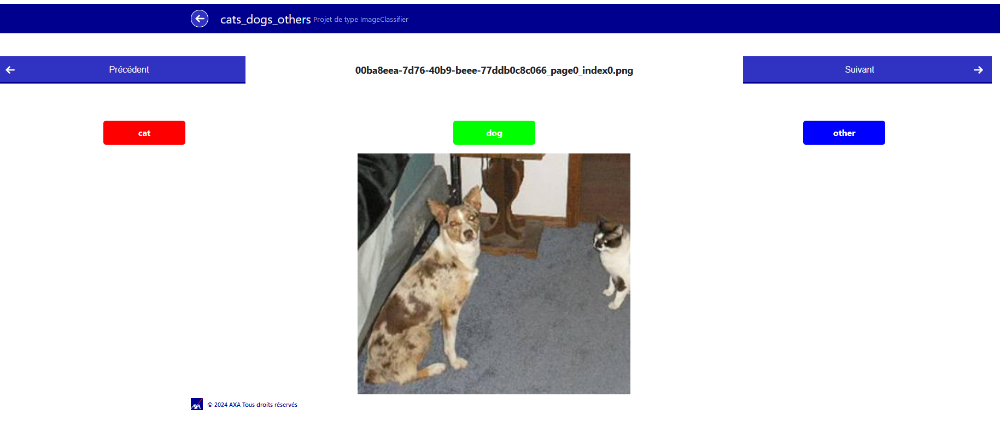

Une fois l'exercice d'annotation terminé (c'est l'affaire de quelques minutes), vous pouvez extraire vos annotations.
Cette extraction est précieuse et va servir de source de vérité pour notre modèle. Annotez sérieusement ! Voici la page
que vous aurez en fin d'exercice : 

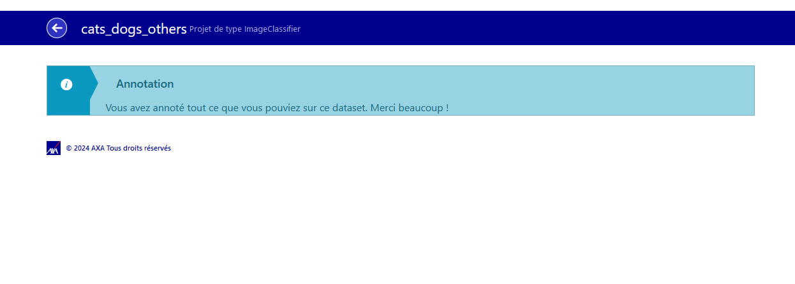

Cliquez sur la flèche en haut à gauche pour revenir à la page du projet, puis cliquez en haut à droite sur Exporter pour
récupérer votre export : 

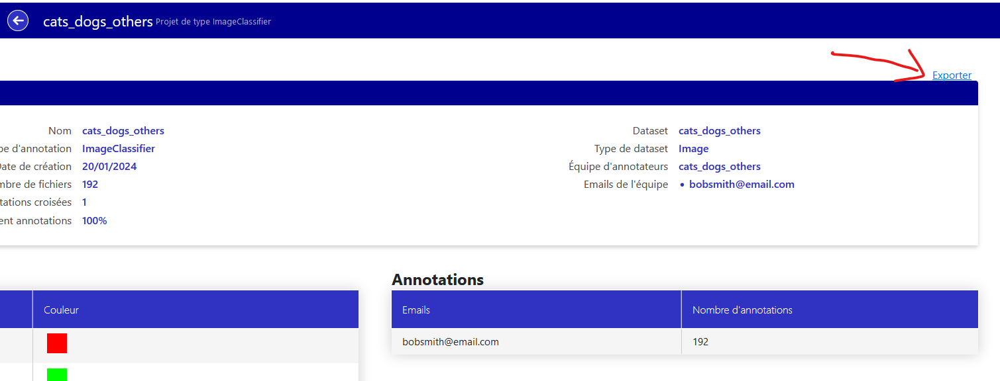

Copiez et collez dans le répertoire `label/dataset` le fichier téléchargé :

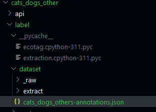

Prenons un peu de temps pour regarder à quoi ressemble ce fichier.

Vous pouvez maintenant éteindre ecotag avec les commandes suivantes :
```bash
cd cats_dogs_other/label/ecotag/
docker compose down -v
```

Sauvegardez votre travail en commitant et poussant vos modifications sur votre propre branche : 
```bash
cd /workspaces/kto-mlops
git status
git add .
git commit -m "feat: ce que vous voulez comme message"
git push origin votrenom/step01
```

N'oubliez pas, pousser ces informations sur votre repository git n'est pas souhaitable. Voyons désormais les alternatives
et l'intérêt de versionner nos données dans un outil dédié.

## Versioning de la donnée et stockage

### Pourquoi ?

Il est généralement déconseillé de pousser des datasets dans un repository Git pour les raisons suivantes :
- **Taille des fichiers** : Les fichiers de données peuvent être très volumineux, ce qui peut entraîner des problèmes 
de performance lors de la mise à jour du repository. De plus, cela peut augmenter considérablement la taille du 
repository, ce qui peut rendre le clonage et la synchronisation plus lents.
- **Historique des versions** : Les fichiers de données sont souvent mis à jour fréquemment, ce qui peut entraîner 
un historique de versions encombré et difficile à gérer. Cela peut également rendre difficile la comparaison des 
versions précédentes des fichiers de données.
- **Collaboration** : Les fichiers de données sont souvent partagés entre plusieurs personnes, ce qui peut entraîner 
des conflits lors d'un merge des modifications entre branches. De plus, il peut être difficile de gérer les 
autorisations d’accès aux fichiers de données.

Il est donc conseillé de passer par un système de stockage versionné et dédié pour les datasets de type fichier. Le
versioning est important, car votre donnée est vivante. Il faut que vous puissiez facilement retrouver la version
des données brutes avec laquelle vous avez entraîné votre modèle.

### Comment ?

Il existe plusieurs alternatives pour stocker les fichiers de données en dehors d’un repository Git, notamment :
- **Stockage de fichiers** : Les fichiers de données peuvent être stockés sur un système de fichiers partagé ou dans 
un service de stockage de fichiers cloud tel que Dropbox ou Google Drive. Cela permet de partager facilement les 
fichiers de données avec d’autres personnes et de les synchroniser automatiquement.
- **Bases de données** : Les fichiers de données peuvent être stockés dans une base de données, ce qui permet une 
gestion plus efficace des versions et une collaboration plus facile. Les bases de données peuvent également offrir 
des fonctionnalités telles que la recherche et la requête de données.
- **Services de stockage de données** : Il existe des services de stockage de données tels que Amazon S3 et 
Microsoft Azure Blob Storage qui sont conçus pour stocker des fichiers de données volumineux. Ces services offrent 
des fonctionnalités telles que la réplication de données, la sauvegarde et la restauration, ainsi que des options de 
sécurité avancées.

Pour faciliter également la gestion de ces fichiers, vous pouvez utiliser [Data Version Control, ou DVC](https://dvc.org/).

DVC est un outil open source qui permet de gérer et de versionner des fichiers de données. Contrairement à Git, 
DVC est conçu spécifiquement pour les fichiers de données volumineux et peut être utilisé en conjonction 
avec Git pour gérer les versions de code et de données. Ses avantages sont :
- **Taille des fichiers** : DVC utilise des liens symboliques pour stocker les fichiers de données, ce qui permet de 
gérer efficacement les fichiers volumineux sans les stocker directement dans le repository. Cela permet de réduire 
considérablement la taille du repository et d’améliorer les performances.
- **Historique des versions** : DVC stocke les fichiers de données dans un système de fichiers séparé, ce qui permet 
de gérer efficacement l’historique des versions des fichiers de données sans encombrer l’historique de versions de Git.
- **Collaboration** : DVC permet de partager facilement les fichiers de données avec d’autres personnes et de gérer 
les autorisations d’accès aux fichiers de données.

Pour simplifier ce cours, nous n'allons pas utiliser DVC, mais plutôt un service de stockage de données compris dans notre
solution de plateforme ML dédiée : [kto-mlflow](#installation-de-kto-mlflow-et-présentation-de-minio-et-dailyclean). 
Ce ne sera pas le plus idéal et peut-être trop manuel, mais cela fonctionnera pour l'exemple ;-)

### Installation de kto-mlflow et présentation de minio et DailyClean

**kto-mlflow** est une plateforme ML sur le Cloud de dernière génération développée spécifiquement pour ce cours. Nous
reviendrons dessus plus tard dans la partie qui lui est [consacrée](./06_ml_platforms.md).

Pour l'heure, et parce qu'elle contient un service de stockage de fichiers, nous allons installer préalablement 
cette plateforme dans notre Red Hat Developer Sandbox.

En voici la procédure : 
- Connectez-vous à votre compte [Red Hat Developer](https://developers.redhat.com/)
- Ouvrez votre [Sandbox](https://console.redhat.com/openshift/sandbox) et lancez votre 

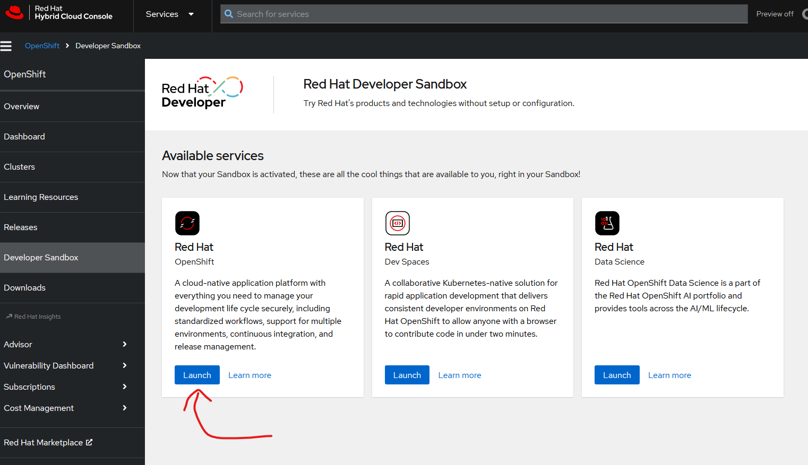

- Une fois sur votre Dashboard d'accueil OpenShift, ouvrez votre Web Terminal

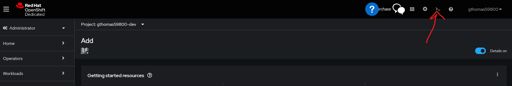

- Désormais, installez notre solution avec les commandes suivantes. Copiez ces lignes et faites un clic droit -> coller dans le Web Terminal
```bash
git clone https://github.com/guillaume-thomas/kto-mlflow
cd kto-mlflow/k8s
oc apply -f minio.yml
oc apply -f mysql.yml
oc apply -f mlflow.yml
oc apply -f dailyclean.yml
oc label deployment dailyclean-api axa.com/dailyclean=false
oc label statefulset mysql axa.com/dailyclean=true
cd ../..
rm -rf kto-mlflow

```

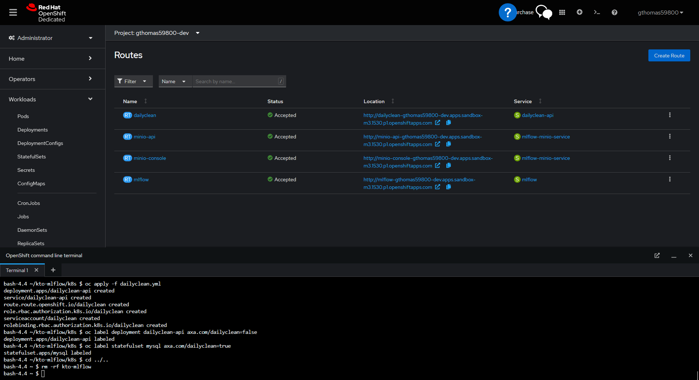

Attention, la dernière ligne ne sera pas forcément lancée, faites Entrée dans le doute.

Nous utiliserons minio comme service de stockage de fichier. Soyez un bon citoyen ou une bonne citoyenne du Cloud,
utilisez DailClean (compris dans cette solution), pour éteindre kto-mlflow quand vous ne vous en servez plus. Pas de
panique, votre travail sera sauvegardé malgré l'extinction.

### Procédure de sauvegarde

Pour sauvegarder nos données, nous devons déjà les télécharger depuis Codespaces sur notre machine locale.
- Rendez-vous d'abord sur votre fork Github et sélectionnez la branche dans laquelle vous aviez sauvegardé vos 
annotations dans la liste déroulante en haut à gauche.
- Cliquez sur le bouton vert <>Code, sélectionnez Local puis Download ZIP

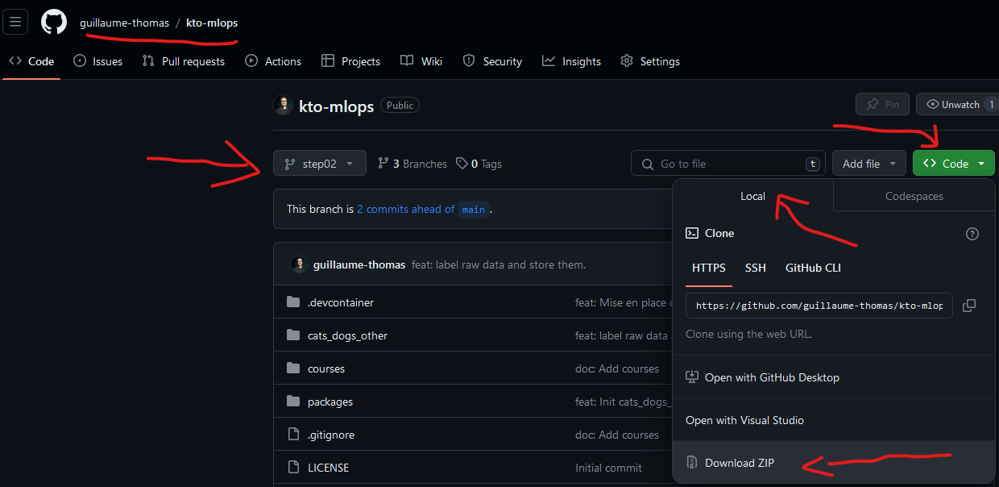

- Dézippez ce fichier sur votre machine

Maintenant, sauvegardez ces fichiers sur le minio de kto-mlflow. Pour cela :
- Cliquez sur Networking -> Routes sur le menu à gauche de votre OpenShift
- Dans la liste des routes, identifiez la ligne minio-console et cliquez sur le lien de la colonne Location
- En fonction de votre navigateur, il est possible que votre url ouverte dans votre onglet commence 
par `https://` au lieu d'`http://` (notamment dans Chrome). Cela empêche la console de s'ouvrir correctement ... retirez le `s`
- Vous arrivez sur la fenêtre de connection. Saisissez le login `minio` et le mot de passe `minio123`

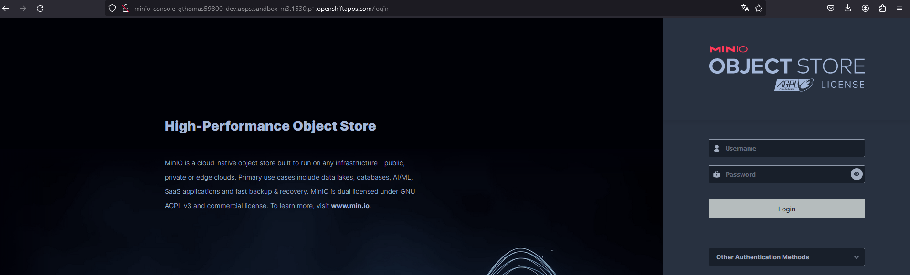

- Vous êtes automatiquement sur le navigateur d'objets
- Dans le menu à gauche, cliquez sur Administrator -> Buckets


- En haut à droite, cliquez sur Create Bucket +


- Dans Bucket Name, saisissez le nom : `cats-dogs-other`. Attention les underscores ne sont pas autorisés !!
- Vous pouvez mettre Versioning à On si vous le souhaitez (nous n'allons pas nous en servir dans ce projet) 
- Cliquez sur Create Bucket

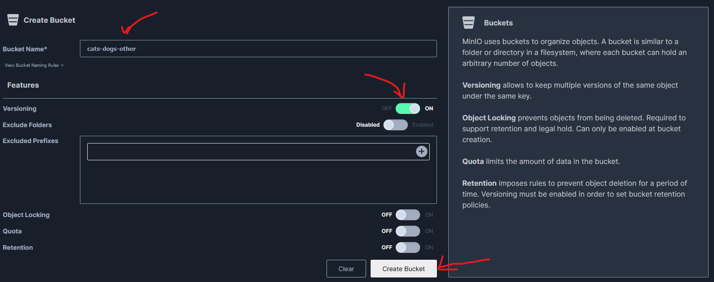

- Retournez dans l'Object Browser

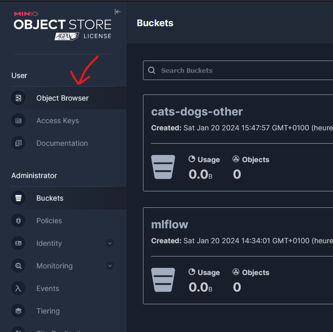

- Sélectionnez cats-dogs-other

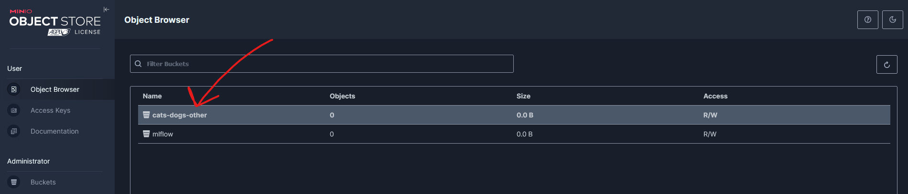

- En haut à droite, cliquez sur Upload puis Upload folder

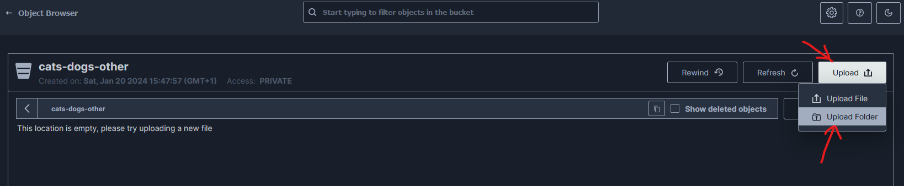

- Sélectionnez votre répertoire dataset puis cliquez sur Envoyer

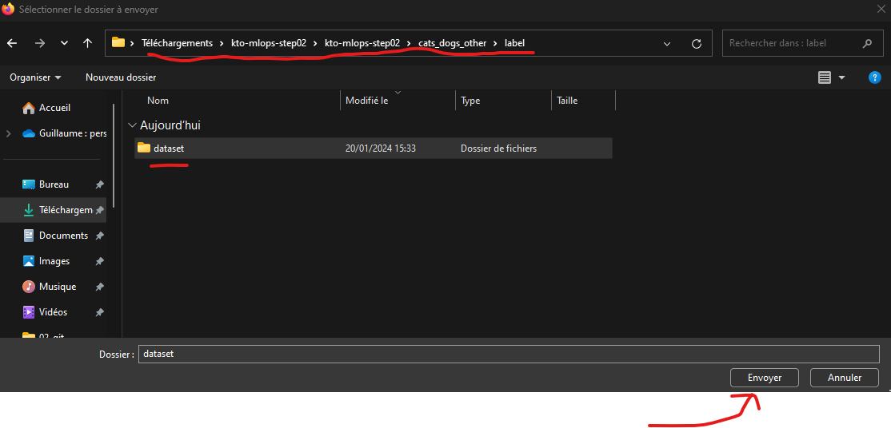

- Confirmez l'envoie dans l'infobulle qui apparaît puis patientez quelques secondes
- Votre dataset est maintenant sauvegardé !!

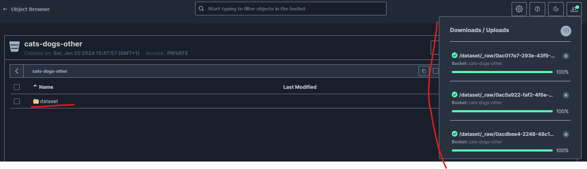

- Ouvrez Dailyclean (attention avec cette histoire de https au lien d'http)

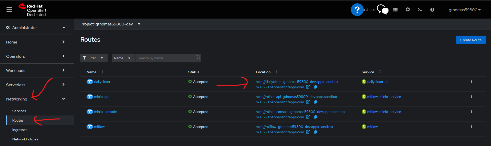

- Eteignez kto-mlflow avec Dailclean

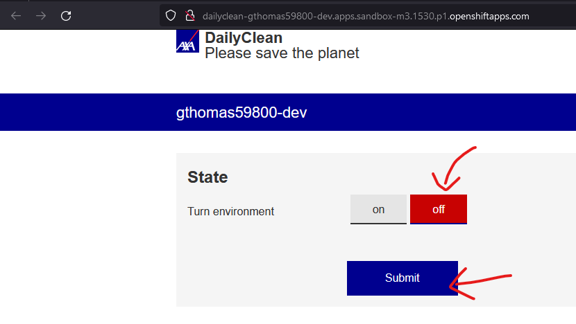

- Supprimez les fichiers et le zip téléchargé. Il est certainement interdit de garder de la donnée confidentielle sur votre
machine !!
- **Communiquez par mail votre branche où vous avez sauvegardé vos données, mais aussi les liens vers votre Dailyclean et
minio console (évaluation)**

Etant donné que l'espace de stockage va disparaître au bout des 30 jours d'activation de la Sandbox, nous allons donc malgré
tout garder une trace de notre dataset et de nos annotations dans notre repo Git. **Ce N'EST PAS une bonne pratique**, mais 
nous devrons faire une exception à cause de ces limitations (que nous ne remettrons pas en cause, elles sont parfaitement 
justifiées).

Cette partie est terminée ! Bravo !