# 5. Train dans un notebook 

Dans cette petite partie, nous allons mettre en place l'entraînement de notre modèle dans un notebook et discuterons 
de sa pertinence.

Avant de commencer, afin que tout le monde parte du même point, vérifiez que vous n'avez aucune modification en 
cours sur votre working directory avec `git status`.
Si c'est le cas, vérifiez que vous avez bien sauvegardé votre travail lors de l'étape précédente pour ne pas perdre 
votre travail.
Sollicitez le professeur, car il est possible que votre contrôle continue en soit affecté. 

Sinon, annulez toutes vos modifications avec `git reset --hard HEAD`. Supprimez potentiellement les fichiers
non indexés.
Changez maintenant de branche avec `git switch step02`.
Créez désormais une branche avec votre nom : `git switch -c votrenom/step02`

## Installation et présentation de JupyterLab

JupyterLab est une interface web graphique pour l'environnement de développement de Jupyter, 
une application open-source permettant de créer et partager des documents interactifs (notebook) qui contiennent du
code et du texte. JupyterLab est compatible avec tous les langages de programmation de 
Jupyter, notamment Python, R, Julia et bien d'autres encore.

Avec JupyterLab, il est facile de créer des documents interactifs pour le ML, le traitement, la visualisation et la
modélisation de données.

Pour l'installer dans votre Codespaces, utilisez la commande suivante dans votre Terminal : 

```bash
pip install jupyterlab
```

Pour lancer JupyterLab, utilisez la commande suivante : 
```bash
jupyter lab
```

Il n'est pas impossible que le terminal "boggue" sur votre Codespace. Pour débloquer la situation, voici comment faire : 
- Constatez le problème

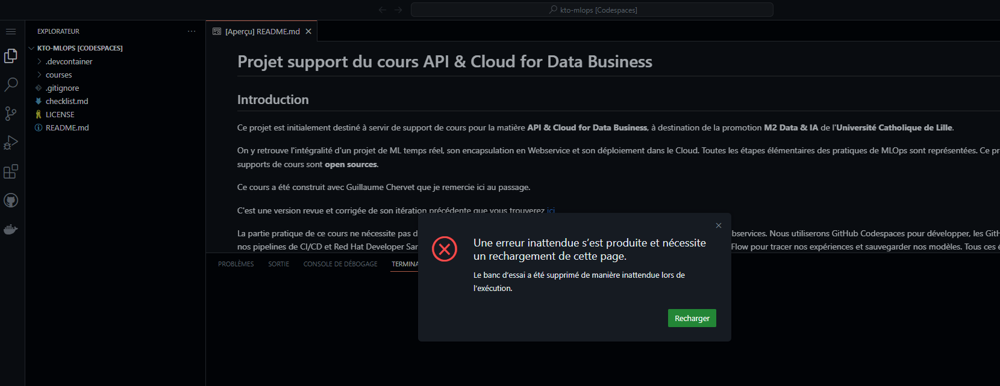

- Cliquez sur Recharger cela va redémarrer Codespaces
- Constatez que cela fonctionne

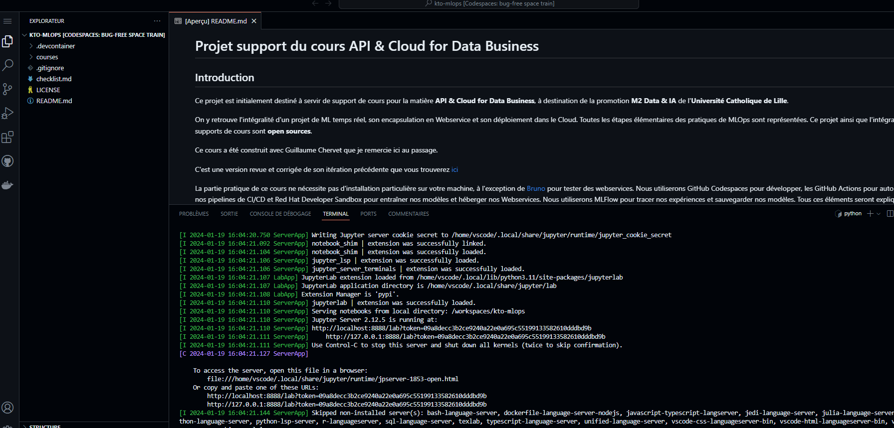

Maintenant, ouvrez votre JupyterLab :
- CTRL+clic sur le lien indiqué dans la console : 
```
Or copy and paste one of these URLs:
        http://localhost:8888/lab?token=blabla
        http://127.0.0.1:8888/lab?token=blabla
```
- Cela ouvre la page d'authentification
- Copiez et collez le jeton présent dans les URLs ci-dessus, après `token=`, ici : blabla, dans le champ Password or token

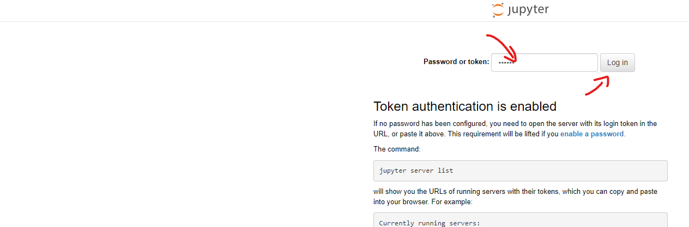

- Cliquez sur Log in
- C'est prêt !

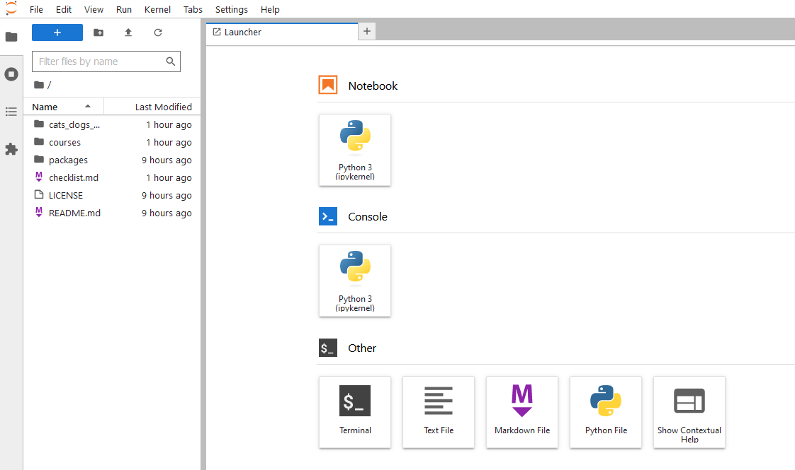

## Training de notre modèle dans un Notebook

Commençons maintenant à expérimenter l'entrainement d'un modèle à partir d'un nouveau notebook. Créons le répertoire
``/cats_dogs_other/train``. Il faut pour cela naviguer dans l'explorateur à gauche et cliquer sur le boutono suivant :

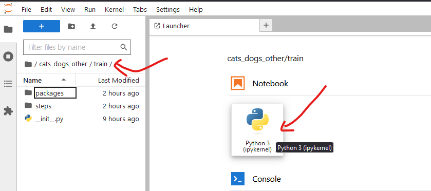

Renommez le `train.ipynb` au lieu de Untitled. Pour cela, faites un clic droit et sélectionnez Rename :

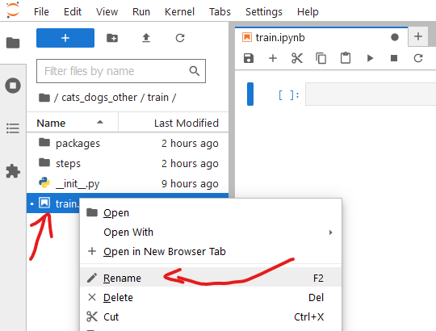

Désormais, vous êtes prêt.e à expérimenter ! 

Avant toute chose, démarrez minio seulement dans kto-mlflow. Vous n'êtes pas obligé de tout démarrer avec Dailyclean :
- Connectez-vous sur votre OpenShift 
- Rendez-vous dans Workloads -> Deployments 
- Sélectionnez minio

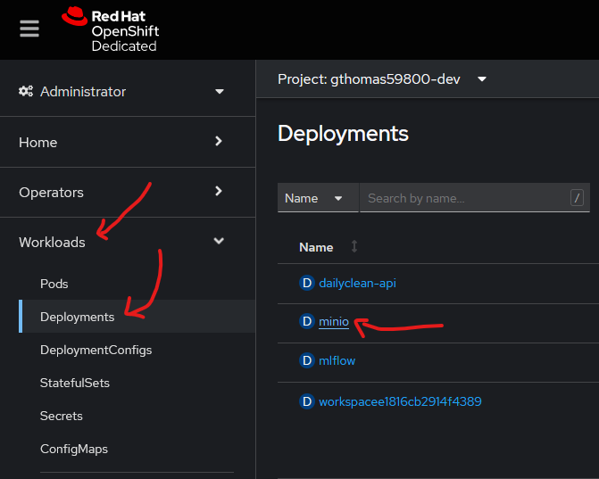

- Cliquez sur la petite flèche qui va vers le haut, à droite du cercle

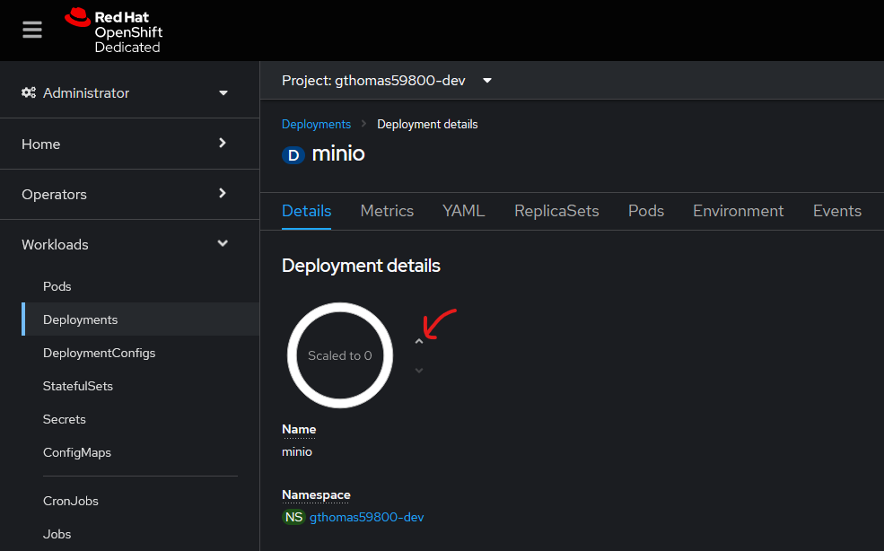

- Copiez / collez l'url vers l'API de minio en vous rendant sur Networking -> Routes, trouvez la ligne minio-api et cliquez
sur le logo Copier à droite de l'url dans la colonne Location et mettez là de côté (dans voter notebook, si ça vous chante).

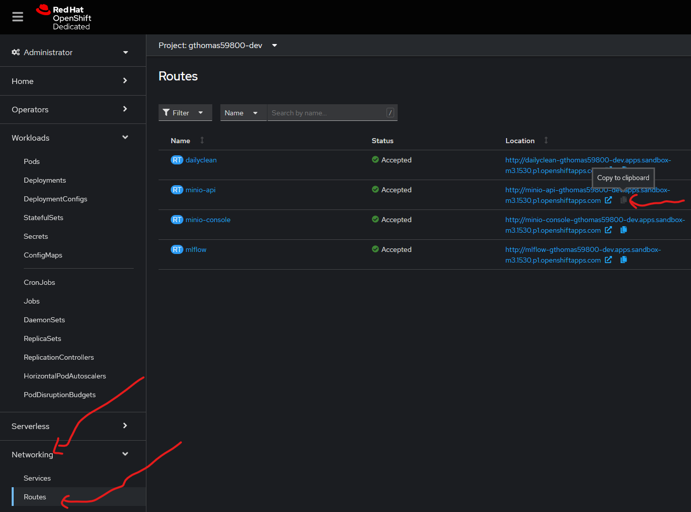

Nous allons d'abord commencer par structurer un peu notre pensée. Normalement, un notebook peut servir à expérimenter
des boûts de code sans structure particulière. Pour les besoins de la clarté de ce cours, nous allons tout de même cadrer un
peu les choses.

Nous allons diviser notre notebook en 5 parties distinctes. 
- Donc commençons par créer 5 cellules dans notre notebook avec le bouton `+` en haut à gauche 


- Nous pouvons changer le type de contenu de nos cellules. Par défaut, il s'agit de code. Mais nous pouvons également 
y mettre du Markdown. Changeons donc le type de nos 5 cellulle en Markdown avec la liste déroulante en haut à droite

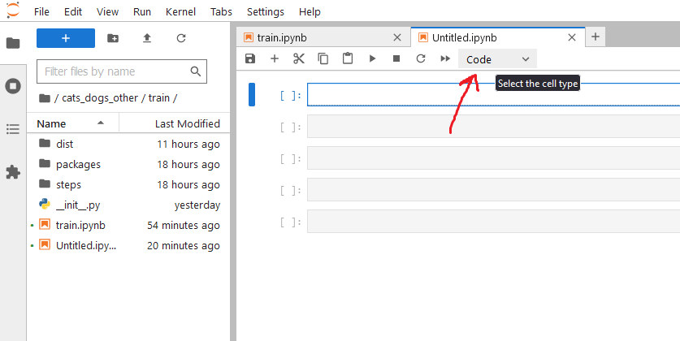

- Mettons maintenant dans chaque cellule, les 5 titres suivants :
```markdown
# Create s3 client in order to download and upload data from minio
# Extract labels from annotations file
# Random split train / evaluate / test
# Train & evaluate ML model
# Test the final model
```
- Maintenant, créez une cellule en dessous de chaque titre que nous venons de créer avec le bouton suivant : 

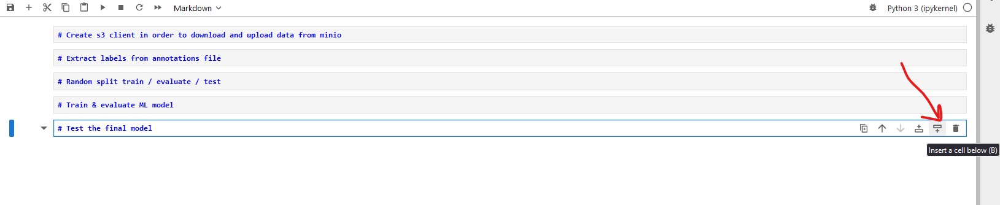

- Pour avoir une belle mise en forme, exécutez chacune des cellules titre avec ce bouton :

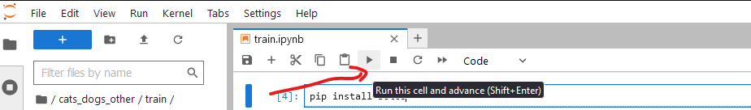

- Vous devriez maintenant avoir quelque chose qui ressemble à ça : 


Comme vous pouvez le voir dans l'illustration ci-dessus, vous pouvez ouvrir et fermer chaque partie avec la flèche à gauche
de votre cellule titre. C'est très pratique pour y voir plus clair pendant vos expérimentations ! Maintenant, développons
chaque partie.

### Connection à S3

- Dans la première cellule de votre notebook, mettez cette ligne, cela installera un client permettant de télécharger les
  fichiers stockés dans minio :
```bash
pip install boto3
```
- Lancez cette cellule à partir de ce bouton :


- Le retour de la console indique qu'il faut redémarrer le kernel pour prendre les installations en compte.

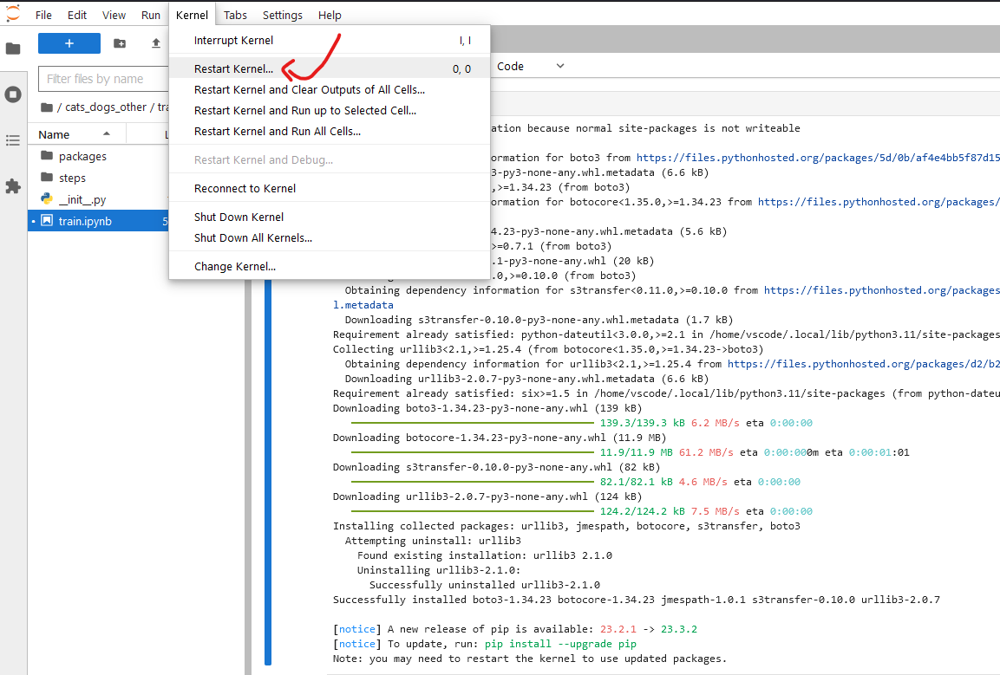

- Maintenant, créez une nouvelle cellule et insérez le code ci-dessous : 
```python
import boto3

s3_client = boto3.client(
    "s3",
    endpoint_url="http://minio-api-blabla-dev.apps.sandbox-m3.666.p1.openshiftapps.com",
    aws_access_key_id="minio",
    aws_secret_access_key="minio123"
)
```
- **Prenez bien garde à bien mettre le lien vers votre API minio à vous**
- Exécutez ce code

Discutons de ce code ensemble puis exécutez cette cellule. Vous disposez maintenant d'une variable s3_client qui dispose
d'une connection vers votre minio (minio est compatible S3 dont voici 
un [lien Wikipédia](https://fr.wikipedia.org/wiki/Amazon_S3) si vous voulez en savoir plus). Nous sommes donc maintenant
en mesure de télécharger des fichiers se trouvant dans minio.

Cette partie de votre notebook, sans les logs d'exécutions, doit ressembler à ceci :

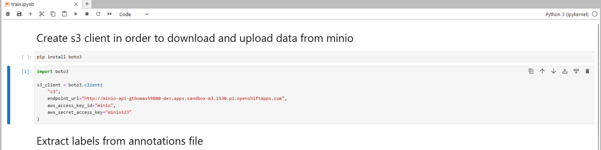

### Extraction des annotations

Dans cette partie, nous allons télécharger notre fichier des annotations produit avec ecotag et que nous avons chargé dans
minio. Puis, nous allons extraire les informations qui s'y trouvent dans un `dict` et un `set`. Dans le dictionnaire,
nous mettrons en clé le nom du fichier et en valeur, la classe de ce fichier. Dans le set, nous mettrons l'ensemble des 
classes rencontrées. Donc normalement, en fin d'exécution, nous devrions avec dans ce set les valeurs `cat`, `dog` et `other`.

- Dans la première cellule de cette partie, nous allons définir une fonction qui fait ce qui est indiqué ci-dessus : 
```python
import json
from pathlib import Path
from typing import Any

def extraction_from_annotation_file(bucket_name: str, s3_path: str, filename: str, s3_client) -> tuple[dict[Any, Any], set[Any]]:
    Path(filename).parent.mkdir(parents=True, exist_ok=True)
    s3_client.download_file(bucket_name, s3_path, filename)

    extract = {}
    classes = set()
    with open(filename) as file:
        annotations = json.load(file)["annotations"]
        for annotation in annotations:
            label = annotation["annotation"]["label"]
            extract[annotation["fileName"]] = label
            classes.add(label)
    return extract, classes
```
- Parlons de ce code ensemble et exécutez le
- Créez une nouvelle cellule en dessous pour exécuter cette fonction :
```python
working_dir = "./dist"
bucket_name = "cats-dogs-other"
extract, classes = extraction_from_annotation_file(bucket_name, 
                                                    "dataset/cats_dogs_others-annotations.json",
                                                    working_dir + "/cats_dogs_others-annotations.json",
                                                    s3_client)
```
- Exécutez ce code

Comme vous pouvez le voir, nous créons dans notre environnement de travail des répertoires de destination pour les fichiers
téléchargés et même pour plus tard, les fichiers créés. Ce "répertoire de travail", `dist` sera créé à la racine du notebook,
donc dans le répertoire train. Notez que tous les répertoires dist se trouvant dans notre projet serons ignorés par git, car
présents dans le fichier .gitignore à la racine de notre projet.

Votre notebook devrait ressembler à ceci pour cette partie :

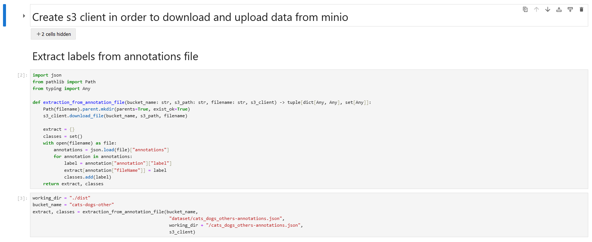

Si vous vous rendez dans le répertoire dist nouvellement créé, vous devriez retrouver notre fichier d'annotations.

Pour tester que tout a bien fonctionné, vous pouvez créer une nouvelle cellule et regarder les valeurs stockées dans les
variables `extract` et `classes`. Passons maintenant au split de notre donnée.

### Split de la donnée

Le but de cette partie est de diviser notre dataset en trois parties. Chaque partie est dédiée :
- à l'entraînement de notre modèle
- à l'évaluation de notre modèle
- au test de notre modèle final

Pour ce faire, nous allons partager aléatoirement le dictionnaire contenant les noms de nos fichiers et leurs classes
associées, à partir de trois ratios paramétrables. Ce partage donnera lieu à trois dictionnaires : un pour le train, un
pour l'évaluation et un pour le test. Et pour chaque dictionnaire, nous allons télécharger les fichiers et les positionner
dans des répertoires spécifiques : Trois répertoires train, evaluate, test et tous les trois subdivisés en trois classes : 
cat, dog et other. Ces répertoires seront créés dans le répertoire de travail dist créé dans l'étape précédente.

Pour ce faire :
- Dans la permière cellule, crééz trois variables contenant les chemins des répertoires train, evaluate et test :
```python
train_dir = working_dir + "/train"
evaluate_dir = working_dir + "/evaluate"
test_dir = working_dir + "/test"
```
- N'oubliez pas d'exécuter le code à chaque fois 
- Dans une nouvelle cellule, définissez ces deux fonctions : 
```python
import random
from pathlib import Path

def random_split_train_evaluate_test_from_extraction(extract: dict,
                                                     classes: set,
                                                     split_ratio_train: float,
                                                     split_ratio_evaluate: float,
                                                     split_ratio_test: float,
                                                     train_dir: str,
                                                     evaluate_dir: str,
                                                     test_dir: str,
                                                     bucket_name: str,
                                                     s3_path: str,
                                                     s3_client):

    if split_ratio_train + split_ratio_evaluate + split_ratio_test != 1:
        raise Exception("sum of ratio must be equal to 1")

    keys_list = list(extract.keys())  # shuffle() wants a list
    random.shuffle(keys_list)  # randomize the order of the keys

    nkeys_train = int(split_ratio_train * len(keys_list))  # how many keys does split ratio train% equal
    keys_train = keys_list[:nkeys_train]
    keys_evaluate_and_test = keys_list[nkeys_train:]

    split_ratio_evaluate_and_test = split_ratio_evaluate + split_ratio_test
    nkeys_evaluate = int((split_ratio_evaluate / split_ratio_evaluate_and_test) * len(keys_evaluate_and_test))
    keys_evaluate = keys_evaluate_and_test[:nkeys_evaluate]
    keys_test = keys_evaluate_and_test[nkeys_evaluate:]

    extract_train = {k: extract[k] for k in keys_train}
    extract_evaluate = {k: extract[k] for k in keys_evaluate}
    extract_test = {k: extract[k] for k in keys_test}

    # create directories
    for existing_class in classes:
        Path(train_dir + "/" + existing_class).mkdir(parents=True, exist_ok=True)
        Path(evaluate_dir + "/" + existing_class).mkdir(parents=True, exist_ok=True)
        Path(test_dir + "/" + existing_class).mkdir(parents=True, exist_ok=True)

    # add files in directories
    download_files(extract_train, train_dir, bucket_name, s3_path, s3_client)
    download_files(extract_evaluate, evaluate_dir, bucket_name, s3_path, s3_client)
    download_files(extract_test, test_dir, bucket_name, s3_path, s3_client)


def download_files(extract: dict, directory: str, bucket_name: str, s3_path: str, s3_client):
    for key, value in extract.items():
        s3_client.download_file(bucket_name, s3_path + key, directory + "/" + value + "/" + key)
```
- Discutons rapidement du code ensemble
- Définissons désormais trois ratios dans des variables et exécutons la fonction `random_split_train_evaluate_test_from_extraction`
```python
split_ratio_train = 0.8
split_ratio_evaluate = 0.1
split_ratio_test = 0.1

random_split_train_evaluate_test_from_extraction(extract, classes, split_ratio_train,
                                                 split_ratio_evaluate, split_ratio_test,
                                                 train_dir, evaluate_dir, test_dir, bucket_name,
                                                 "dataset/extract/", s3_client)
```

Votre partie devrait ressembler à ceci dans votre notebook :


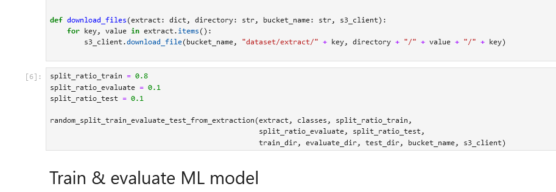

Si vous allez dans dist, vous devriez retrouver vos fichiers ordonnés comme vu dans la consigne en début de cette partie.
Passons maintenant à la création de notre modèle.

### Entrainement et évaluation de notre modèle

Pour entraîner notre modèle, nous allons utiliser tensorflow. Dans la première cellule de cette partie,
mettez ce code pour installer les librairies utiles :

```bash
pip install tensorflow matplotlib scipy
```

Dans une seconde cellule, nous allons créer les variables suivantes : 
```python
model_filename = "final_model.keras"
model_plot_filename = "model_plot.png"
batch_size = 64 
epochs = 4

# train & evaluate
model_dir = working_dir + "/model"
model_path = model_dir + "/" + model_filename
plot_filepath = model_dir + "/" + model_plot_filename
```

Créons maintenant les fonctions utiles à l'entraînement, l'évaluation et la création de graphiques pour notre modèle :
```python
from pathlib import Path

from keras import Model
from keras.src.applications.vgg16 import VGG16
from keras.src.callbacks import History
from keras.src.layers import Dropout, Flatten, Dense
from keras.src.losses import SparseCategoricalCrossentropy
from tensorflow.keras.preprocessing.image import ImageDataGenerator
from matplotlib import pyplot

def train_and_evaluate_model(train_dir: str,
                             evaluate_dir: str,
                             test_dir: str,
                             model_dir: str,
                             model_path: str,
                             plot_filepath: str,
                             batch_size: int,
                             epochs: int):
    model = define_model()

    # create data generator
    datagen = ImageDataGenerator(featurewise_center=True)
    # specify imagenet mean values for centering
    datagen.mean = [123.68, 116.779, 103.939]
    # prepare iterator
    train_it = datagen.flow_from_directory(
        train_dir,
        class_mode="binary",
        batch_size=batch_size,
        target_size=(224, 224)
    )
    validation_it = datagen.flow_from_directory(
        evaluate_dir,
        class_mode="binary",
        batch_size=batch_size,
        target_size=(224, 224)
    )
    # fit model
    history = model.fit(
        train_it,
        steps_per_epoch=len(train_it),
        validation_data=validation_it,
        validation_steps=len(validation_it),
        epochs=epochs,
        verbose=1,
    )
    # test model
    evaluate_it = datagen.flow_from_directory(
        test_dir,
        class_mode="binary",
        batch_size=batch_size,
        target_size=(224, 224)
    )
    _, acc = model.evaluate(evaluate_it, steps=len(evaluate_it), verbose=1)
    evaluate_accuracy_percentage = acc * 100.0
    print("> %.3f" % evaluate_accuracy_percentage)

    Path(model_dir).mkdir(parents=True, exist_ok=True)

    create_history_plots(history, plot_filepath)

    model.save(model_path)

def define_model() -> Model:
    model = VGG16(include_top=False, input_shape=(224, 224, 3))
    # mark loaded layers as not trainable
    for layer in model.layers:
        layer.trainable = False
    # add new classifier layers
    output = model.layers[-1].output
    drop1 = Dropout(0.2)(output)
    flat1 = Flatten()(drop1)
    class1 = Dense(64, activation="relu", kernel_initializer="he_uniform")(flat1)
    output = Dense(3, activation="sigmoid")(class1)
    # define new model
    model = Model(inputs=model.inputs, outputs=output)
    # compile model
    model.compile(optimizer='adam',
                  loss=SparseCategoricalCrossentropy(from_logits=True),
                  metrics=['accuracy'])
    return model


def create_history_plots(history: History, plot_filepath: str):
    # plot loss
    pyplot.subplot(211)
    pyplot.title("Cross Entropy Loss")
    pyplot.plot(history.history["loss"], color="blue", label="train")
    pyplot.plot(history.history["val_loss"], color="orange", label="test")
    # plot accuracy
    pyplot.subplot(212)
    pyplot.title("Classification Accuracy")
    pyplot.plot(history.history["accuracy"], color="blue", label="train")
    pyplot.plot(history.history["val_accuracy"], color="orange", label="test")
    # save plot to file
    pyplot.savefig(plot_filepath)
    pyplot.close()

```

Enfin, exécutons le train avec la cellule suivante : 
```python
train_and_evaluate_model(train_dir, evaluate_dir, test_dir, model_dir, model_path,
                         plot_filepath, batch_size, epochs)
```

Attention son exécution devrait prendre un certain temps. Votre notebook devrait ressembler à ceci : 

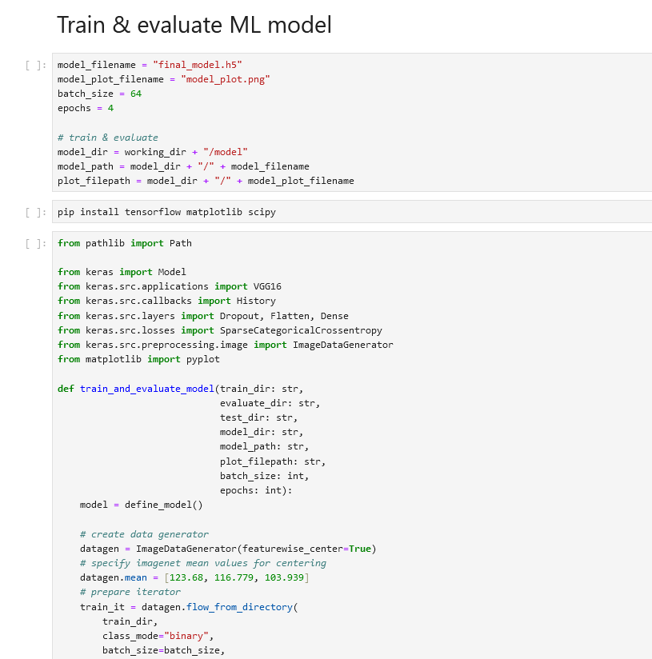
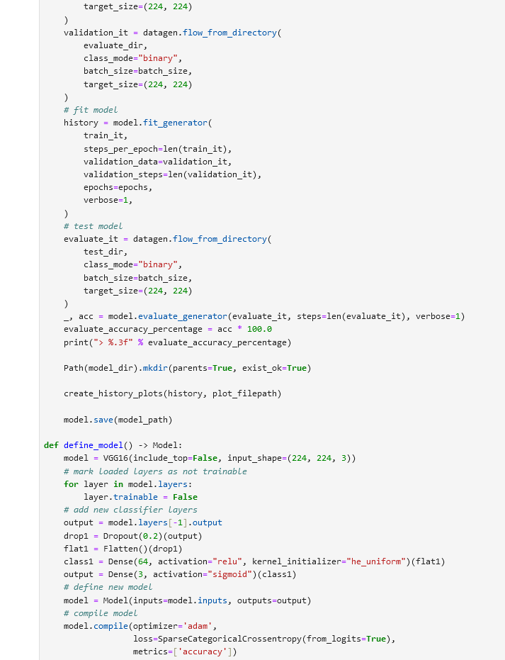
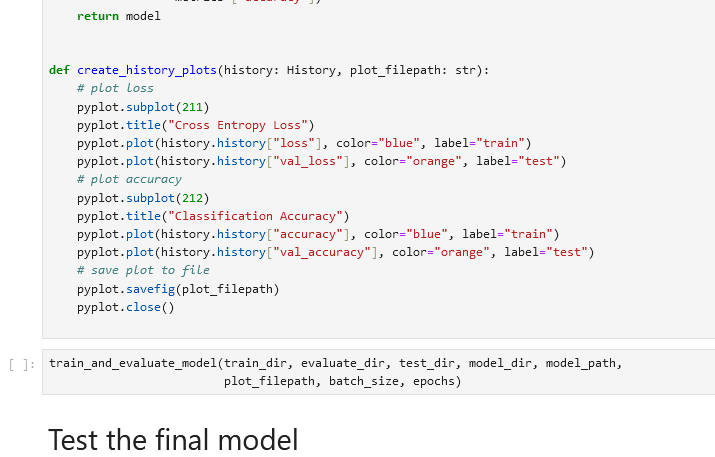

### Test du modèle

Dernière étape, le test du modèle. Dans un premier temps, nous mettrons en place un bout de code permettant d'inférer
sur notre modèle nouvellement créé. Puis nous ferons des prédictions à partir des images dans test et en tirerons des
statistiques simples.

- Dans notre première cellule, notre code de chargement de notre modèle et les prédictions sur des images données 
en paramètres
```python
from io import BytesIO

import numpy as np
from tensorflow.keras.preprocessing.image import load_img, img_to_array
from keras.models import load_model
from pathlib import Path


# load and prepare the image
def load_image(filename: str|BytesIO):
    # load the image
    img = load_img(filename, target_size=(224, 224))
    # convert to array
    img = img_to_array(img)
    # reshape into a single sample with 3 channels
    img = img.reshape(1, 224, 224, 3)
    # center pixel data
    img = img.astype('float32')
    img = img - [123.68, 116.779, 103.939]
    return img

class Inference:
    def __init__(self, model_path: str):
        self.model = load_model(model_path)

    def execute(self, filepath:str|BytesIO):
        img = load_image(filepath)
        result = self.model.predict(img)
        values = [float(result[0][0]), float(result[0][1]), float(result[0][2])]
        switcher = ['Cat', 'Dog', 'Other']
        prediction = np.argmax(result[0])
        return {"prediction": switcher[prediction], "values": values}

```
- Commentons rapidement ce code
- Dans une autre cellule, définissons une fonction de test utilisant le code d'inférence ci-dessus et permettant de comparer
l'attendu avec ce qui est prédit par notre modèle 
```python
import json
from pathlib import Path

def test_model(model_inference: Inference, model_dir: str, test_dir: str):
    statistics = {"ok": 0, "ko": 0, "total": 0}
    results = []
    path_test_dir = Path(test_dir)
    for path in path_test_dir.glob("**/*"):
        if path.is_dir():
            continue
        model_result = model_inference.execute(str(path))

        prediction = model_result["prediction"]
        prediction_truth = path.parent.name.lower().replace("s", "")
        status = prediction_truth == prediction.lower()
        statistics["ok" if status else "ko"] += 1
        result = {
            "filename": path.name,
            "ok": status,
            "prediction": prediction,
            "prediction_truth": prediction_truth,
            "values": model_result["values"],
        }
        results.append(result)
    statistics["total"] = statistics["ok"] + statistics["ko"]

    with open(model_dir + "/statistics.json", "w") as file_stream:
        json.dump(statistics, file_stream, indent=4)

    with open(model_dir + "/predictions.json", "w") as file_stream:
        json.dump(results, file_stream, indent=4)

```
- Discutons sur code
- Enfin, lançons notre test 

```python
# test the model
model_inference = Inference(model_path)

test_model(model_inference, model_dir, test_dir)
```

Votre code devrait ressembler à ceci : 

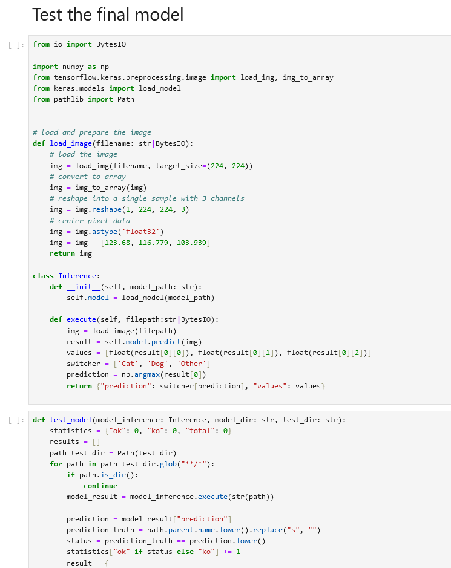
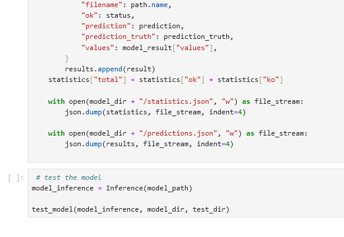

Vous pouvez maintenant constater de la performance de votre modèle avec les graphiques dans dist !

Et voilà ! Vous avez entraîné votre première IA avec Jupyter. **Veuillez télécharger votre notebook (clic droit sur son nom) 
et faites le parvenir par mail à votre professeur (évaluation).**

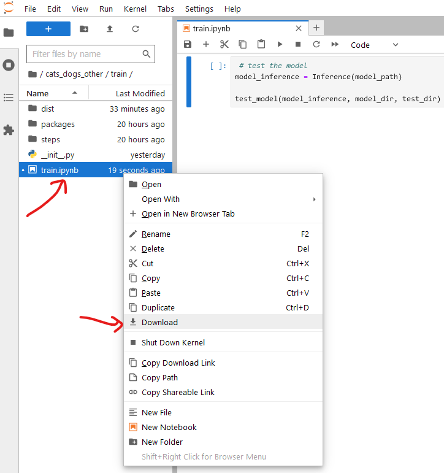


Vous pouvez maintenant éteindre JupyterLab en faisant CTRL+C dans le Terminal de votre Codespace et en confirmant dans
les 5 secondes : 

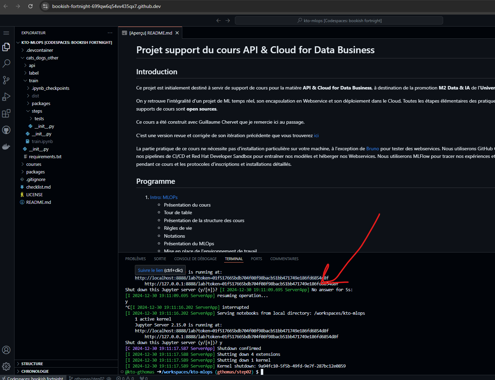

Maintenant, remettons un peu en cause cette démarche ...

## Les limites de la démarche

Les notebooks sont un outil populaire pour le développement de modèles de machine learning, mais ils ont également 
des **limites**. En voici quelques-unes des plus courantes :
- **Manque de contrôle de version** : Les notebooks sont souvent utilisés pour expérimenter et explorer les données, 
ce qui peut rendre difficile la gestion des versions de votre code et de vos données.
- **Manque de modularité** : Les notebooks ont tendance à encourager l’écriture de code non modulaire, ce qui peut rendre 
difficile la réutilisation de votre code pour d’autres projets.
- **Manque de performances** : Les notebooks ne sont pas conçus pour les charges de travail de production à grande 
échelle, ce qui peut entraîner des problèmes de performances lors de l’exécution de modèles de machine learning sur 
des ensembles de données volumineux.
- **Manque de sécurité** : Les notebooks peuvent contenir des informations sensibles telles que des clés d’API et des
informations d’identification, ce qui peut poser des problèmes de sécurité si les notebooks sont partagés ou stockés 
de manière incorrecte.
- **Manque de collaboration** : Les notebooks peuvent être difficiles à collaborer, surtout si plusieurs personnes
travaillent sur le même notebook en même temps.
- **Difficultés pour faire des tests unitaires automatisables** : Les notebooks sont souvent utilisés pour expérimenter 
et explorer les données, ce qui peut rendre difficile la création de tests unitaires automatisés 
pour votre code de machine learning. Les tests unitaires sont importants pour garantir que votre code fonctionne 
correctement et pour éviter les erreurs lors de la production de modèles de machine learning. Cependant, il existe des 
outils tels que `nbval` et `papermill` qui permettent d’automatiser les tests unitaires pour les notebooks de 
machine learning. C'est donc possible, mais plus difficile.

Maintenant que nous avons bien défini notre code dans un notebook, il pourrait être intéressant de le structurer dans le code
Python de notre projet. Prenons un peu de temps maintenant pour le faire :)

## Proposition d'alternative à notre Notebook

Nous allons créer un script train.py dans le répertoire train. Etant donné que nous avons plusieurs étapes, nous allons
en profiter pour créer des scripts relatifs à chaque étape pour y mettre les définitions des fonctions que nous avons
créées dans notre notebook !

Commençons déjà par créer nos différents scripts. Créons `train.py` dans le répertoire `train` et créons les scripts
`extraction.py`, `split.py`, `train_and_evaluate.py` et `test.py` dans le répertoire `train/steps` déjà existant. 

Vous devriez avoir votre espace de travail comme suit : 

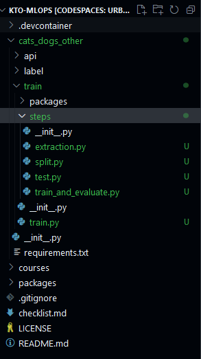

Maintenant, copions chaque fonction dans les scripts qui correspondent. Attention aux dépendances dans `test.py` car il y a
le contenu de deux cellules différentes. Vous pouvez les réorganiser correctement si vous le souhaitez.

Voici donc les contenus de :
- `extraction.py`
```python
import json
from pathlib import Path
from typing import Any


def extraction_from_annotation_file(bucket_name: str, s3_path: str, filename: str, s3_client) -> tuple[dict[Any, Any], set[Any]]:
  Path(filename).parent.mkdir(parents=True, exist_ok=True)
  s3_client.download_file(bucket_name, s3_path, filename)

  extract = {}
  classes = set()
  with open(filename) as file:
    annotations = json.load(file)["annotations"]
    for annotation in annotations:
      label = annotation["annotation"]["label"]
      extract[annotation["fileName"]] = label
      classes.add(label)
  return extract, classes

```
- `split.py`
```python
import random
from pathlib import Path


def random_split_train_evaluate_test_from_extraction(extract: dict,
                                                     classes: set,
                                                     split_ratio_train: float,
                                                     split_ratio_evaluate: float,
                                                     split_ratio_test: float,
                                                     train_dir: str,
                                                     evaluate_dir: str,
                                                     test_dir: str,
                                                     bucket_name: str,
                                                     s3_path: str,
                                                     s3_client):
  if split_ratio_train + split_ratio_evaluate + split_ratio_test != 1:
    raise Exception("sum of ratio must be equal to 1")

  keys_list = list(extract.keys())  # shuffle() wants a list
  random.shuffle(keys_list)  # randomize the order of the keys

  nkeys_train = int(split_ratio_train * len(keys_list))  # how many keys does split ratio train% equal
  keys_train = keys_list[:nkeys_train]
  keys_evaluate_and_test = keys_list[nkeys_train:]

  split_ratio_evaluate_and_test = split_ratio_evaluate + split_ratio_test
  nkeys_evaluate = int((split_ratio_evaluate / split_ratio_evaluate_and_test) * len(keys_evaluate_and_test))
  keys_evaluate = keys_evaluate_and_test[:nkeys_evaluate]
  keys_test = keys_evaluate_and_test[nkeys_evaluate:]

  extract_train = {k: extract[k] for k in keys_train}
  extract_evaluate = {k: extract[k] for k in keys_evaluate}
  extract_test = {k: extract[k] for k in keys_test}

  # create directories
  for existing_class in classes:
    Path(train_dir + "/" + existing_class).mkdir(parents=True, exist_ok=True)
    Path(evaluate_dir + "/" + existing_class).mkdir(parents=True, exist_ok=True)
    Path(test_dir + "/" + existing_class).mkdir(parents=True, exist_ok=True)

  # add files in directories
  download_files(extract_train, train_dir, bucket_name, s3_path, s3_client)
  download_files(extract_evaluate, evaluate_dir, bucket_name, s3_path, s3_client)
  download_files(extract_test, test_dir, bucket_name, s3_path, s3_client)


def download_files(extract: dict, directory: str, bucket_name: str, s3_path: str, s3_client):
  for key, value in extract.items():
    s3_client.download_file(bucket_name, s3_path + key, directory + "/" + value + "/" + key)

```
- `train_and_evaluate.py`
```python
from pathlib import Path

from keras import Model
from keras.src.applications.vgg16 import VGG16
from keras.src.callbacks import History
from keras.src.layers import Dropout, Flatten, Dense
from keras.src.losses import SparseCategoricalCrossentropy
from tensorflow.keras.preprocessing.image import ImageDataGenerator
from matplotlib import pyplot


def train_and_evaluate_model(train_dir: str,
                             evaluate_dir: str,
                             test_dir: str,
                             model_dir: str,
                             model_path: str,
                             plot_filepath: str,
                             batch_size: int,
                             epochs: int):
  model = define_model()

  # create data generator
  datagen = ImageDataGenerator(featurewise_center=True)
  # specify imagenet mean values for centering
  datagen.mean = [123.68, 116.779, 103.939]
  # prepare iterator
  train_it = datagen.flow_from_directory(
    train_dir,
    class_mode="binary",
    batch_size=batch_size,
    target_size=(224, 224)
  )
  validation_it = datagen.flow_from_directory(
    evaluate_dir,
    class_mode="binary",
    batch_size=batch_size,
    target_size=(224, 224)
  )
  # fit model
  history = model.fit(
    train_it,
    steps_per_epoch=len(train_it),
    validation_data=validation_it,
    validation_steps=len(validation_it),
    epochs=epochs,
    verbose=1,
  )
  # test model
  evaluate_it = datagen.flow_from_directory(
    test_dir,
    class_mode="binary",
    batch_size=batch_size,
    target_size=(224, 224)
  )
  _, acc = model.evaluate(evaluate_it, steps=len(evaluate_it), verbose=1)
  evaluate_accuracy_percentage = acc * 100.0
  print("> %.3f" % evaluate_accuracy_percentage)

  Path(model_dir).mkdir(parents=True, exist_ok=True)

  create_history_plots(history, plot_filepath)

  model.save(model_path)


def define_model() -> Model:
  model = VGG16(include_top=False, input_shape=(224, 224, 3))
  # mark loaded layers as not trainable
  for layer in model.layers:
    layer.trainable = False
  # add new classifier layers
  output = model.layers[-1].output
  drop1 = Dropout(0.2)(output)
  flat1 = Flatten()(drop1)
  class1 = Dense(64, activation="relu", kernel_initializer="he_uniform")(flat1)
  output = Dense(3, activation="sigmoid")(class1)
  # define new model
  model = Model(inputs=model.inputs, outputs=output)
  # compile model
  model.compile(optimizer='adam',
                loss=SparseCategoricalCrossentropy(from_logits=True),
                metrics=['accuracy'])
  return model


def create_history_plots(history: History, plot_filepath: str):
  # plot loss
  pyplot.subplot(211)
  pyplot.title("Cross Entropy Loss")
  pyplot.plot(history.history["loss"], color="blue", label="train")
  pyplot.plot(history.history["val_loss"], color="orange", label="test")
  # plot accuracy
  pyplot.subplot(212)
  pyplot.title("Classification Accuracy")
  pyplot.plot(history.history["accuracy"], color="blue", label="train")
  pyplot.plot(history.history["val_accuracy"], color="orange", label="test")
  # save plot to file
  pyplot.savefig(plot_filepath)
  pyplot.close()

```
- `test.py`
```python
import json
from io import BytesIO
from pathlib import Path

import numpy as np
from keras.models import load_model
from tensorflow.keras.preprocessing.image import load_img, img_to_array


# load and prepare the image
def load_image(filename: str|BytesIO):
  # load the image
  img = load_img(filename, target_size=(224, 224))
  # convert to array
  img = img_to_array(img)
  # reshape into a single sample with 3 channels
  img = img.reshape(1, 224, 224, 3)
  # center pixel data
  img = img.astype('float32')
  img = img - [123.68, 116.779, 103.939]
  return img


class Inference:
  def __init__(self, model_path: str):
    self.model = load_model(model_path)

  def execute(self, filepath:str|BytesIO):
    img = load_image(filepath)
    result = self.model.predict(img)
    values = [float(result[0][0]), float(result[0][1]), float(result[0][2])]
    switcher = ['Cat', 'Dog', 'Other']
    prediction = np.argmax(result[0])
    return {"prediction": switcher[prediction], "values": values}


def test_model(model_inference: Inference, model_dir: str, test_dir: str):
  statistics = {"ok": 0, "ko": 0, "total": 0}
  results = []
  path_test_dir = Path(test_dir)
  for path in path_test_dir.glob("**/*"):
    if path.is_dir():
      continue
    model_result = model_inference.execute(str(path))

    prediction = model_result["prediction"]
    prediction_truth = path.parent.name.lower().replace("s", "")
    status = prediction_truth == prediction.lower()
    statistics["ok" if status else "ko"] += 1
    result = {
      "filename": path.name,
      "ok": status,
      "prediction": prediction,
      "prediction_truth": prediction_truth,
      "values": model_result["values"],
    }
    results.append(result)
  statistics["total"] = statistics["ok"] + statistics["ko"]

  with open(model_dir + "/statistics.json", "w") as file_stream:
    json.dump(statistics, file_stream, indent=4)

  with open(model_dir + "/predictions.json", "w") as file_stream:
    json.dump(results, file_stream, indent=4)

```

Maintenant, occupons-nous de `train.py`. Nous devons ajouter tout le reste à part bien sûr, les installations des différentes
librairies. Cela devrait donner quelque chose comme ceci :
```python
import boto3

s3_client = boto3.client(
    "s3",
    endpoint_url="http://minio-api-blabla-dev.apps.sandbox-m3.666.p1.openshiftapps.com",
    aws_access_key_id="minio",
    aws_secret_access_key="minio123"
)

working_dir = "./dist"
bucket_name = "cats-dogs-other"
extract, classes = extraction_from_annotation_file(bucket_name,
                                                   "dataset/cats_dogs_others-annotations.json",
                                                   working_dir + "/cats_dogs_others-annotations.json",
                                                   s3_client)

train_dir = working_dir + "/train"
evaluate_dir = working_dir + "/evaluate"
test_dir = working_dir + "/test"

split_ratio_train = 0.8
split_ratio_evaluate = 0.1
split_ratio_test = 0.1

random_split_train_evaluate_test_from_extraction(extract, classes, split_ratio_train,
                                                 split_ratio_evaluate, split_ratio_test,
                                                 train_dir, evaluate_dir, test_dir, bucket_name,
                                                 "dataset/extract/", s3_client)

model_filename = "final_model.keras"
model_plot_filename = "model_plot.png"
batch_size = 64
epochs = 4

# train & evaluate
model_dir = working_dir + "/model"
model_path = model_dir + "/" + model_filename
plot_filepath = model_dir + "/" + model_plot_filename

train_and_evaluate_model(train_dir, evaluate_dir, test_dir, model_dir, model_path,
                         plot_filepath, batch_size, epochs)

# test the model
model_inference = Inference(model_path)

test_model(model_inference, model_dir, test_dir)
```

Point important, comme vous pouvez le voir, nous faisons référence à des fonctions présentes dans d'autres scripts. 
Nous devons donc, pour que cela fonctionne, importer ces définitions dans notre script `train.py`. Vous pouvez le faire
à l'aide de votre IDE. Vous devriez obtenir quelque chose comme ceci :
```python
from steps.extraction import extraction_from_annotation_file
from steps.split import random_split_train_evaluate_test_from_extraction
from steps.test import Inference, test_model
from steps.train_and_evaluate import train_and_evaluate_model
```

Donc à la fin, votre script doit ressembler à ceci :
```python
import boto3
from steps.extraction import extraction_from_annotation_file
from steps.split import random_split_train_evaluate_test_from_extraction
from steps.test import Inference, test_model
from steps.train_and_evaluate import train_and_evaluate_model

s3_client = boto3.client(
    "s3",
    endpoint_url="http://minio-api-babla-dev.apps.sandbox-m3.666.p1.openshiftapps.com",
    aws_access_key_id="minio",
    aws_secret_access_key="minio123"
)

working_dir = "./dist"
bucket_name = "cats-dogs-other"
extract, classes = extraction_from_annotation_file(bucket_name,
                                                   "dataset/cats_dogs_others-annotations.json",
                                                   working_dir + "/cats_dogs_others-annotations.json",
                                                   s3_client)

train_dir = working_dir + "/train"
evaluate_dir = working_dir + "/evaluate"
test_dir = working_dir + "/test"

split_ratio_train = 0.8
split_ratio_evaluate = 0.1
split_ratio_test = 0.1

random_split_train_evaluate_test_from_extraction(extract, classes, split_ratio_train,
                                                 split_ratio_evaluate, split_ratio_test,
                                                 train_dir, evaluate_dir, test_dir, bucket_name,
                                                 "dataset/extract/", s3_client)

model_filename = "final_model.keras"
model_plot_filename = "model_plot.png"
batch_size = 64
epochs = 4

# train & evaluate
model_dir = working_dir + "/model"
model_path = model_dir + "/" + model_filename
plot_filepath = model_dir + "/" + model_plot_filename

train_and_evaluate_model(train_dir, evaluate_dir, test_dir, model_dir, model_path,
                         plot_filepath, batch_size, epochs)

# test the model
model_inference = Inference(model_path)

test_model(model_inference, model_dir, test_dir)
```

Dernier détail à régler, les dépendances. Veuillez les ajouter dans le fichier `cats_dogs_other/requirements.txt` :

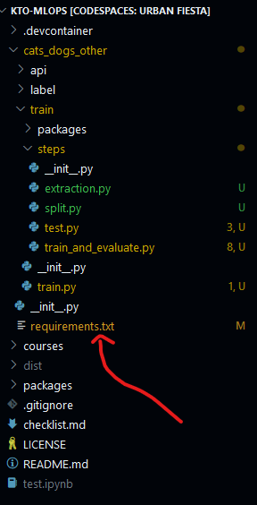

Voici ce que vous devriez y trouver :
```
boto3
tensorflow 
matplotlib 
scipy
```

Testons notre code avec les commandes suivantes : 
```bash
pip install -r ./cats_dogs_other/requirements.txt
python ./cats_dogs_other/train/train.py
```

Constatez que le code fonctionne parfaitement ! Chouette ! Améliorons maintenant rapidement ce code en ajoutant 
en argument les paramètres qui peuvent facilement varier. Par exemple, le repertoire de travail, les ratios, le batch size
et le nombre d'epochs.

Il serait également mal venu de pousser sur votre repository git l'url, ainsi que les users et mots de passe de votre minio.
Nous allons donc faire mieux, en faisant en sorte d'aller chercher ces informations dans des variables d'environnement.
Vous rappelez-vous de ce que c'est ? :-)

Pour aller chercher une variable d'environnement sur votre système, vous pouvez utiliser ce code : 
```python
import os
os.environ.get("MA_VARIABLE")
```


Cela donnerait donc quelque chose comme ceci : 
```python
import argparse
import os
import boto3

from steps.extraction import extraction_from_annotation_file
from steps.split import random_split_train_evaluate_test_from_extraction
from steps.test import Inference, test_model
from steps.train_and_evaluate import train_and_evaluate_model

parser = argparse.ArgumentParser("training")
parser.add_argument("--split_ratio_train", type=float)
parser.add_argument("--split_ratio_evaluate", type=float)
parser.add_argument("--split_ratio_test", type=float)
parser.add_argument("--batch_size", type=int)
parser.add_argument("--epochs", type=int)
parser.add_argument("--working_dir", type=str)

args = parser.parse_args()
split_ratio_train = args.split_ratio_train
split_ratio_evaluate = args.split_ratio_evaluate
split_ratio_test = args.split_ratio_test
batch_size = args.batch_size
epochs = args.epochs
working_dir = args.working_dir

if __name__ == "__main__":
  s3_client = boto3.client(
    "s3",
    endpoint_url=os.environ.get("MLFLOW_S3_ENDPOINT_URL"),
    aws_access_key_id=os.environ.get("AWS_ACCESS_KEY_ID"),
    aws_secret_access_key=os.environ.get("AWS_SECRET_ACCESS_KEY")
  )

  bucket_name = "cats-dogs-other"
  extract, classes = extraction_from_annotation_file(bucket_name,
                                                     "dataset/cats_dogs_others-annotations.json",
                                                     working_dir + "/cats_dogs_others-annotations.json",
                                                     s3_client)

  train_dir = working_dir + "/train"
  evaluate_dir = working_dir + "/evaluate"
  test_dir = working_dir + "/test"

  random_split_train_evaluate_test_from_extraction(extract, classes, split_ratio_train,
                                                   split_ratio_evaluate, split_ratio_test,
                                                   train_dir, evaluate_dir, test_dir, bucket_name,
                                                   "dataset/extract/", s3_client)

  model_filename = "final_model.keras"
  model_plot_filename = "model_plot.png"

  # train & evaluate
  model_dir = working_dir + "/model"
  model_path = model_dir + "/" + model_filename
  plot_filepath = model_dir + "/" + model_plot_filename

  train_and_evaluate_model(train_dir, evaluate_dir, test_dir, model_dir, model_path,
                           plot_filepath, batch_size, epochs)

  # test the model
  model_inference = Inference(model_path)

  test_model(model_inference, model_dir, test_dir)

```

Enfin, testons une dernière fois ce script en n'oubliant pas de créer nos variables d'environnement. Donc, dans votre Terminal,
lancez les commandes suivantes : 

```bash
export MLFLOW_S3_ENDPOINT_URL=http://minio-api-balba-dev.apps.sandbox-m3.666.p1.openshiftapps.com
export AWS_ACCESS_KEY_ID=minio
export AWS_SECRET_ACCESS_KEY=minio123
python ./cats_dogs_other/train/train.py --split_ratio_train=0.8 --split_ratio_evaluate=0.1 --split_ratio_test=0.1 --batch_size=64 --epochs=4 --working_dir="./cats_dogs_other/train/dist"
```

Et voilà ! C'est terminé !

N'oubliez pas de commiter et pusher votre travail sur votre branche `votrenom/step02` et surtout, **communiquez le nom de votre
branche par mail au professeur (évaluation).** (Et oui, il y a une coquille dans la capture ci-dessous.)

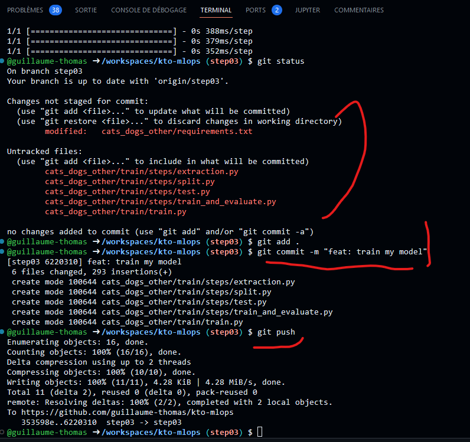

### Et les tests unitaires ?

Arf ... Non, ce n'est pas terminé ... Un des défauts des notebooks c'est qu'il est difficile de faire des tests unitaires.
Maintenant que nous avons redéfini notre code dans des scripts, il serait bienvenu de faire quelques tests non ? Allez, c'est parti !

Vous trouverez d'abord, un répertoire `train/steps/tests`. C'est ici que l'on va créer nos tests. Il existe déjà un sous-répertoire par élément à tester.
Dans chacun de ces répertoires, vous trouverez des jeux de données déjà prêts !

#### Tests du train

Cela fait partie des tests les plus simples. Créez dans `train/steps/tests/train_and_evaluate`, un script nommé `test_train.py`.
Dans ce script, mettez le code suivant.
```python
import shutil
import unittest
from pathlib import Path

from cats_dogs_other.train.steps.train_and_evaluate import train_and_evaluate_model

BASE_PATH = Path(__file__).resolve().parent
output_directory = BASE_PATH / "output"
input_directory = BASE_PATH / "input"
train_directory = input_directory / "train"
evaluate_directory = input_directory / "evaluate"
test_directory = input_directory / "test"
model_path = output_directory / "model.keras"
model_plot_path = output_directory / "model_plot.png"


class TrainTest(unittest.TestCase):
    def test_train(self):
        if output_directory.is_dir():
            shutil.rmtree(str(output_directory))
        train_and_evaluate_model(str(train_directory), str(evaluate_directory), str(test_directory),
                                 str(output_directory),
                                 str(model_path),
                                 str(model_plot_path),
                                 10, 1)
        self.assertEqual(True, model_path.is_file())
        self.assertEqual(True, model_plot_path.is_file())
        shutil.rmtree(str(output_directory))


if __name__ == '__main__':
    unittest.main()

```

Prenons le temps de l'observer, puis exécutez le test avec la commande suivante :
```bash
python -m unittest cats_dogs_other.train.steps.tests.train_and_evaluate.test_train
```

#### Tests du test du modèle

Dans la partie test, nous allons surtout nous concentrer sur le test de l'inférence. Le reste du code est difficile à tester 
et pas forcément pertinent. Un bon test doit aussi être utile.

Créez un script `test_inference.py` dans le répertoire `train/steps/tests/test`. Mettez-y ensuite le code suivant : 
```python
import unittest
from pathlib import Path

from cats_dogs_other.train.steps.test import Inference

BASE_PATH = Path(__file__).resolve().parent
output_directory = BASE_PATH / "output"
input_directory = BASE_PATH / "input"


class TestInference(unittest.TestCase):

    def test_inference(self):
        inference = Inference(str((input_directory / "model" / "final_model.keras")))
        inference_result = inference.execute(str(input_directory / "images" / "cat.png"))

        expected_result = {'prediction': 'Cat', 'values': [1.0, 2.370240289845506e-30, 0.0]}
        self.assertEqual(inference_result['prediction'], expected_result['prediction'])
        self.assertEqual(len(inference_result['values']), len(expected_result['values']))


if __name__ == "__main__":
    unittest.main()

```

Une nouvelle fois, commentons le code. Exécutez votre test avec la commande suivante : 
```bash
python -m unittest cats_dogs_other.train.steps.tests.test.test_inference
```

#### Tests de l'extraction

Alors, celui-ci est plus compliqué ... Réfléchissons brièvement pourquoi :)

En effet, nous allons avoir un petit soucis avec le client s3. En effet, il n'est pas recommandé DU TOUT d'avoir un test
unitaire dépendant d'un service tiers, d'autant plus s'il est dans le Cloud. Un test unitaire doit se suffire à lui-même et doit
fonctionner en vase clos. C'est pourquoi il va falloir que l'on trouve une technique pour que notre client S3 fonctionne ... sans 
pour autant se connecter sur minio. On va devoir utiliser une technique bien connue des devs : l'utilisation de Mock.

Un "Mock" (ou "Mock Object") est un objet fictif utilisé dans les tests unitaires pour simuler le comportement d'un 
objet réel. Les mocks sont souvent utilisés pour tester des parties d'un système qui dépendent d'un système tiers, 
comme une base de données ou un service Web, ce qui est notre cas ici :)

En créant un mock, vous pouvez reproduire le comportement attendu de l'objet réel, sans avoir à le configurer 
réellement ou à passer par des étapes compliquées pour le faire fonctionner. Cela vous permet de tester votre code de 
manière isolée et de détecter les erreurs plus facilement.

Les mocks peuvent être créés à la main ou avec l'aide de bibliothèques de tests unitaires spécialisées qui offrent 
des fonctionnalités de mock.

Pour faire le parallèle avec la précédente définition, s3_client est l'objet réel et nous allons créer un mock object de ce s3_client.
Nous allons le faire à la main en utilisant un concept provenant du développement orienté objet (encore lui ...) : les interfaces.

Attention aux faux amis ... Ici une interface est une sorte de contrat. En gros, nous allons définir la liste des fonctions qu'une classe
**implémentant** cette interface, doit définir. Voici un exemple : 

```python
from abc import abstractmethod, ABC

class MyInterface(ABC):
    
    @abstractmethod
    def method_1(self, param1, param2):
        pass
    
    @abstractmethod
    def method_2(self):
        pass
```

Et maintenant, si je veux implémenter cette interface dans une classe : 
```python
class MyImplementation(MyInterface):

  def method_1(self, param1, param2):
    # Logique utilisant param1 et param2
    return

  def method_2(self):
    # Logique
    return
```

Donc, voici ce que nous pouvons faire pour "mocker" notre s3_client : 
- Dans notre répertoire `train/steps`, créons le script `s3_wrapper.py`. Un wrapper permet de masquer la complexité de 
l'objet sous-jacent et de fournir une interface plus facile à utiliser pour les développeurs qui l'utilisent.
- Voici une proposition de wrapper pour notre client : 
```python
from abc import abstractmethod, ABC


class IS3ClientWrapper(ABC):
    @abstractmethod
    def download_file(self, bucket: str, s3_path: str, dest_filename: str) -> None:
        pass
```
- Nous avons donc défini une interface qui dit que, toute implémentation doit définir download_file. Voici une implémentation pour notre client :
```python
class S3ClientWrapper(IS3ClientWrapper):
    def __init__(self, s3_client):
        self.s3_client = s3_client

    def download_file(self, bucket: str, s3_path: str, dest_filename: str):
        self.s3_client.download_file(bucket, s3_path, dest_filename)

```
- Nous avons un wrapper qui prend en paramètre de constructeur (méthode qui permet de créer un objet à partir d'une classe), le client s3
et qui définit notre méthode download_file. Son implémentation est donc tout simplement de rappeler la méthode download_file du client déjà existante.
Donc c'est bien beau tout ça, mais vous allez me dire que cela ne sert pas à grand chose ... Oui, certes, mais maintenant, dans mes tests, je peux
définir une tout autre implémentation ! Par exemple : 
```python
class TestS3ClientWrapper(IS3ClientWrapper):

    def download_file(self, bucket: str, s3_path: str, dest_filename: str):
        Path(dest_filename).parent.mkdir(parents=True, exist_ok=True)
        shutil.copyfile(s3_path, dest_filename)
```
- Ici, j'ai défini une implémentation spéciale qui va tout simplement copier les fichiers d'un dossier A, vers un dossier B.
Et voilà ! J'ai redéfini le comportement de mon wrapper en fonction de mes besoins et de mon contexte !!! Mettons en pratique !
- Notre script `s3_wrapper.py` doit ressembler à ceci : 
```python
from abc import abstractmethod, ABC


class IS3ClientWrapper(ABC):
    @abstractmethod
    def download_file(self, bucket: str, s3_path: str, dest_filename: str) -> None:
        pass


class S3ClientWrapper(IS3ClientWrapper):
    def __init__(self, s3_client):
        self.s3_client = s3_client

    def download_file(self, bucket: str, s3_path: str, dest_filename: str):
        self.s3_client.download_file(bucket, s3_path, dest_filename)

```
- Pensez à bien changer la signature de notre fonction extraction_from_annotation_file dans `extraction.py` en définissant
le type de notre paramètre :
```python
from .s3_wrapper import IS3ClientWrapper


def extraction_from_annotation_file(bucket_name: str, s3_path: str, filename: str, s3_client: IS3ClientWrapper) -> tuple[dict[Any, Any], set[Any]]:
```
- Cela vous donnera le script `extraction.py` suivant :
```python
import json
from pathlib import Path
from typing import Any

from .s3_wrapper import IS3ClientWrapper


def extraction_from_annotation_file(bucket_name: str, s3_path: str, filename: str, s3_client: IS3ClientWrapper) -> tuple[dict[Any, Any], set[Any]]:
    Path(filename).parent.mkdir(parents=True, exist_ok=True)
    s3_client.download_file(bucket_name, s3_path, filename)

    extract = {}
    classes = set()
    with open(filename) as file:
        annotations = json.load(file)["annotations"]
        for annotation in annotations:
            label = annotation["annotation"]["label"]
            extract[annotation["fileName"]] = label
            classes.add(label)
    return extract, classes

```
- Dans le script `train.py`, modifiez votre `s3_client` pour que ce soit votre wrapper qui soit envoyé en paramètre de la méthode
`extraction_from_annotation_file` : 
```python
from steps.s3_wrapper import S3ClientWrapper

s3_client = S3ClientWrapper(
    boto3.client(
        "s3",
        endpoint_url=os.environ.get("MLFLOW_S3_ENDPOINT_URL"),
        aws_access_key_id=os.environ.get("AWS_ACCESS_KEY_ID"),
        aws_secret_access_key=os.environ.get("AWS_SECRET_ACCESS_KEY")
  )
)
```
- Cela vous donnera le script `train.py` suivant :
```python
import argparse
import os
import boto3

from steps.s3_wrapper import S3ClientWrapper
from steps.extraction import extraction_from_annotation_file
from steps.split import random_split_train_evaluate_test_from_extraction
from steps.test import Inference, test_model
from steps.train_and_evaluate import train_and_evaluate_model

parser = argparse.ArgumentParser("training")
parser.add_argument("--split_ratio_train", type=float)
parser.add_argument("--split_ratio_evaluate", type=float)
parser.add_argument("--split_ratio_test", type=float)
parser.add_argument("--batch_size", type=int)
parser.add_argument("--epochs", type=int)
parser.add_argument("--working_dir", type=str)

args = parser.parse_args()
split_ratio_train = args.split_ratio_train
split_ratio_evaluate = args.split_ratio_evaluate
split_ratio_test = args.split_ratio_test
batch_size = args.batch_size
epochs = args.epochs
working_dir = args.working_dir

if __name__ == "__main__":
    s3_client = S3ClientWrapper(
        boto3.client(
            "s3",
            endpoint_url=os.environ.get("MLFLOW_S3_ENDPOINT_URL"),
            aws_access_key_id=os.environ.get("AWS_ACCESS_KEY_ID"),
            aws_secret_access_key=os.environ.get("AWS_SECRET_ACCESS_KEY")
        )
    )

    bucket_name = "cats-dogs-other"
    extract, classes = extraction_from_annotation_file(bucket_name,
                                                       "dataset/cats_dogs_others-annotations.json",
                                                       working_dir + "/cats_dogs_others-annotations.json",
                                                       s3_client)

    train_dir = working_dir + "/train"
    evaluate_dir = working_dir + "/evaluate"
    test_dir = working_dir + "/test"

    random_split_train_evaluate_test_from_extraction(extract, classes, split_ratio_train,
                                                     split_ratio_evaluate, split_ratio_test,
                                                     train_dir, evaluate_dir, test_dir, bucket_name,
                                                     "dataset/extract/", s3_client)
    
    model_filename = "final_model.keras"
    model_plot_filename = "model_plot.png"

    # train & evaluate
    model_dir = working_dir + "/model"
    model_path = model_dir + "/" + model_filename
    plot_filepath = model_dir + "/" + model_plot_filename

    train_and_evaluate_model(train_dir, evaluate_dir, test_dir, model_dir, model_path,
                             plot_filepath, batch_size, epochs)

    # test the model
    model_inference = Inference(model_path)

    test_model(model_inference, model_dir, test_dir)

```
- Pour terminer notre refactoring, pensez bien à redéfinir la signature de la méthode `random_split_train_evaluate_test_from_extraction` 
et `download_files` du script `split.py`, afin de spécifier le type du client S3 : 
```python
import random
from pathlib import Path

from .s3_wrapper import IS3ClientWrapper


def random_split_train_evaluate_test_from_extraction(extract: dict,
                                                     classes: set,
                                                     split_ratio_train: float,
                                                     split_ratio_evaluate: float,
                                                     split_ratio_test: float,
                                                     train_dir: str,
                                                     evaluate_dir: str,
                                                     test_dir: str,
                                                     bucket_name: str,
                                                     s3_path: str,
                                                     s3_client: IS3ClientWrapper):
    if split_ratio_train + split_ratio_evaluate + split_ratio_test != 1:
        raise Exception("sum of ratio must be equal to 1")

    keys_list = list(extract.keys())  # shuffle() wants a list
    random.shuffle(keys_list)  # randomize the order of the keys

    nkeys_train = int(split_ratio_train * len(keys_list))  # how many keys does split ratio train% equal
    keys_train = keys_list[:nkeys_train]
    keys_evaluate_and_test = keys_list[nkeys_train:]

    split_ratio_evaluate_and_test = split_ratio_evaluate + split_ratio_test
    nkeys_evaluate = int((split_ratio_evaluate / split_ratio_evaluate_and_test) * len(keys_evaluate_and_test))
    keys_evaluate = keys_evaluate_and_test[:nkeys_evaluate]
    keys_test = keys_evaluate_and_test[nkeys_evaluate:]

    extract_train = {k: extract[k] for k in keys_train}
    extract_evaluate = {k: extract[k] for k in keys_evaluate}
    extract_test = {k: extract[k] for k in keys_test}

    # create directories
    for existing_class in classes:
        Path(train_dir + "/" + existing_class).mkdir(parents=True, exist_ok=True)
        Path(evaluate_dir + "/" + existing_class).mkdir(parents=True, exist_ok=True)
        Path(test_dir + "/" + existing_class).mkdir(parents=True, exist_ok=True)

    # add files in directories
    download_files(extract_train, train_dir, bucket_name, s3_path, s3_client)
    download_files(extract_evaluate, evaluate_dir, bucket_name, s3_path, s3_client)
    download_files(extract_test, test_dir, bucket_name, s3_path, s3_client)


def download_files(extract: dict, directory: str, bucket_name: str, s3_path: str, s3_client: IS3ClientWrapper):
    for key, value in extract.items():
        s3_client.download_file(bucket_name, s3_path + key, directory + "/" + value + "/" + key)

```
- Maintenant, créons un script `test_extraction.py` dans `train/steps/tests/extraction` et mettons-y le code suivant :
```python
import shutil
import unittest
from pathlib import Path

from cats_dogs_other.train.steps.extraction import extraction_from_annotation_file
from cats_dogs_other.train.steps.s3_wrapper import IS3ClientWrapper

BASE_PATH = Path(__file__).resolve().parent
output_directory = BASE_PATH / "output"
input_directory = BASE_PATH / "input"
expected_extract = {
    "a_page0_index0.png": "other",
    "b_page2_index0.png": "other",
    "b_page4_index0.png": "cat",
    "c_page4_index0.png": "dog"
}


class TestS3ClientWrapper(IS3ClientWrapper):

    def download_file(self, bucket: str, s3_path: str, dest_filename: str):
        Path(dest_filename).parent.mkdir(parents=True, exist_ok=True)
        shutil.copyfile(s3_path, dest_filename)


class TestExtraction(unittest.TestCase):

    def test_extraction(self):
        extract, classes = extraction_from_annotation_file("bucket", # ce paramètre n'a pas d'importance
                                                           str(input_directory / "labels.json"),
                                                           str(output_directory / "labels.json"),
                                                           TestS3ClientWrapper())
        self.assertEqual(sorted({"cat", "other", "dog"}), sorted(classes))
        self.assertEqual(expected_extract, extract)
        shutil.rmtree(str(output_directory))


if __name__ == "__main__":
    unittest.main()

```
- Testons maintenant avec la commande : 
```bash
python -m unittest cats_dogs_other.train.steps.tests.extraction.test_extraction
```
- Vérifions également que nous n'avons pas cassé le train, avec les commandes : 
```bash
export MLFLOW_S3_ENDPOINT_URL=http://minio-api-balba-dev.apps.sandbox-m3.666.p1.openshiftapps.com
export AWS_ACCESS_KEY_ID=minio
export AWS_SECRET_ACCESS_KEY=minio123
python ./cats_dogs_other/train/train.py --split_ratio_train=0.8 --split_ratio_evaluate=0.1 --split_ratio_test=0.1 --batch_size=64 --epochs=4 --working_dir="./cats_dogs_other/train/dist"
```
- Tout fonctionne toujours parfaitement ! Vous venez peut-être de faire votre premier mock et votre premier wrapper ! Bravo !!! :)


#### Tests du split

Ce test-ci est particulier, car il y a plusieurs choses à couvrir. Déjà son bon fonctionnement nominal, mais également la condition
sur la somme des ratios différente de 1. De plus, cette partie est délicate, parce que, étant donné que nous y mettons de l'aléatoire, il sera
difficile de prédire le comportement complet de notre fonction. Et puis à cela, ajoutons notre fameux client S3, cela rajoute encore de la compléxité
avec un mock à ajouter (ou à réutiliser).

Voici une proposition de tests dont nous pouvons discuter, à ajouter dans un script `train/steps/tests/split/test_split.py` : 

```python
import os
import shutil
import unittest
from pathlib import Path

from cats_dogs_other.train.steps.s3_wrapper import IS3ClientWrapper
from cats_dogs_other.train.steps.split import random_split_train_evaluate_test_from_extraction

BASE_PATH = Path(__file__).resolve().parent
output_directory = BASE_PATH / "output"
input_directory = BASE_PATH / "input/images"

output_directory_train = output_directory / "train"
output_directory_evaluate = output_directory / "evaluate"
output_directory_test = output_directory / "test"

extract = {
    "a_page0_index0.png": "other",
    "a_page1_index0.png": "other",
    "a_page2_index0.png": "other",
    "b_page1_index0.png": "cat",
    "b_page2_index0.png": "dog",
    "b_page3_index0.png": "cat",
    "b_page4_index0.png": "dog",
    "c_page4_index0.png": "dog",
    "d_page0_index0.png": "other"
}
classes = {"cat", "dog", "other"}


class TestS3ClientWrapper(IS3ClientWrapper):

    def download_file(self, bucket: str, s3_path: str, dest_filename: str):
        Path(dest_filename).parent.mkdir(parents=True, exist_ok=True)
        shutil.copyfile(s3_path, dest_filename)


class SplitTest(unittest.TestCase):
    def test_splitting_works_properly(self):
        random_split_train_evaluate_test_from_extraction(extract, classes, 0.55, 0.3, 0.15,
                                                         str(output_directory_train), str(output_directory_evaluate),
                                                         str(output_directory_test), "bucket",
                                                         str(input_directory) + "/", TestS3ClientWrapper())
        self.count_files_in_directory_and_assert(output_directory_train, 4)
        self.count_files_in_directory_and_assert(output_directory_evaluate, 3)
        self.count_files_in_directory_and_assert(output_directory_test, 2)
        shutil.rmtree(str(output_directory))

    def count_files_in_directory_and_assert(self, dir_path: Path, count_asserted: int):
        total = 0
        for root, dirs, files in os.walk(dir_path):
            total += len(files)
        self.assertEqual(total, count_asserted)

    def test_splitting_with_ratios_not_equal_to_one_raises_an_exception(self):
        self.assertRaises(Exception, random_split_train_evaluate_test_from_extraction, extract, classes, 0.25, 0.3,
                          0.15, str(output_directory_train), str(output_directory_evaluate), str(output_directory_test),
                          "bucket", str(input_directory) + "/", TestS3ClientWrapper())
        

if __name__ == '__main__':
    unittest.main()

```

Enfin, lancez ces tests avec la commande : 
```bash
python -m unittest cats_dogs_other.train.steps.tests.split.test_split
```

Notez que vous pouvez lancer tous vos tests en une seule fois en lançant la commande suivante à la racine de votre projet : 
```bash
python -m unittest
```

Si vous constatez une erreur de dépendance avec `fitz`, exécutez cette commande : 
```bash
pip install -r cats_dogs_other/label/requirements.txt
```

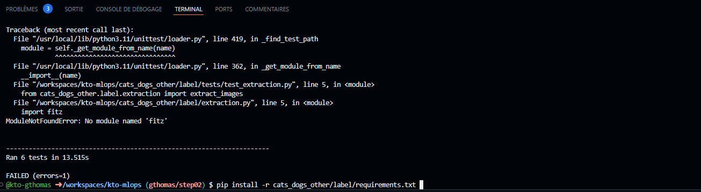

Prenez bien garde à la documentation du [Test Discovery de unittest](https://docs.python.org/3/library/unittest.html#unittest-test-discovery). 
Ce dernier permet de scanner votre projet pour détecter automatiquement les tests à lancer. Par défaut, vos scripts de test
doivent être nommés en respectant un pattern précis et doivent faire partie d'un module Python. C'est notre cas ici ;-)

Maintenant que vous avez fait vos tests, n'oubliez pas de commiter et de pusher vos modifications, toujours sur la 
même branche ! **Je me ferai un plaisir de relire vos tests ! :) (évaluations)**

Notez qu'il y a quelques soucis avec le procédé que nous avons mis en place ici (split aléatoire, process non scalable ect ...).
Prenons quelques instants pour en discuter ;-)

Et voilà ! Cette partie entraînement de modèle est terminée ! Bravo ! Maintenant, voyons comment l'industrialiser un peu plus
avec les outils que le marché nous propose.