# 6. Les plateformes de ML sur le Cloud

Dans cette partie, nous allons étudier comment dé porter l'entraînement de notre modèle sur le Cloud. Le but étant de 
bénéficier des avantages de ce dernier dans le domaine du ML. 

Avant de commencer, afin que tout le monde parte du même point, vérifiez que vous n'avez aucune modification en
cours sur votre working directory avec `git status`.
Si c'est le cas, vérifiez que vous avez bien sauvegardé votre travail lors de l'étape précédente pour ne pas perdre
votre travail.
Sollicitez le professeur, car il est possible que votre contrôle continue en soit affecté.

Sinon, annulez toutes vos modifications avec `git reset --hard HEAD`. Supprimez potentiellement les fichiers
non indexés.
Changez maintenant de branche avec `git switch step03`.
Créez désormais une branche avec votre nom : `git switch -c votrenom/step03`


## Présentation du cloud et ses avantages

Le cloud computing permet de fournir des services informatiques via Internet, tels que le stockage de données, 
le traitement de données, la gestion de bases de données, le déploiement de webservices et bien d'autres.

Au lieu d'installer et de maintenir des infrastructures de serveurs et de logiciels locaux dans leur propre centre 
de données, les entreprises peuvent accéder à des outils, des applications et des ressources informatiques via le cloud, 
généralement fournis par un fournisseur de services cloud tel qu'Amazon Web Services, Google Cloud Platform ou Microsoft Azure.

Les avantages du cloud computing comprennent la souplesse, la rapidité, la facilité d'accès et la réduction des coûts. 
Les entreprises peuvent facilement dimensionner les ressources en fonction de la demande, sans avoir à investir dans 
des infrastructures coûteuses. La mise en place de serveurs et de logiciels peut être accélérée grâce à l'utilisation 
de ressources cloud préconfigurées, ce qui permet aux entreprises de se concentrer sur le développement de leur activité
principale plutôt que sur les aspects informatiques.

L'avènement du cloud computing est une opportunité considérable pour le machine learning. Le cloud offre aux datascientists 
un accès simple et rapide à des ressources de calcul à grande échelle, ce qui est essentiel pour entraîner des modèles 
de machine learning complexes et gérer de très grandes quantités de données.

Voici quelques avantages clés pour le machine learning dans le cloud :

- **Évolutivité** : Le cloud permet aux scientifiques des données de dimensionner leurs ressources de calcul et de 
stockage en fonction de leurs besoins spécifiques pour un projet donné. Cela signifie qu'ils peuvent ajuster la capacité 
à la hausse ou à la baisse en fonction de la demande, sans avoir à investir dans des infrastructures ou des ressources coûteuses.
- **Accessibilité** : Le cloud permet aux scientifiques des données de travailler à distance et d'accéder à leurs 
projets de machine learning depuis n'importe où, ce qui peut améliorer la collaboration et la flexibilité du travail.
- **Coût** : Les ressources de machine learning peuvent être coûteuses car elles nécessitent un grand nombre de 
ressources de calcul et de stockage. Le cloud permet aux scientifiques des données de payer ce dont ils ont besoin, 
quand ils en ont besoin, sans encourir les coûts liés à l'achat et à la maintenance d'infrastructures de machine learning.
- **Sécurité** : Les fournisseurs de cloud ont des mesures de sécurité robustes pour protéger leurs ressources de 
machine learning. Les scientifiques des données peuvent donc utiliser des ressources de machine learning en toute 
sécurité dans le cloud sans avoir à se soucier de la sécurité de leur infrastructure.

En somme, l'avènement du cloud est une chance pour le machine learning car il offre aux scientifiques des données des 
ressources de calcul et de stockage puissantes et économiques, une grande souplesse, une meilleure accessibilité et une 
sécurité renforcée pour leurs projets de machine learning.

## Présentation des solutions du marché
### Databricks / MLflow

MLflow est une plateforme open source pour la gestion du cycle de vie des projets de Machine Learning. Elle a été créée 
par Databricks en 2018 et permet aux scientifiques des données de gérer leurs projets de machine learning de manière 
efficace, en suivant les données, les modèles, les résultats et les expériences de manière systématique.

Elle offre une fiabilité, une sécurité et une évolutivité de niveau entreprise. MLflow regroupe quatre composants : 
MLflow Tracking, MLflow Projects, MLflow Models et MLflow Model Registry : 

- **MLflow Tracking** permet de suivre les expériences de machine learning et de gérer les résultats associés. 
- **MLflow Projects** fournit un moyen simple de packager du code de machine learning dans un format reproductible, 
afin de le partager avec d’autres personnes ou de le déployer sur des systèmes de production. 
- **MLflow Models** permet de gérer les modèles de machine learning de manière centralisée, en prenant en charge les 
formats de modèles courants
- **MLflow Model Registry** permet de suivre les versions des modèles, de gérer les autorisations et de déployer les
modèles dans des environnements de production.

Databricks, de son côté, est une entreprise de logiciels fondée par les créateurs d'Apache Spark en 2013. Elle fournit 
une plateforme d'analyse de données unifiée dans le cloud (via un lakehouse, fusion entre un datalake et un data warehouse), 
qui permet aux entreprises de traiter des données à grande échelle, en utilisant des technologies distribuées. 
Cette plateforme est compatible avec les principales offres Cloud du marché et repose sur des technologies open sources 
éprouvées telles que Spark et MlFlow. 

### OpenShift DataScience

OpenShift Data Science est une solution développée par Red Hat pour aider les entreprises à gérer efficacement 
leur infrastructure de ML/DL (Machine Learning/Deep Learning) sur leurs propres serveurs ou dans le cloud. 
Cette solution fournit des outils pour créer, gérer et déployer des modèles de machine learning, en utilisant des 
frameworks tels que TensorFlow, scikit-learn, ou PyTorch, tous intégrés à la plateforme.

Les fonctionnalités d'OpenShift Data Science incluent également la gestion des environnements virtuels, la 
surveillance des modèles en cours d'exécution, le partage de modèles entre différents projets ou utilisateurs, 
ainsi que la possibilité d'utiliser des workflows de conteneurs pour déployer les modèles de manière automatisée.

### Azure ML

Azure Machine Learning Studio est une plateforme basée sur le cloud, développée par Microsoft, pour créer, déployer et
gérer des modèles de machine learning. Elle fournit une interface graphique pour la création de workflows de machine 
learning en assemblant des blocs de traitement de données et de modèles pré-conçus.

Azure Machine Learning Studio prend également en charge de nombreux langages de programmation, tels que Python, R et
C#, ce qui permet aux scientifiques des données de travailler avec les outils qu'ils connaissent déjà.

En outre, la plateforme d'Azure Machine Learning est hautement intégrée avec le reste des services Microsoft Azure, 
ce qui facilite la gestion et la maintenance des environnements de machine learning sur le cloud.

Comme d'autres plateformes vues ici, Azure ML permet également de déployer rapidement des modèles sous formes de 
Webservice directement dans ses infrastructures. Ce procédé est intéressant pour aller vite, mais pourrait se heurter
à quelques soucis d'intégration en entreprise, comme l'usage de bibliothèques spécifiques ou même la sécurisation
d'un tel service dans le Cloud, s'autant plus s'il est public. Cette approche ne sera pas étudiée dans ce cours, nous 
prendrons l'option moins packagée et ferons nous-même l'exercice à la main. Mais sachez que ça existe ! ;)


## Présentation de kto-mlflow

Ce cours est dédié à toutes et tous. Il doit également être suivi en pleine autonomie pour permettre aux absentes, absents,
de pouvoir rattraper le plus facilement possible. C'est pourquoi, nous n'utiliserons pas ici de plateforme du marché,
nécessitant des comptes payants provisionnés ou des comptes de formations issus de partenariat. 

Nous allons utiliser une plateforme maison, mise en place spécifiquement pour ce cours : kto-mlflow. Cette plateforme
nécessite uniquement d'avoir accès à un Kubernetes en ligne. C'est pourquoi, nous utiliserons la DevSandbox de RedHat,
car elle est gratuite. En d'autres termes, vous bénéficiez d'une plateforme OpenShift (une sorte de Kubernetes sous stéroïdes)
accessible en ligne pendant 30 jours, réactivables à volonté.

kto-mlflow se compose des composants suivants :
- mlflow : Vous devez déjà le connaitre, voir plus haut ;)
- minio : Pareil, vous connaissez déjà minio, c'est une sorte de S3 d'Amazone, donc un service de stockage de fichiers
- mysql : Célèbre base de données
- Dailyclean : Solution opensource permettant de libérer vos ressources Cloud quand vous n'en n'avez pas besoin. Permet
également de les rendre disponibles. C'est une sorte de bouton ON/OFF pour kto-mlflow

## Training avec MlFlow

Nous allons commencer par travailler avec MLflow en local, directement dans notre Codespace. Comme vous l'avez vu précédemment,
MLflow dispose d'un outil de tracking. Ce dernier permet donc de "logger" (ou journaliser) des informations utiles 
d'un run d'une expérience.

Dans MLflow, une **expérience** est la principale unité d'organisation. Toutes les exécutions (ou run) MLflow appartiennent
à une expérience. Chaque expérience vous permet de visualiser, de rechercher et de comparer des exécutions,
ainsi que de télécharger des artefacts ou des métadonnées à analyser dans d’autres outils. Les expériences sont
conservées dans le server de Tracking MLflow (local ici d'abord, puis hébergé dans kto-mlflow).

Dans MLflow, un **run** est une exécution d'un script ou d'un workflow de machine learning.
Il est associé à une expérience et contient des informations sur les paramètres, les métriques, les artefacts et les
tags de l'exécution. Vous pouvez utiliser les runs pour suivre les performances de votre modèle, comparer les
résultats de différentes exécutions et partager les résultats avec d'autres personnes.

En d'autres termes, chaque fois que vous lancerez un entraînement d'un modèle avec le support de MLflow, un nouveau run
dans votre expérience va se créer, et contiendra toutes les informations utiles que l'on aura souhaité y mettre. Nous
pouvons logger toutes sortes d'informations, que l'on verra par la suite. 
Plus d'informations [ici](https://mlflow.org/docs/latest/tracking.html) 

### Création d'un projet en local

Dans MLflow, un **projet** est un format pour empaqueter le code d'entraînement de manière réutilisable 
et reproductible. En outre, le composant **MLflow Projects** comprend une API et des outils en ligne de commande pour 
exécuter des projets. Chaque projet est simplement un répertoire de fichiers, ou un référentiel Git, contenant votre 
code. Vous pouvez décrire votre projet en détail en ajoutant un fichier MLproject, qui est un fichier texte formaté 
YAML. Nous pouvons spécifier pour un projet plusieurs propriétés, telles que son nom, ses points d'entrée et 
son environnement d'exécution.

Les **environnements d’exécution** pour les projets MLflow sont utilisés pour spécifier les dépendances et les packages 
requis pour exécuter notre code. Les environnements d'exécution possibles pour les projets MLflow sont les suivants :
- **Environnement virtuel (Virtualenv)** : Les environnements virtuels prennent en charge les packages Python 
disponibles sur PyPI (nécessite pyenv pour fonctionner).
- **Environnement Conda** : Les environnements Conda prennent en charge les packages Python disponibles sur Anaconda.
(attention à la licence !!!)
- **Conteneur Docker** : Les conteneurs Docker sont des environnements d'exécution isolés qui contiennent tous les 
packages et dépendances nécessaires pour exécuter votre code.
- **Environnement système** : Les environnements système sont les environnements d'exécution par défaut qui 
utilisent les packages Python installés sur votre système.

Vous pouvez exécuter n'importe quel projet à partir d'un URI Git ou d'un répertoire local à l'aide de l'outil en 
ligne de commande `mlflow run` ou de l'API Python `mlflow.projects.run()`. Ces API permettent également de soumettre 
le projet pour une exécution à distance sur Databricks et Kubernetes. L'approche de l'exécution à distance est intéressante,
car elle nous permet d'entraîner nos modèles dans le Cloud et donc de bénéficier de ses avantages.

En guise d'environnement, étant donné que notre cible est de pouvoir entraîner nos modèles dans un Kubernetes en ligne,
nous allons préférer l'approche avec Docker. Nous reviendrons sur Docker et Kubernetes plus en détail plus loin dans ce cours.
Retenez pour l'instant que cette approche permet de créer une sorte d'environnement virtuel, un ordinateur dans votre 
ordinateur, complètement isolé, dans lequel nous allons ajouter notre code et nos dépendances.

Allez ! Commençons ! :-)

Ajoutez dans le fichier `requirements.txt` la dépendance mlflow : 
```
boto3
tensorflow 
matplotlib 
scipy
mlflow
```

Relancez la commande pip install : 
```bash
pip install -r ./cats_dogs_other/requirements.txt
```

Créez un fichier `MLproject` dans le répertoire `train`, dont voici le contenu :
```yaml
name: cats-dogs-other

docker_env:
  image: local/cats-dogs-other-train

entry_points:
  main:
    parameters:
        split_ratio_train: {type: float, default: 0.8}
        split_ratio_evaluate: {type: float, default: 0.1}
        split_ratio_test: {type: float, default: 0.1}
        batch_size: {type: int, default: 64}
        epochs: {type: int, default: 4}
        working_dir: {type: str, default: ./cats_dogs_other/train/dist}
        model_filename: {type: str, default: final_model.keras}
        model_plot_filename: {type: str, default: model_plot.png}
    command: "python ./cats_dogs_other/train/train.py --split_ratio_train={split_ratio_train} --split_ratio_evaluate={split_ratio_evaluate} --split_ratio_test={split_ratio_test} --batch_size={batch_size} --epochs={epochs} --working_dir={working_dir}"
```

Créez également un fichier `Dockerfile` dans le même répertoire : 
```Dockerfile
FROM python:3.11-slim

ARG MLFLOW_S3_ENDPOINT_URL
ARG AWS_ACCESS_KEY_ID
ARG AWS_SECRET_ACCESS_KEY

ENV MLFLOW_S3_ENDPOINT_URL=${MLFLOW_S3_ENDPOINT_URL}
ENV AWS_ACCESS_KEY_ID=${AWS_ACCESS_KEY_ID}
ENV AWS_SECRET_ACCESS_KEY=${AWS_SECRET_ACCESS_KEY}

COPY --chown=${USER} cats_dogs_other/train ./cats_dogs_other/train
COPY --chown=${USER} cats_dogs_other/requirements.txt ./cats_dogs_other/requirements.txt

RUN chmod -R 777 ./cats_dogs_other
RUN pip install -r /cats_dogs_other/requirements.txt
```

Vous devriez avoir ceci :

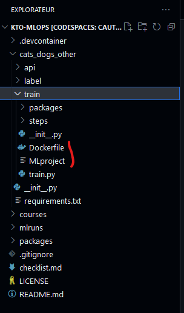

Créez l'image docker avec la commande (n'oubliez pas de remettre les variables d'environnement) : 
```bash
docker build -f ./cats_dogs_other/train/Dockerfile -t local/cats-dogs-other-train --build-arg MLFLOW_S3_ENDPOINT_URL=$MLFLOW_S3_ENDPOINT_URL --build-arg AWS_ACCESS_KEY_ID=$AWS_ACCESS_KEY_ID --build-arg AWS_SECRET_ACCESS_KEY=$AWS_SECRET_ACCESS_KEY .
```

Notez que l'on nomme ici l'image `local/cats-dogs-other-train`. Ceci est raccord avec ce que l'on a mis dans le fichier
`MLproject`. 

Enfin, jouez la commande suivante : 
```bash
mlflow run ./cats_dogs_other/train --experiment-name cats-dogs-other
```

L'expérience est désormais enregistrée dans mlflow et exécutez dans un environnement Docker. 
Vous pouvez lancer un server mlflow local avec la commande suivante :
```bash
mlflow server --host 127.0.0.1 --port 8080
```

Rendez-vous dans l'onglet PORTS pour visiter la page web écoutant le port 8080.

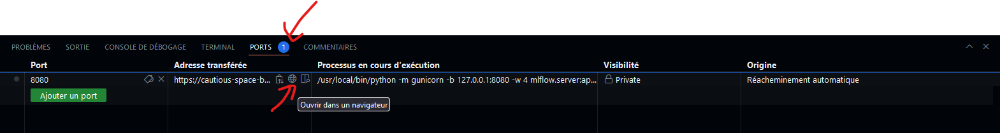

Constatez que vous avez bien votre expérience crée, ainsi que votre run local. 

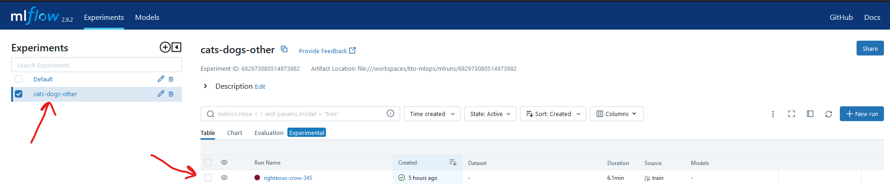

Notez également qu'il n'y a pas beaucoup d'informations dans votre run à part les paramètres d'entrée utilisés.

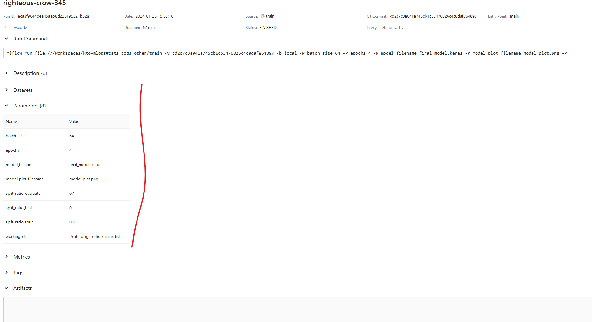

Éteignez votre serveur en faisant le raccourci CTRL+C dans votre Terminal.

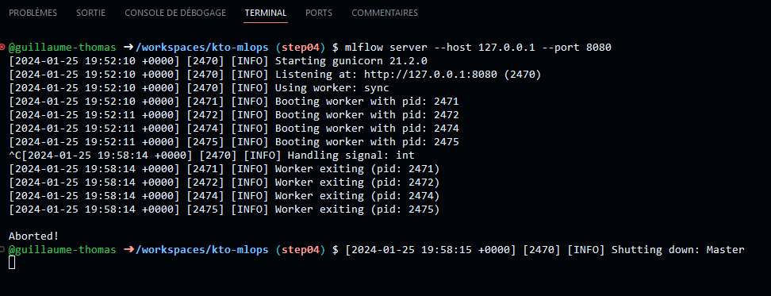

Ajoutons maintenant quelques éléments dans nos run mlflow.

Pour ce faire, nous allons utiliser les capacités de MLflow Tracking, dont voici la [documentation](https://mlflow.org/docs/latest/tracking/tracking-api.html) 
Prenons un peu de temps pour la parcourir !

Nous allons utiliser l'autolog pour commencer. Il s'agit d'une fonctionnalité puissante qui vous permet de logger 
automatiquement les métriques, les paramètres et les modèles sans avoir besoin de déclarer explicitement des 
instructions de journalisation. Tout ce que vous avez à faire est d'appeler `mlflow.autolog()` avant votre code 
d'entraînement. Cette fonctionnalité est disponible pour plusieurs bibliothèques de machine learning telles que 
scikit-learn, TensorFlow, PyTorch, XGBoost, LightGBM ...

Lorsque vous utilisez l'autolog, MLflow enregistre automatiquement diverses informations sur votre exécution, notamment :
- Les **métriques** : MLflow présélectionne un ensemble de métriques à enregistrer, en fonction du modèle et de la
bibliothèque que vous utilisez.
- Les **paramètres** : les hyperparamètres spécifiés pour l'entraînement, ainsi que les valeurs par défaut fournies 
par la bibliothèque si elles ne sont pas explicitement définies.
- La **signature du modèle** : une instance de signature de modèle qui décrit le schéma d'entrée et de sortie du modèle.
- Les **artefacts** : par exemple, les points de contrôle du modèle.
- Le **jeu de données** : l'objet de jeu de données utilisé pour l'entraînement, le cas échéant 
(ne fonctionnera pas dans notre cas, cette fonctionnalité est encore en développement).


Pour utiliser l'autolog dans notre projet, ajoutez ces deux lignes dans `train.py`, pensez également à importer le 
module `mlflow.keras` :
```python
import mlflow.keras
mlflow.autolog()
with mlflow.start_run():
    print('toto')
```

Cela donne donc ce script : 
```python
import argparse
import os
import boto3
import mlflow.keras

from steps.s3_wrapper import S3ClientWrapper
from steps.extraction import extraction_from_annotation_file
from steps.split import random_split_train_evaluate_test_from_extraction
from steps.test import Inference, test_model
from steps.train_and_evaluate import train_and_evaluate_model

parser = argparse.ArgumentParser("training")
parser.add_argument("--split_ratio_train", type=float)
parser.add_argument("--split_ratio_evaluate", type=float)
parser.add_argument("--split_ratio_test", type=float)
parser.add_argument("--batch_size", type=int)
parser.add_argument("--epochs", type=int)
parser.add_argument("--working_dir", type=str)

args = parser.parse_args()
split_ratio_train = args.split_ratio_train
split_ratio_evaluate = args.split_ratio_evaluate
split_ratio_test = args.split_ratio_test
batch_size = args.batch_size
epochs = args.epochs
working_dir = args.working_dir

if __name__ == "__main__":
    mlflow.autolog()
    with mlflow.start_run():
        s3_client = S3ClientWrapper(
            boto3.client(
                "s3",
                endpoint_url=os.environ.get("MLFLOW_S3_ENDPOINT_URL"),
                aws_access_key_id=os.environ.get("AWS_ACCESS_KEY_ID"),
                aws_secret_access_key=os.environ.get("AWS_SECRET_ACCESS_KEY")
            )
        )

        bucket_name = "cats-dogs-other"
        extract, classes = extraction_from_annotation_file(bucket_name,
                                                        "dataset/cats_dogs_others-annotations.json",
                                                        working_dir + "/cats_dogs_others-annotations.json",
                                                        s3_client)

        train_dir = working_dir + "/train"
        evaluate_dir = working_dir + "/evaluate"
        test_dir = working_dir + "/test"

        random_split_train_evaluate_test_from_extraction(extract, classes, split_ratio_train,
                                                        split_ratio_evaluate, split_ratio_test,
                                                        train_dir, evaluate_dir, test_dir, bucket_name,
                                                        "dataset/extract/", s3_client)

        model_filename = "final_model.h5"
        model_plot_filename = "model_plot.png"

        # train & evaluate
        model_dir = working_dir + "/model"
        model_path = model_dir + "/" + model_filename
        plot_filepath = model_dir + "/" + model_plot_filename

        train_and_evaluate_model(train_dir, evaluate_dir, test_dir, model_dir, model_path,
                                plot_filepath, batch_size, epochs)

        # test the model
        model_inference = Inference(model_path)

        test_model(model_inference, model_dir, test_dir)

```

Reconstruisez l'image docker avec la commande :
```bash
docker build -f ./cats_dogs_other/train/Dockerfile -t local/cats-dogs-other-train --build-arg MLFLOW_S3_ENDPOINT_URL=$MLFLOW_S3_ENDPOINT_URL --build-arg AWS_ACCESS_KEY_ID=$AWS_ACCESS_KEY_ID --build-arg AWS_SECRET_ACCESS_KEY=$AWS_SECRET_ACCESS_KEY .
```

Relancez un nouveau run mlflow : 
```bash
mlflow run ./cats_dogs_other/train --experiment-name cats-dogs-other
```

Relancez le server mlflow et constatez les différences : 
```bash
mlflow server --host 127.0.0.1 --port 8080
```

*Attention ! Vous venez de modifier votre code et ce dernier est testé unitairement ! Prenez l'habitude d'exécuter vos
tests unitaires régulièrement pour vérifier que rien n'a été cassé. Comme vous pouvez le constater, mlflow ne modifie
en rien la bonne exécution de nos tests, ce qui est une excellente nouvelle !*

Notez que l'accès à certains Artifacts ne fonctionnent malheureusement pas. C'est un soucis de droits d'accès sur le système
de fichier de codespace, car l'exécution en local de mlflow créé les éléments directement sur votre disque. Pour corriger ce 
problème, vous pouvez utiliser la commande suivante : 
```bash
sudo chmod -R 777 mlruns/
```

Notez que désormais, nous avons plus d'information dans nos runs de train ! Merci autolog ! Mais il va nous manquer des choses !
Par exemple, pas trace de nos plots ! Ni du split qui a été effectué, pas d'info sur les datasets ! 
Et puis, si vous regardez le model produit dans vos artefacts, et bien, il n'est pas enregistré avec l'extension `.h5` 
(oui, cette extension est legacy et non recommandée, ce sera mis à jour pour l'année prochaine ;-)). 

Nous allons donc ajouter des logs mlflow supplémentaires !

Prenons les choses dans l'ordre et occupons-nous d'abord de l'extraction de nos annotations.
Dans notre script `train/steps/extraction.py`, nous allons enregistrer le dictionnaire `extract` créé, car il récapitule
l'intégralité de nos annotations. Pour ce faire, nous pouvons utiliser la méthode [log_dict](https://mlflow.org/docs/latest/python_api/mlflow.html#mlflow.log_dict)
de MLflow : 
```python
import mlflow.keras
mlflow.log_dict(extract, "annotations/extract.json")
```

Votre script devrait ressembler à ceci : 
```python
import json
from pathlib import Path
from typing import Any

import mlflow.keras

from .s3_wrapper import IS3ClientWrapper


def extraction_from_annotation_file(bucket_name: str, s3_path: str, filename: str, s3_client: IS3ClientWrapper) -> tuple[dict[Any, Any], set[Any]]:
    Path(filename).parent.mkdir(parents=True, exist_ok=True)
    s3_client.download_file(bucket_name, s3_path, filename)

    extract = {}
    classes = set()
    with open(filename) as file:
        annotations = json.load(file)["annotations"]
        for annotation in annotations:
            label = annotation["annotation"]["label"]
            extract[annotation["fileName"]] = label
            classes.add(label)
    mlflow.log_dict(extract, "annotations/extract.json")
    return extract, classes

```

Maintenant, sauvegardons le résultat du split, avec la même méthode `log_dict`. Ce qui va nous intéresser, c'est de 
garder une trace des dictionnaires créées dans notre fonction. Notre fichier `train/steps/extraction.py`
devrait ressembler à ceci : 

```python
import random
from pathlib import Path

import mlflow.keras

from .s3_wrapper import IS3ClientWrapper


def random_split_train_evaluate_test_from_extraction(extract: dict,
                                                     classes: set,
                                                     split_ratio_train: float,
                                                     split_ratio_evaluate: float,
                                                     split_ratio_test: float,
                                                     train_dir: str,
                                                     evaluate_dir: str,
                                                     test_dir: str,
                                                     bucket_name: str,
                                                     s3_path: str,
                                                     s3_client: IS3ClientWrapper):
    if split_ratio_train + split_ratio_evaluate + split_ratio_test != 1:
        raise Exception("sum of ratio must be equal to 1")

    keys_list = list(extract.keys())  # shuffle() wants a list
    random.shuffle(keys_list)  # randomize the order of the keys

    nkeys_train = int(split_ratio_train * len(keys_list))  # how many keys does split ratio train% equal
    keys_train = keys_list[:nkeys_train]
    keys_evaluate_and_test = keys_list[nkeys_train:]

    split_ratio_evaluate_and_test = split_ratio_evaluate + split_ratio_test
    nkeys_evaluate = int((split_ratio_evaluate / split_ratio_evaluate_and_test) * len(keys_evaluate_and_test))
    keys_evaluate = keys_evaluate_and_test[:nkeys_evaluate]
    keys_test = keys_evaluate_and_test[nkeys_evaluate:]

    extract_train = {k: extract[k] for k in keys_train}
    extract_evaluate = {k: extract[k] for k in keys_evaluate}
    extract_test = {k: extract[k] for k in keys_test}

    # create directories
    for existing_class in classes:
        Path(train_dir + "/" + existing_class).mkdir(parents=True, exist_ok=True)
        Path(evaluate_dir + "/" + existing_class).mkdir(parents=True, exist_ok=True)
        Path(test_dir + "/" + existing_class).mkdir(parents=True, exist_ok=True)

    # add files in directories
    download_files(extract_train, train_dir, bucket_name, s3_path, s3_client)
    download_files(extract_evaluate, evaluate_dir, bucket_name, s3_path, s3_client)
    download_files(extract_test, test_dir, bucket_name, s3_path, s3_client)

    mlflow.log_dict(extract_train, "annotations/split_train.json")
    mlflow.log_dict(extract_evaluate, "annotations/split_evaluate.json")
    mlflow.log_dict(extract_test, "annotations/split_test.json")


def download_files(extract: dict, directory: str, bucket_name: str, s3_path: str, s3_client: IS3ClientWrapper):
    for key, value in extract.items():
        s3_client.download_file(bucket_name, s3_path + key, directory + "/" + value + "/" + key)

```

Maintenant, sauvegardons notre modèle dans le format attendu, ainsi que nos jolis graphiques. Pour ce faire, nous allons
utiliser les méthodes [log_model](https://www.mlflow.org/docs/1.20.2/python_api/mlflow.keras.html#mlflow.keras.log_model) 
et [log_artifact](https://mlflow.org/docs/latest/python_api/mlflow.html#mlflow.log_artifact) : 
```python
import mlflow.keras
#...
model.save(model_path)
mlflow.keras.log_model(model, "model", keras_model_kwargs={"save_format": "h5"})
#...
# save plot to file
pyplot.savefig(plot_filepath)
mlflow.log_artifact(plot_filepath)
```

Votre script devrait donc ressembler à ceci : 
```python
from pathlib import Path

from keras import Model
from keras.src.applications import VGG16
from keras.src.callbacks import History
from keras.src.layers import Dropout, Flatten, Dense
from keras.src.losses import SparseCategoricalCrossentropy
from keras.src.preprocessing.image import ImageDataGenerator
from matplotlib import pyplot
import mlflow.keras


def train_and_evaluate_model(train_dir: str,
                             evaluate_dir: str,
                             test_dir: str,
                             model_dir: str,
                             model_path: str,
                             plot_filepath: str,
                             batch_size: int,
                             epochs: int):
    model = define_model()

    # create data generator
    datagen = ImageDataGenerator(featurewise_center=True)
    # specify imagenet mean values for centering
    datagen.mean = [123.68, 116.779, 103.939]
    # prepare iterator
    train_it = datagen.flow_from_directory(
        train_dir,
        class_mode="binary",
        batch_size=batch_size,
        target_size=(224, 224)
    )
    validation_it = datagen.flow_from_directory(
        evaluate_dir,
        class_mode="binary",
        batch_size=batch_size,
        target_size=(224, 224)
    )
    # fit model
    history = model.fit_generator(
        train_it,
        steps_per_epoch=len(train_it),
        validation_data=validation_it,
        validation_steps=len(validation_it),
        epochs=epochs,
        verbose=1,
    )
    # test model
    evaluate_it = datagen.flow_from_directory(
        test_dir,
        class_mode="binary",
        batch_size=batch_size,
        target_size=(224, 224)
    )
    _, acc = model.evaluate_generator(evaluate_it, steps=len(evaluate_it), verbose=1)
    evaluate_accuracy_percentage = acc * 100.0
    print("> %.3f" % evaluate_accuracy_percentage)

    Path(model_dir).mkdir(parents=True, exist_ok=True)

    create_history_plots(history, plot_filepath)

    model.save(model_path)
    mlflow.keras.log_model(model, "model", keras_model_kwargs={"save_format": "h5"})


def define_model() -> Model:
    model = VGG16(include_top=False, input_shape=(224, 224, 3))
    # mark loaded layers as not trainable
    for layer in model.layers:
        layer.trainable = False
    # add new classifier layers
    output = model.layers[-1].output
    drop1 = Dropout(0.2)(output)
    flat1 = Flatten()(drop1)
    class1 = Dense(64, activation="relu", kernel_initializer="he_uniform")(flat1)
    output = Dense(3, activation="sigmoid")(class1)
    # define new model
    model = Model(inputs=model.inputs, outputs=output)
    # compile model
    model.compile(optimizer='adam',
                  loss=SparseCategoricalCrossentropy(from_logits=True),
                  metrics=['accuracy'])
    return model


def create_history_plots(history: History, plot_filepath: str):
    # plot loss
    pyplot.subplot(211)
    pyplot.title("Cross Entropy Loss")
    pyplot.plot(history.history["loss"], color="blue", label="train")
    pyplot.plot(history.history["val_loss"], color="orange", label="test")
    # plot accuracy
    pyplot.subplot(212)
    pyplot.title("Classification Accuracy")
    pyplot.plot(history.history["accuracy"], color="blue", label="train")
    pyplot.plot(history.history["val_accuracy"], color="orange", label="test")
    # save plot to file
    pyplot.savefig(plot_filepath)
    mlflow.log_artifact(plot_filepath)
    
    pyplot.close()

```

Notez que dans ces conditions, autolog continue de générer le modèle dans son format par défaut. Pour ne pas gâcher notre
espace disque, nous pouvons demander à autolog d'ignorer la sauvegarde du modèle : 
```python
mlflow.autolog(log_models=False)
```

Faites-le dans votre projet et relancez un run en rebuildant votre image et en utilisant la commande mlflow.
Constatez les changements ! Bravo ! Vous avez terminé cette partie ! **Créez un nouveau commit et poussez vos
modifications sur votre branche. (évaluations)**

Maintenant, lançons nos runs dans le **Cloud** !!!

### Un peu de clean avant

Faites attention, construire des images Docker et exécuter des runs en lcal, occupent de l'espace disque sur votre Codespaces.
Il est peut-être temps de faire un brin de ménage.
Débarrassez-vous des répertoires `dist` et `mlruns` qui se trouvent dans votre Explorateur de fichier.

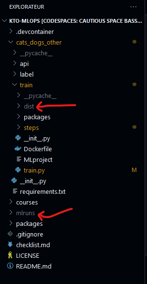

Si certains fichiers ne veulent pas se supprimer, utilisez cette méthode radicale (à utiliser prudemment) :
```bash
sudo rm -rf mlruns/
```

Il faut également néttoyer vos images docker en trop. Utilisez les commandes suivantes :
```bash
docker rm -vf $(docker ps -aq)
docker rmi -f $(docker images -aq)
docker image prune -f
```

### Exécution dans kto-mlflow

Maintenant que nous avons fait fonctionner notre projet MLflow en local, faisons en sorte de le faire tourner dans
kto-mlflow, soit dans Kubernetes. Retenez pour l'instant que Kubernetes est, ce que l'on appelle, un orchestrateur
pour docker. Il permet donc de créer ce que l'on appelle des `Jobs`, qui exécutent docker et le code que l'on a mis dedans.
MLflow fonctionne ainsi. Quand il est en mode Kubernetes, il nous demande de configurer en amont les accès permettant
de se connecter à notre Kubernetes (ici notre OpenShift), pour créer un Job à partir d'un template et de l'image 
Docker que nous avons créé précédemment ;)

Etant donné que notre plateforme kto-mlflow est en ligne, il faut, avant tout autre chose, rendre notre image docker
de train disponible sur le net. Nous reviendrons plus en profondeur sur le fonctionnement de docker et sur ses concepts,
plus loin dans ce cours.

Pour rendre notre image disponible, nous allons la pousser sur Quay.io. Quay.io est disponible avec votre compte Red
Hat Developer et est gratuit sous certaines conditions. Pareil, nous en reparlerons plus en détail plus tard. Pour le 
moment, concentrons-nous sur le procédé.

Tout d'abord, connectez-vous sur [Quay.io](https://quay.io/) et cliquez en haut à droite sur Sign In :

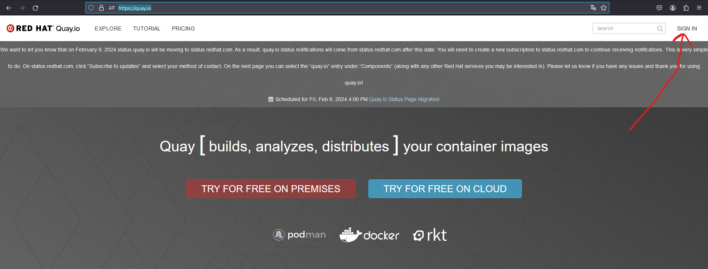
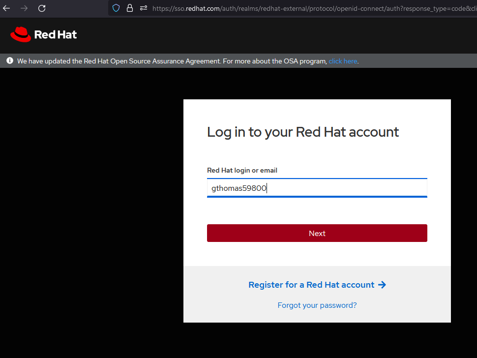 

Normalement, vous devriez être redirigé vers le menu Repositories. Si ce n'est pas le cas, cliquez sur ce menu en haut :

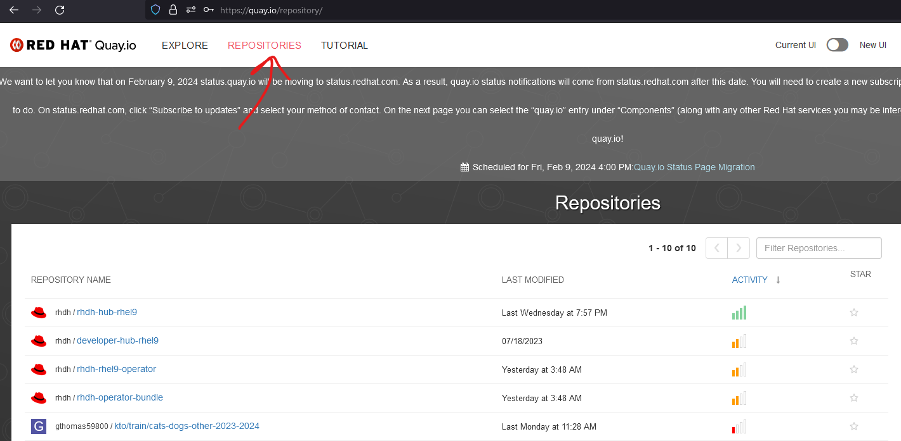

Il faut maintenant que nous créions un nouveau repository. Cliquez sur ce bouton : 

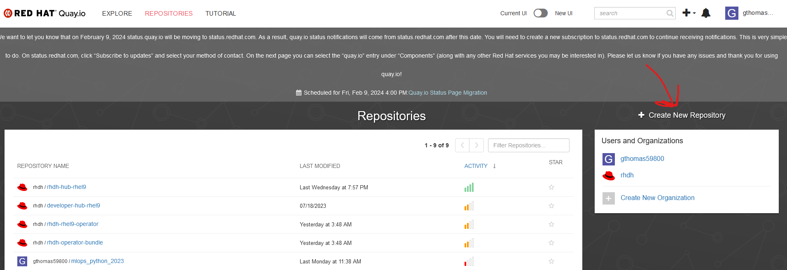

Renseignez le nom de votre repo : `kto/train/cats-dogs-other-2023-2024`. Puis, surtout, veuillez faire en sorte que ce 
repository soit Public (cela me permettra d'y accéder et cela fait également partie des limitations de quay.io gratuit).
Enfin, cliquez sur Create Public Repository : 

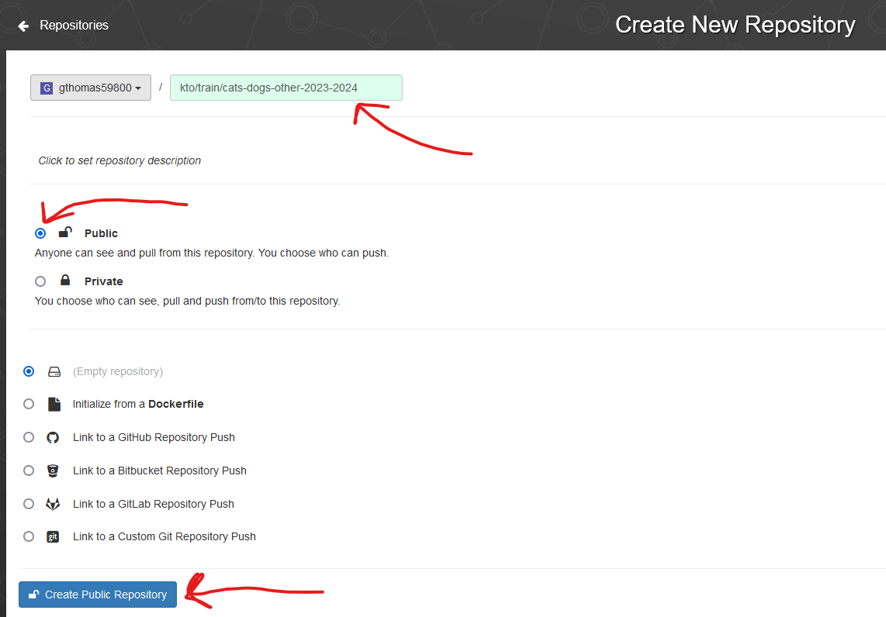

Vous devriez désormais arriver sur cette page ! Bravo ! Vous avez créé votre espace de stockage en ligne !

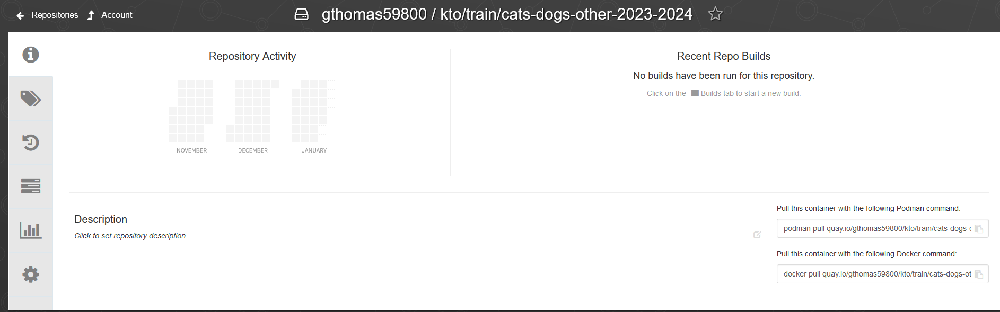

Maintenant, il faut que l'on pousse notre image sur Quay. Pour ce faire, il faudra d'abord connecter votre client docker
de Codespace sur votre compte quay. Pour cela, nous allons créer un compte de type "Robot". Ces types de compte seront 
très utiles pour la suite de ce cours. Nous reviendrons dessus plus tard. Voyons désormais comment créer un compte !

Cliquez sur le menu en haut à droite et sélectionnez Account Settings : 

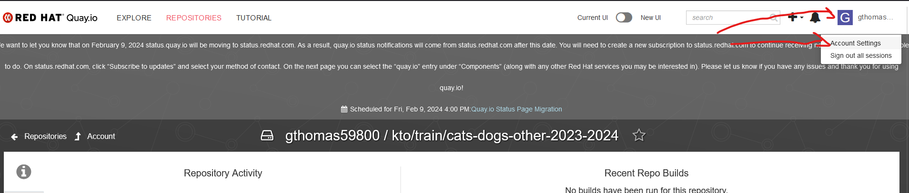

Cliquez ensuite sur le logo en forme de robot à gauche et cliquez sur Create Robot Account : 

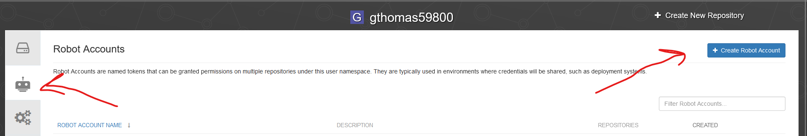

Saisissez le nom du robot, par exemple `mlflow_train_2023_2024` et cliquez sur Create Robot Account : 

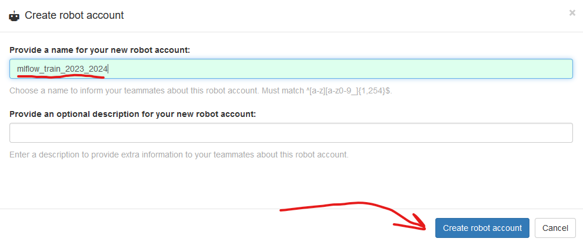

Maintenant, nous devons autoriser ce compte pour notre repository. Retournez dans le repository 
`kto/train/cats-dogs-other-2023-2024`, puis sélectionnez la roue crantée et ajoutez votre compte robot comme indiqué 
ci-dessous :

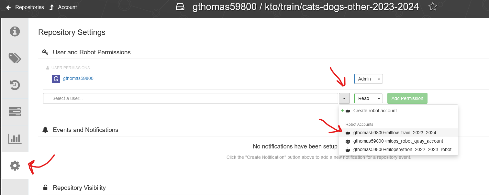

Mettez bien les droits admins à votre robot et ajoutez la permission :

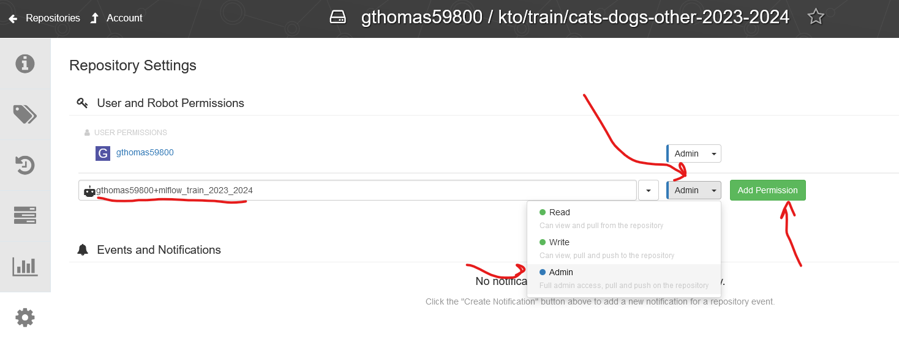

Voici ce que vous devriez obtenir : 


Maintenant, retournez dans le menu des comptes robot et sélectionnez votre compte créé précédemment :


Dans la popup qui vient de s'ouvrir, sélectionnez Docker puis copiez la commande :

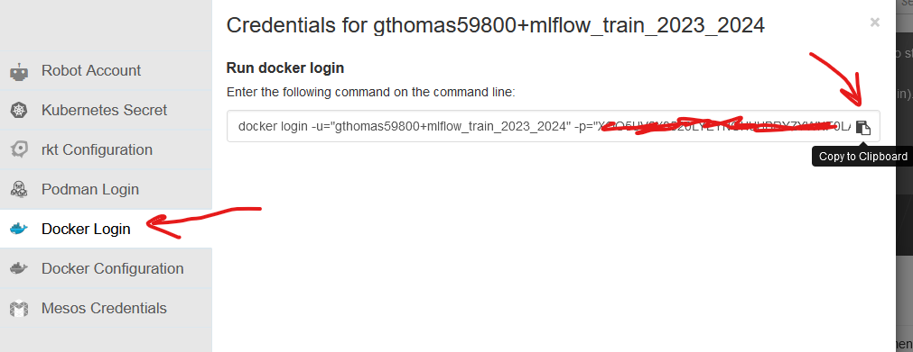

Jouez cette commande dans votre Terminal de Codespace et vous serez prêt à envoyer votre image !

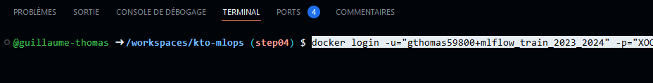

Maintenant, il vous faut ajouter deux nouveaux fichiers dans votre projet, dans le répertoire `train` :
- `kubernetes_config.json` dans lequel vous mettrez ce contenu. Veillez-bien à mettre le nom de votre propre image dans quay
à la ligne `repository-uri` :
```json
{
  "kube-context": "openshift-context",
  "kube-job-template-path": "kubernetes_job_template.yaml",
  "repository-uri": "quay.io/gthomas59800/kto/train/cats-dogs-other-2023-2024"
}
```
- `kubernetes_job_template.yaml` dans lequel vous mettrez ce contenu. Veillez de nouveau à renseigner le nom de votre "namespace"
dans OpenShift à la 5eme ligne, au niveau de `namespace` :
```yaml
apiVersion: batch/v1
kind: Job
metadata:
  name: "{replaced with MLflow Project name}"
  namespace: METTEZ_ICI_VOTRE_NAMESPACE
spec:
  ttlSecondsAfterFinished: 100
  backoffLimit: 0
  template:
    spec:
      containers:
        - name: "{replaced with MLflow Project name}"
          image: "{replaced with URI of Docker image created during Project execution}"
          command: ["{replaced with MLflow Project entry point command}"]
          resources:
            limits:
              cpu: 1300m
              memory: 4000Mi
            requests:
              cpu: 1300m
              memory: 4000Mi
      restartPolicy: Never
```
Vous trouverez cette information en vous connectant sur votre OpenShift : 

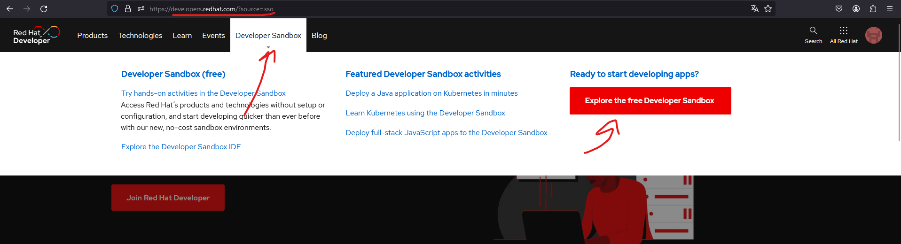
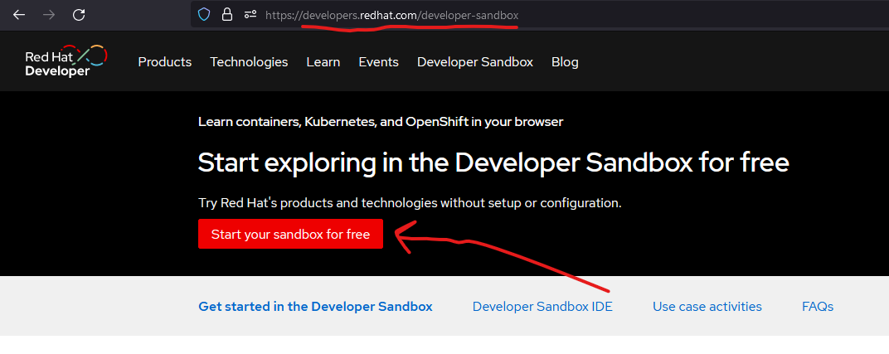
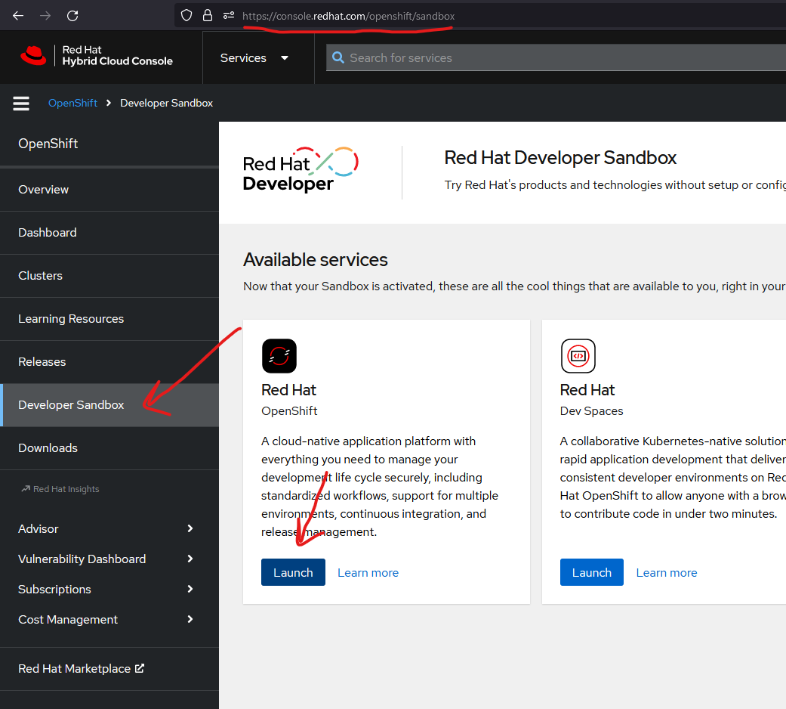
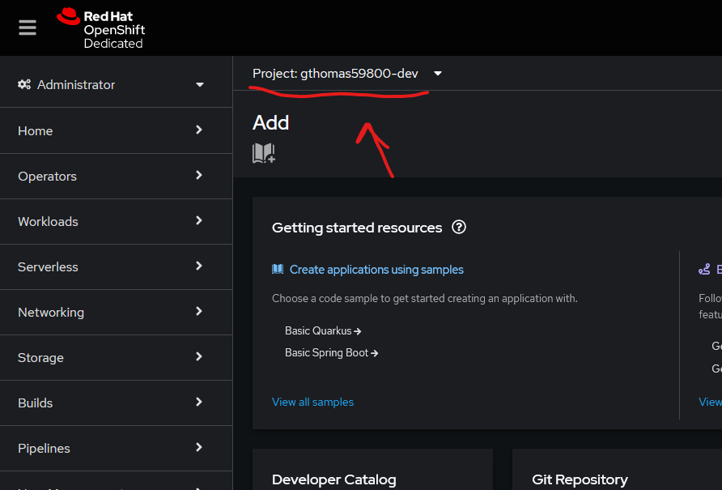

Vous devriez avoir ceci : 

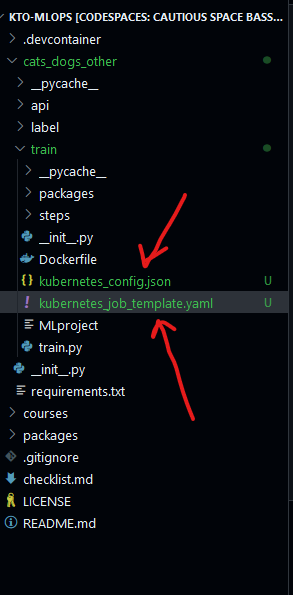

Maintenant, dans votre fichier train/MLproject, changez ligne 4 le nom de l'image local/cats-dogs-other-train, par
le nom de votre image sur quay. Voici un exmeple : 
```yaml
name: cats-dogs-other

docker_env:
  image: quay.io/gthomas59800/kto/train/cats-dogs-other-2023-2024

entry_points:
  main:
    parameters:
        split_ratio_train: {type: float, default: 0.8}
        split_ratio_evaluate: {type: float, default: 0.1}
        split_ratio_test: {type: float, default: 0.1}
        batch_size: {type: int, default: 64}
        epochs: {type: int, default: 4}
        working_dir: {type: str, default: ./cats_dogs_other/train/dist}
        model_filename: {type: str, default: final_model.keras}
        model_plot_filename: {type: str, default: model_plot.png}
    command: "python ./cats_dogs_other/train/train.py --split_ratio_train={split_ratio_train} --split_ratio_evaluate={split_ratio_evaluate} --split_ratio_test={split_ratio_test} --batch_size={batch_size} --epochs={epochs} --working_dir={working_dir}"
```

En fait, ici, nous avons indiqué à MLflow le chemin où est stockée notre image. Elle ne sera plus sur votre machine
de développement, mais directement sur Quay.

Maintenant, construisez votre image avec cette commande, n'oubliez pas vos variables d'environnement si elles manquent,
notez également que le "tag" de votre image a changé pour laisser place à son nom dans quay.io : 
```bash
docker build -f ./cats_dogs_other/train/Dockerfile -t quay.io/gthomas59800/kto/train/cats-dogs-other-2023-2024 --build-arg MLFLOW_S3_ENDPOINT_URL=$MLFLOW_S3_ENDPOINT_URL --build-arg AWS_ACCESS_KEY_ID=$AWS_ACCESS_KEY_ID --build-arg AWS_SECRET_ACCESS_KEY=$AWS_SECRET_ACCESS_KEY .
```

Une fois l'image buildée, poussez la dans quay avec la commande suivante :
```bash
docker push quay.io/gthomas59800/kto/train/cats-dogs-other-2023-2024
```

Constatez que votre image est bien dans votre repository quay.io : 

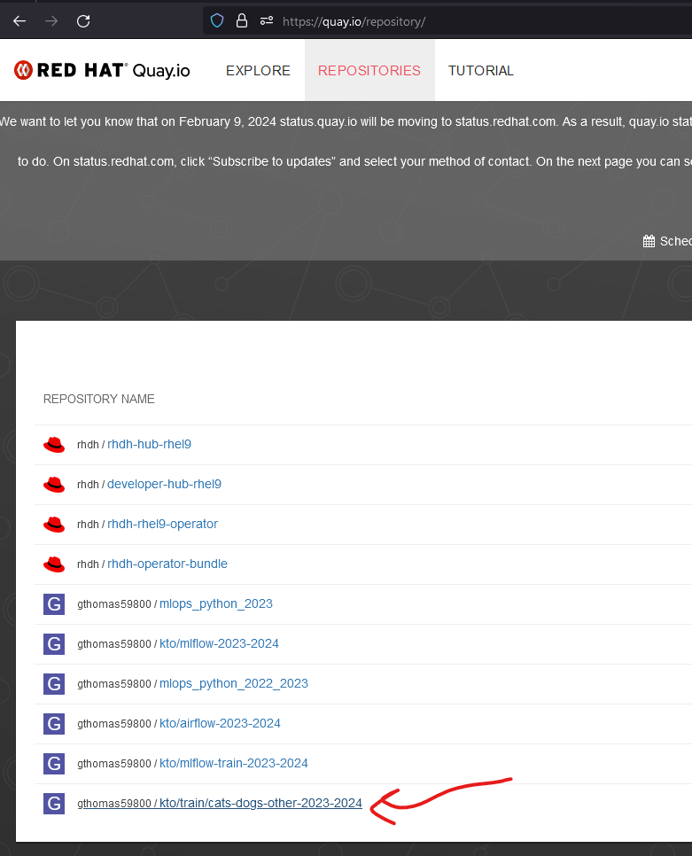
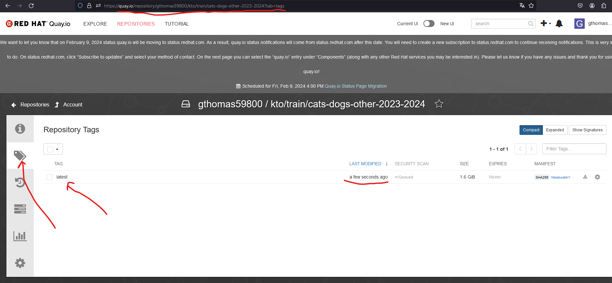

Maintenant, il est temps de réveiller kto-mlflow dans OpenShift. Allumez Dailyclean s'il est éteint dans le menu Workloads => Deployments,
Sélectionnez `dailyclean-api` et s'il est inscrit `scaled to zero` dans le cercle, cliquez une fois sur la flèche à droite.

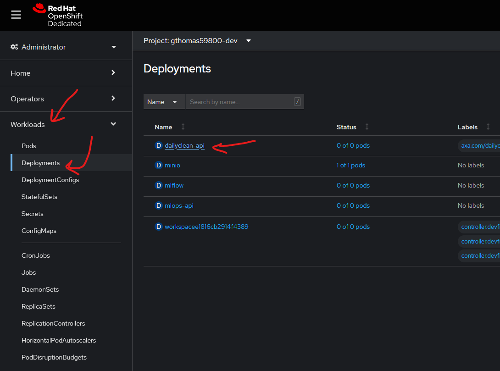
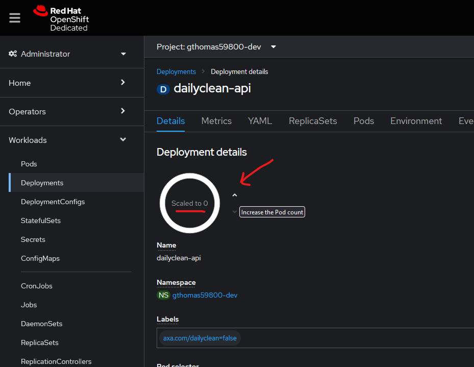

Rendez-vous sur la page de votre dailyclean (vous trouverez le lien dans Network => Routes) et allumez votre environnement :

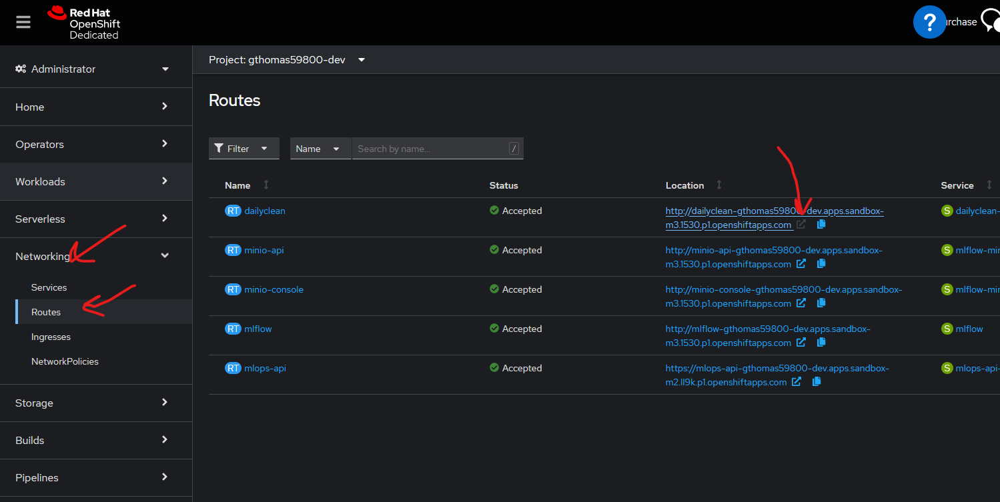
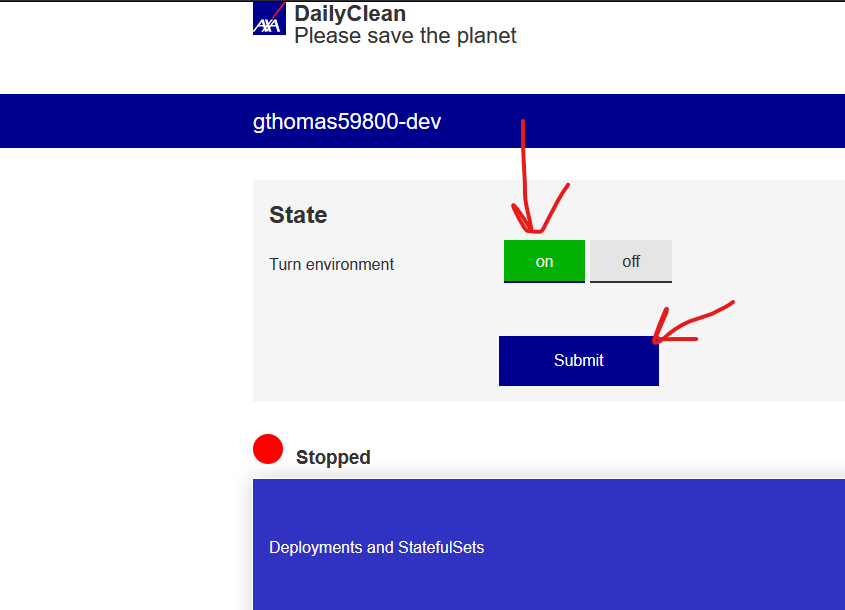

Attendez quelques instants que tout démarre. En attendant, il va falloir ajouter de nouveau quelques variables d'environnement
pour que tout fonctionne bien ! Grrrr. Bon, certaines sont normalement déjà configurée, mais dans le doute, voici toutes
les variables nécessaies : 
```bash
export KUBE_MLFLOW_TRACKING_URI=http://mlflow-balba-dev.apps.sandbox-m3.666.p1.openshiftapps.com
export MLFLOW_TRACKING_URI=http://mlflow-balba-dev.apps.sandbox-m3.666.p1.openshiftapps.com
export MLFLOW_S3_ENDPOINT_URL=http://minio-api-balba-dev.apps.sandbox-m3.666.p1.openshiftapps.com
export AWS_ACCESS_KEY_ID=minio 
export AWS_SECRET_ACCESS_KEY=minio123
```
Les deux premières variables sont nouvelles, en réalité, ce sont les mêmes, vous trouvez la bonne url ici dans OpenShift :

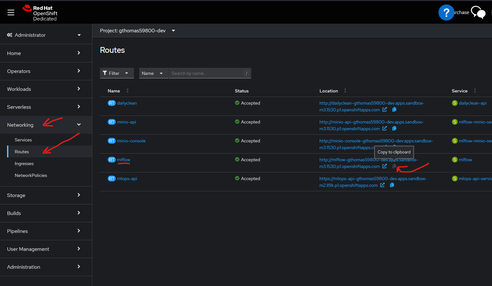

Ce n'est malheureusement pas terminé ... Vous aurez besoin de configurer kubectl, un client kubernetes, qui va permettre
la création de l'exécution de votre train DANS OpenShift. Voici les commandes à exécuter : 
```bash
kubectl config set-cluster openshift-cluster --server=METTEZ_ICI_LADRESSE_DE_VOTRE_OPENSHIFT
kubectl config set-credentials openshift-credentials --token=METTEZ_ICI_SON_JETON_DAUTHENTIFICATION
kubectl config set-context openshift-context --cluster=openshift-cluster --user=openshift-credentials --namespace=METTEZ_ICI_LE_NOM_DE_VOTRE_NAMESPACE
kubectl config use openshift-context
```

Pour trouver les informations à compléter, le nom de votre namespace et le même que celui précédemment renseigné dans le
fichier kubernetes_job_template.json. En ce qui concerne l'adresse du cluster et le jeton, vous trouverez les informations
dans openshift ici, en cliquant sur votre login en haut à droite et sur Copy login command :

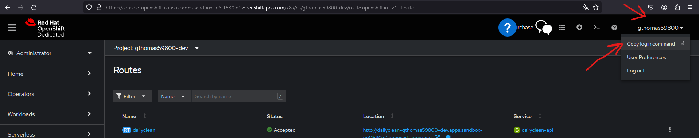

Il n'est pas impossible que l'on vous demande de vous connecter sur votre SandBox :

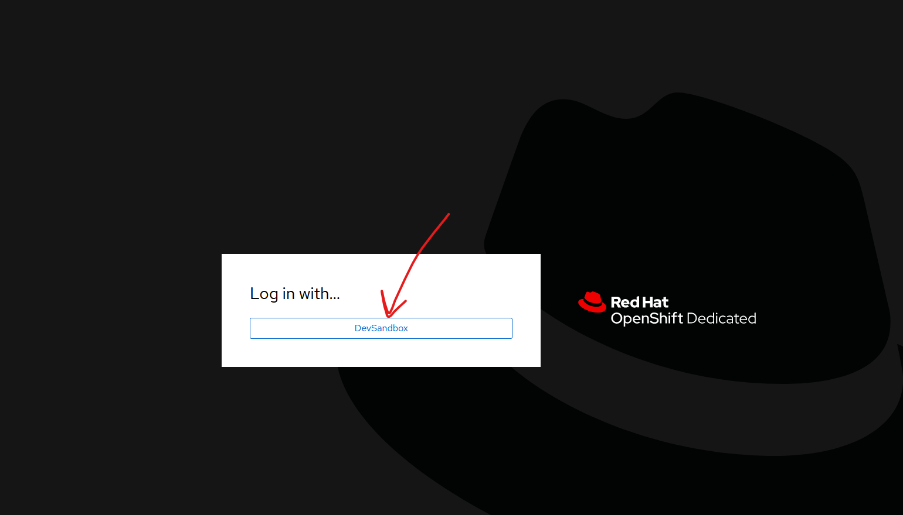

Cliquez sur Display Token

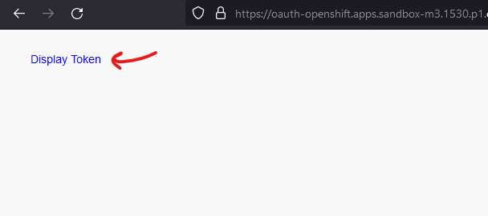

Récupérez vos informations : 

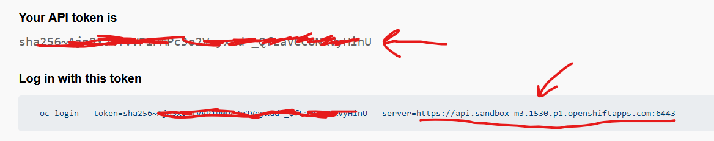

Vous devriez avoir ce genre de réponses dans votre terminal : 

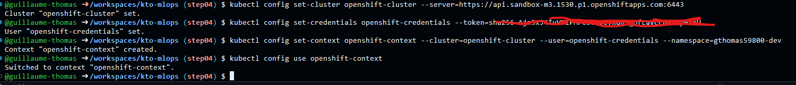

Ce n'est pas encore complètement terminé, pour que le mode "kubernetes" de mlflow fonctionne, vous devez installer la
dépendance python suivante:
```bash
pip install mlflow[extras]
```

Et voilà ! Tout est prêt ! Il ne vous reste qu'à jouer la commande mlflow suivante :
```bash
cd ./cats_dogs_other/train
mlflow run . --experiment-name cats-dogs-other --backend kubernetes --backend-config kubernetes_config.json
cd ../..
```

Suivez le déroulé de votre commande :-) Après quelques instants, votre job est lancé dans votre OpenShift : 


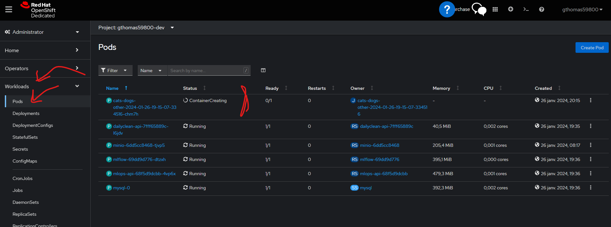

Si vous cliquez sur le job, vous verrez les logs d'exécution de votre train:

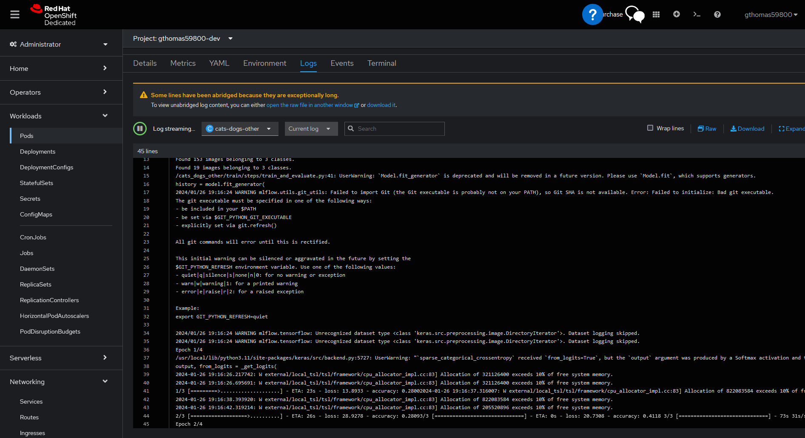

Une fois l'exécution terminée, votre job s'éteindra tout seul. Normalement, la commande mlflow depuis votre codespace
devrait ressembler à ceci :


Vous pouvez maintenant aller consulter vos runs et vos expériences dans votre mlflow en ligne ! Il vous suffit de 
chercher son lien dans Networking => Routes => mlflow :

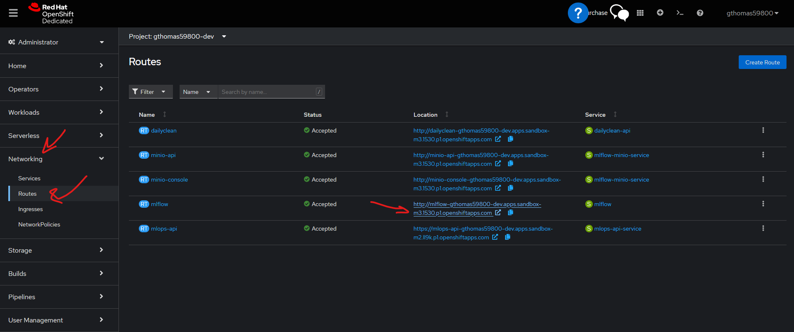

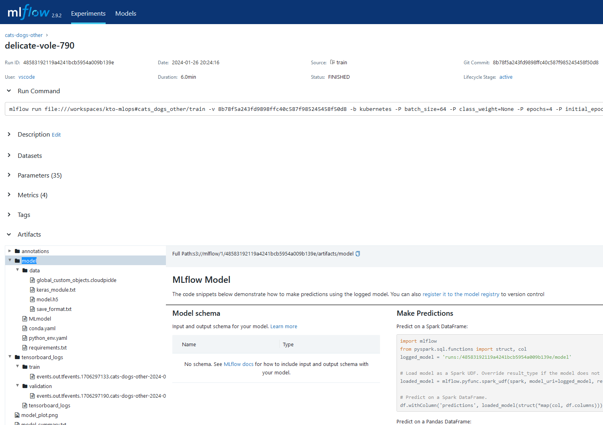

**Maintenant, n'oubliez pas de créer un nouveau commit avec vos modifications et de le pousser sur votre branche (évaluations).
Veuillez également me partager par mail l'adresse de votre dailyclean (évaluations).**

N'oubliez pas d'éteindre votre environnement avec Dailyclean !!!

Bravo ! Cette partie est difficile, vous avez assuré ! Mais, comme vous avez pu le constater, faire tout ceci à la main
est très fastidieux. Le refaire à chaque fois va vous donner beaucoup de travail. C'est pourquoi, automatiser tout ce 
process est INDISPENSABLE ! Voyons maintenant comment faire dans le prochain chapitre !