# 7. Continuous Integration

Dans ce chapitre, nous allons voir comment automatiser tout ce que l'on a fait précédemment grâce à l'intégration continue.

Avant de commencer, afin que tout le monde parte du même point, vérifiez que vous n'avez aucune modification en
cours sur votre working directory avec `git status`.
Si c'est le cas, vérifiez que vous avez bien sauvegardé votre travail lors de l'étape précédente pour ne pas perdre
votre travail.
Sollicitez le professeur, car il est possible que votre contrôle continue en soit affecté.

Sinon, annulez toutes vos modifications avec `git reset --hard HEAD`. Supprimez potentiellement les fichiers
non indexés.
Changez maintenant de branche avec `git switch step04`.
Créez désormais une branche avec votre nom : `git switch -c votrenom/step04`


## A quoi ça sert ?

L'intégration continue est une pratique de développement logiciel qui consiste à intégrer les modifications de 
code dans un projet de manière régulière et automatisée. Les avantages de l'intégration continue sont nombreux. 
Voici quelques-uns d'entre eux :

- **Détection précoce des erreurs** : L'intégration continue permet de détecter les erreurs plus tôt dans le processus 
de développement, ce qui facilite leur correction rapide.
- **Amélioration de la qualité du code** : Les tests automatisés effectués lors de l'intégration continue permettent 
de détecter les erreurs plus rapidement et de manière plus fiable, ce qui améliore la qualité du code.
- **Facilitation de la collaboration entre développeurs** : L'intégration continue permet aux développeurs de 
travailler sur le même code en temps réel, ce qui facilite la collaboration et la communication entre les membres de 
l'équipe.
- **Gain de temps dans la mise en production des applications** : L'intégration continue permet de réduire le temps 
nécessaire pour mettre en production une application, car les modifications sont intégrées au code source en continu.
- **Meilleure gestion des risques** : L'intégration continue permet de réduire les risques liés aux erreurs de code, 
car les modifications sont intégrées et testées en continu.

L'intégration continue consiste à :

- **Mettre en place des tests automatisés** : Cela permet de s'assurer que les modifications apportées au code ne
provoquent pas d'erreurs et que le code fonctionne correctement.
- **Choisir un outil d'intégration continue** : Il est nécessaire d'intégrer un outil d'intégration continue 
tel que Jenkins, Travis CI, CircleCI, GitHub action et bien d'autres, à votre projet. Ces outils permettent 
d'automatiser le processus d'intégration continue.
- **Configurer une pipeline d'intégration continue** : La pipeline d'intégration continue est une série 
d'étapes automatisées qui permettent de compiler, tester et déployer le code. Il est important de configurer 
cette pipeline en fonction des besoins du projet.

Il est important de noter que la mise en place de l'intégration continue peut varier en fonction des besoins du projet
et des outils utilisés.


## Publier un package pour commencer

Profitons également de ce chapitre pour réorganiser certaines parties de notre code en **packages**. En effet, il y a des boûts
de notre code que l'on va pouvoir réutiliser. Avez-vous deviné lesquels ?

Les packages en Python sont un moyen de regrouper des modules connexes. Ils permettent de structurer les projets Python 
en sous-dossiers contenant des modules liés entre eux. Voici quelques avantages de ce procédé :

1. **Organisation du code** : Les packages permettent de structurer le code en sous-dossiers, ce qui facilite la 
navigation et la maintenance du code.
2. **Réutilisation du code** : Les packages permettent de réutiliser facilement le code dans différents projets.
3. **Distribution du code** : Les packages permettent de distribuer facilement le code à d'autres utilisateurs via des 
outils tels que PyPI (Python Package Index).
4. **Gestion des dépendances** : Les packages permettent de gérer facilement les dépendances du projet en spécifiant 
les packages requis dans un fichier `requirements.txt`.

Pour créer un package en Python, il suffit de créer un dossier contenant un fichier `__init__.py` et les modules 
associés. Le fichier `__init__.py` est exécuté lorsque le package est importé et peut contenir du code d'initialisation 
pour le package.

Pour partager facilement un package, il peut être également utile de créer des livrables sous forme de wheels.
Les wheels en Python sont des archives binaires qui contiennent des packages Python pré-compilés.  
Il est recommandé de créer des wheels pour les packages Python, car cela permet d'accélérer le processus d'installation 
et de distribution des packages.

Créons donc maintenant notre premier wheel ! Et pour ce faire, nous allons extraire le code d'inférence de notre modèle 
dans un package dédié ;-) Pourquoi ? Car il est certain que nous réutiliserons ce package dans le chapitre suivant, dédié aux 
API !

Allez, c'est parti !

Détectons pour l'instant le code réutilisable. On peut se dire que ce code-ci, situé dans le script `train/steps/test.py`
, est intéressant :
```python
from io import BytesIO

import numpy as np
from keras.models import load_model
from tensorflow.keras.preprocessing.image import load_img, img_to_array


# load and prepare the image
def load_image(filename: str|BytesIO):
    # load the image
    img = load_img(filename, target_size=(224, 224))
    # convert to array
    img = img_to_array(img)
    # reshape into a single sample with 3 channels
    img = img.reshape(1, 224, 224, 3)
    # center pixel data
    img = img.astype('float32')
    img = img - [123.68, 116.779, 103.939]
    return img


class Inference:
    def __init__(self, model_path: str):
        self.model = load_model(model_path)

    def execute(self, filepath:str|BytesIO):
        img = load_image(filepath)
        result = self.model.predict(img)
        values = [float(result[0][0]), float(result[0][1]), float(result[0][2])]
        switcher = ['Cat', 'Dog', 'Other']
        prediction = np.argmax(result[0])
        return {"prediction": switcher[prediction], "values": values}

```

A la racine de votre projet, vous trouverez un répertoire `packages`. Dans celui-ci, créez un répertoire `inference`.
Dans ce répertoire, créez les fichiers `requirements.txt` et `setup.py`, créez également un sous-répertoire `kto` dans
lequel vous créerez un nouveau script `inference.py`. Votre espace de travail devrait ressembler à ceci :

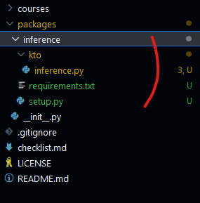

Dans le fichier `requirements.txt`, mettez les dépendances requises au bon fonctionnement du package :
```
tensorflow
pillow
```

Dans le fichier `setup.py`, mettez les informations suivantes :
```python
from setuptools import setup

with open("requirements.txt") as f:
    requirements = f.read().splitlines()

setup(name = 'kto-keras-inference',
      version = '0.0.1',
      install_requires=requirements
     )
```

Dans le script `inference.py`, coupez et collez le code suivant depuis `train/steps/test.py`. `inference.py` devrait ressembler à
ceci : 
```python
from io import BytesIO

import numpy as np
from keras.models import load_model
from tensorflow.keras.preprocessing.image import load_img, img_to_array


# load and prepare the image
def load_image(filename: str|BytesIO):
    # load the image
    img = load_img(filename, target_size=(224, 224))
    # convert to array
    img = img_to_array(img)
    # reshape into a single sample with 3 channels
    img = img.reshape(1, 224, 224, 3)
    # center pixel data
    img = img.astype('float32')
    img = img - [123.68, 116.779, 103.939]
    return img


class Inference:
    def __init__(self, model_path: str):
        self.model = load_model(model_path)

    def execute(self, filepath:str|BytesIO):
        img = load_image(filepath)
        result = self.model.predict(img)
        values = [float(result[0][0]), float(result[0][1]), float(result[0][2])]
        switcher = ['Cat', 'Dog', 'Other']
        prediction = np.argmax(result[0])
        return {"prediction": switcher[prediction], "values": values}

```

Pour builder votre livrable, plusieurs outils sont possibles. Je vous recommanderais de plutôt 
utiliser [build de pypa](https://github.com/pypa/build). Vous pouvez l'installer avec la commande suivante :
```bash
pip install build
```

Enfin, lancez la génération du package avec les commandes suivantes :
```bash
cd packages/inference
python -m build --sdist --wheel
cd ../..
```

Comme vous pouvez les constater, cela a créé plusieurs répertoires dont l'un se nomme `dist`. Dans celui-ci, vous trouverez
votre wheel :

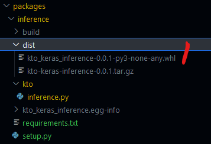

Pour bien faire, il faudrait partager ce livrable à la communauté dans un repository centralisé, tel que pypi. Nous ne le
ferons pas ici, nous allons proposer plutôt de copier/coller le wheel dans des répertoires prévus pour chaque module
qui le nécessitent. Par exemple, dans le répertoire `train`, vous trouverez également un répertoire packages. Nous allons
copier le wheel ici :


Maintenant, ajoutez le wheel dans le `requirements.txt` se trouvant dans `cats_dogs_other` :
```
boto3
tensorflow 
matplotlib 
scipy
mlflow
./cats_dogs_other/train/packages/kto_keras_inference-0.0.1-py3-none-any.whl
```

Faites un pip install de ce `requirements.txt` avec la commande :
```bash
pip install -r ./cats_dogs_other/requirements.txt
```

N'oubliez pas de bien mettre à jour votre script `train/steps/test.py` en enlevant le code d'inference et en ajoutant 
l'import vers votre nouveau package :
```python
import json
from pathlib import Path

from kto.inference import Inference


def test_model(model_inference: Inference, model_dir: str, test_dir: str):
    statistics = {"ok": 0, "ko": 0, "total": 0}
    results = []
    path_test_dir = Path(test_dir)
    for path in path_test_dir.glob("**/*"):
        if path.is_dir():
            continue
        model_result = model_inference.execute(str(path))

        prediction = model_result["prediction"]
        prediction_truth = path.parent.name.lower().replace("s", "")
        status = prediction_truth == prediction.lower()
        statistics["ok" if status else "ko"] += 1
        result = {
            "filename": path.name,
            "ok": status,
            "prediction": prediction,
            "prediction_truth": prediction_truth,
            "values": model_result["values"],
        }
        results.append(result)
    statistics["total"] = statistics["ok"] + statistics["ko"]

    with open(model_dir + "/statistics.json", "w") as file_stream:
        json.dump(statistics, file_stream, indent=4)

    with open(model_dir + "/predictions.json", "w") as file_stream:
        json.dump(results, file_stream, indent=4)

```

Lancez maintenant vos tests unitaires, ceux-ci devraient toujours fonctionner !
D'ailleurs, attention, le test unitaire `test_inference.py` devrait plutôt être déplacé dans le package inference.
Pour l'instant, on le laisse ici, il nous permet de valider que la dépendance avec notre nouveau wheel fonctionne. Faites
en l'expérience en jouant avec (supprimez l'import `from kto.inference import Inference` par exemple).

Une nouvelle fois, beaucoup de manipulations manuelles ont été faites ici et nous n'aimerions pas les reproduire ... Je
vous propose de simplifier ça en créant un script de création du wheel et de copie dans les différents répertoires packages du 
projet. Créé un script shell à la racine de votre projet `init_packages.sh` :

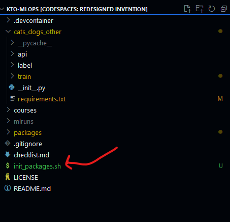

Et mettez-y le script suivant : 
```bash
pip install --upgrade pip
pip install build

pip install -e packages/inference

cd packages/inference/
python -m build --sdist --wheel
cd dist
cp *.whl ../../../cats_dogs_other/train/packages
cd ../../../
```

Modifiez les droits de ce script, puis lancez ce script ainsi que les tests unitaires pour tout revalider :
```bash
chmod 777 init_packages.sh 
./init_packages.sh
pip install -r ./cats_dogs_other/requirements.txt
python -m unittest 
```

Et voilà ! Tout fonctionne ! Bravo ! Vous avez fait votre premier module, construit dans un format wheel, partageable 
et réutilisable !

Attention cependant ! Si l'on veut également que cela fonctionne bien partout, il faut également que l'on mette à jour
le fichier `Dockerfile` qui se trouve dans le répertoire `train`. En effet, c'est lui qui construit l'environnement
d'exécution de l'entraînement de notre modèle dans mlflow.

Il devrait ressembler maintenant à ceci :
```dockerfile
FROM python:3.11-slim

ARG MLFLOW_S3_ENDPOINT_URL
ARG AWS_ACCESS_KEY_ID
ARG AWS_SECRET_ACCESS_KEY

ENV MLFLOW_S3_ENDPOINT_URL=${MLFLOW_S3_ENDPOINT_URL}
ENV AWS_ACCESS_KEY_ID=${AWS_ACCESS_KEY_ID}
ENV AWS_SECRET_ACCESS_KEY=${AWS_SECRET_ACCESS_KEY}

COPY --chown=${USER} cats_dogs_other/train ./cats_dogs_other/train
COPY --chown=${USER} cats_dogs_other/requirements.txt ./cats_dogs_other/requirements.txt
COPY --chown=${USER} packages ./packages
COPY --chown=${USER} init_packages.sh ./init_packages.sh

RUN chmod -R 777 ./cats_dogs_other
RUN chmod -R 777 init_packages.sh
RUN ./init_packages.sh
RUN pip install -r /cats_dogs_other/requirements.txt
```

Nous pouvons tenter une construction rapide en local pour bien vérifier que tout fonctionne.

```bash
docker build -f ./cats_dogs_other/train/Dockerfile -t local/cats-dogs-other-train .
```

L'image est buildée ! Ca fonctionne bien ! 

Commitez vos modifications dans un premier commit et poussez-les sur votre branche !

Maintenant, mettons en place notre pipeline.

## Mise en place de nos github actions

GitHub Actions est un outil d'intégration continue qui permet d'automatiser le processus d'intégration continue.
Il est possible de configurer des workflows personnalisés pour votre projet en utilisant GitHub Actions.
Les workflows sont configurés en utilisant un fichier YAML qui décrit les étapes à suivre pour compiler, tester et
déployer du code.

Cet outil est complètement intégré dans GitHub ! Vous trouverez d'ailleurs vos GitHub actions ici, dans le menu Actions,
directement dans votre repository :

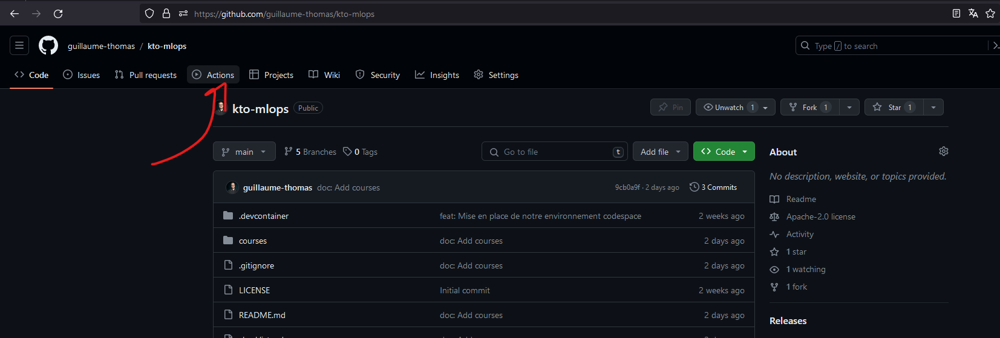

Un autre avantage très appréciable des GitHub actions, c'est que leurs définitions se fait directement dans votre code !
Ainsi pour créer votre action qui permet d'automatiser le lancement de votre entraînement, créez un répertoire `.github`
à la racine de votre projet. Dans ce répertoire, créez un sous-dossier `workflows` et créez enfin un fichier 
`cats-dogs-other.yaml` :

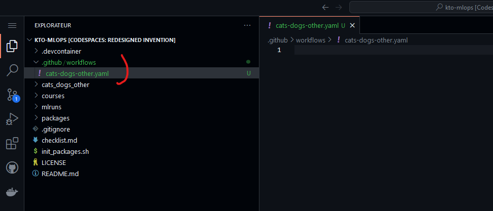

Et pour commencer la mise en place de notre action, nous allons configurer un déclencheur (ou communément trigger). Il
y en a littéralement des tonnes sur GitHub Actions. Si le cœur vous en dit, en voici 
la [documentation complète](https://docs.github.com/en/actions/using-workflows/events-that-trigger-workflows) !

Dans un premier temps, nous allons définir un déclenchement à chaque push sur nos branches `step`. Notez que vous
pouvez spécifier une sorte d'expression régulière sur les noms des branches qui peuvent déclencher notre action. Une bonne
pratique est plutôt de déclencher nos actions à chaque push sur la branche `main`. Nous ne le faisons pas ici à cause de la
structure de notre cours.

Ensuite, votre pipeline sera composé de `jobs` et de `steps`. Ces derniers permettent de structurer votre pipeline en 
étapes et sous-étapes. Un `job` est composé d'une liste de `steps`. Un step est une unité de travail qui peut être 
soit une action, soit un script shell. Vous pouvez utiliser des actions pré-construites ou créer vos propres 
actions personnalisées pour les steps.

Profitons-en pour nommer notre pipeline et commençons par une première étape dans un premier job nommé `train`, 
imprimer `coucou` dans la console :
```yaml
name: Cats and dogs CI/CD
on:
  push:
    branches:
      - step**

jobs:
  train:
    runs-on: ubuntu-latest
    steps:
      - name: Première step d'intro !!
        run: |
          echo "COUCOU !"
```

Notez que nous avons notre job `train` qui s'exécute dans un environnement Linux, plus particulièrement une Ubuntu.
Le shell utilisé dans notre première étape est donc celui d'un environnement Ubuntu.

Pour que vos modifications soient prises en compte ici et pour que votre workflow se créé, 
il faut que vous les commitiez et poussez sur votre branche ! Constatez sa création et sa bonne exécution ! Il y a 
beaucoup d'informations intéressantes sur cette première exécution, comme le message du commit qui a déclenché l'action,
la branche sur laquelle il a été poussé, le nom du job `train`, de notre première step et surtout, les logs de cette
exécution ! Pour voir tout cela, vous pouvez cliquer sur l'instance de votre exécution et sur le job :

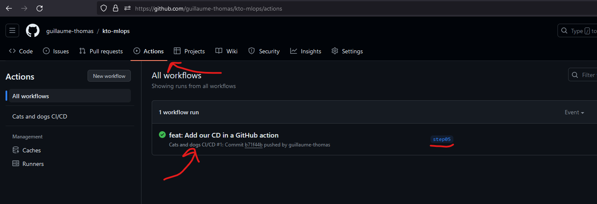
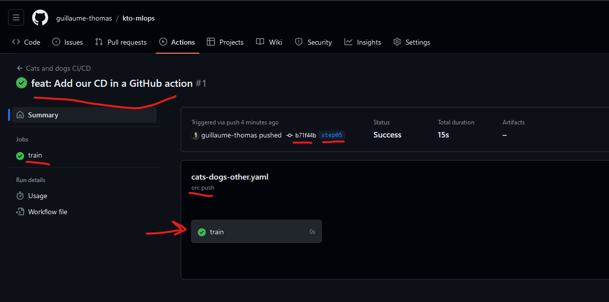
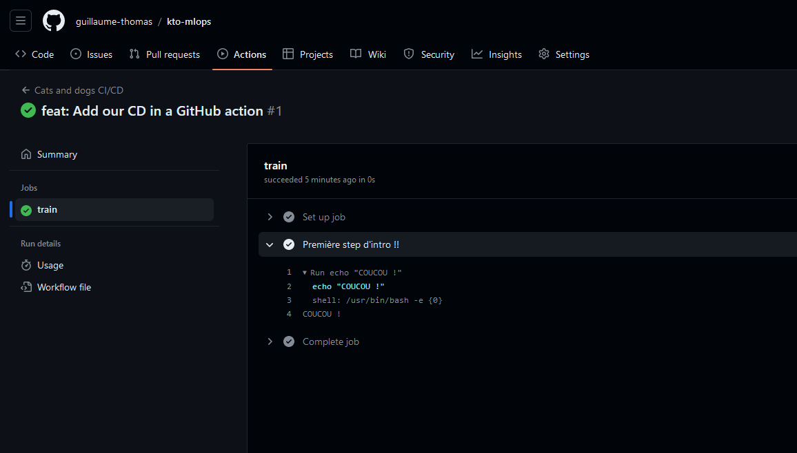

Maintenant, allons un peu plus loin dans notre action en récupérant le code source de notre projet avec un "checkout" git
(il s'agit de l'ancienne commande, remplacée par `git switch`, elle a le même effet, synchroniser le répertoire de 
travail git avec une branche distante). Nous allons également configurer un environnement d'exécution python (oui, c'est
possible !!), ça va installer un interpréteur python dans la version souhaitée. Nous serons donc en mesure d'exécuter
du code python dans notre pipeline ! Ca pourrait être utile pour, par exemple, exécuter des tests unitaires ;)

```yaml
name: Cats and dogs CI/CD
on:
  push:
    branches:
      - step**

jobs:
  train:
    runs-on: ubuntu-latest
    steps:
      - uses: actions/checkout@v3
      - name: Set up Python 3.11
        uses: actions/setup-python@v3
        with:
          python-version: 3.11
      - name: Upgrade pip, install packages and run unittests
        run: |
          pip install --upgrade pip
          ./init_packages.sh
          pip install -r ./cats_dogs_other/requirements.txt
          pip install -r ./cats_dogs_other/label/requirements.txt
          python -m unittest
```

Pour prendre en compte cette modification, rebelote, il va falloir commiter et pusher. Afin d'éviter de polluer votre historique
git, je vous propose plutôt de modifier votre dernier commit avec les commandes suivantes :
```bash
git add .
git commit --amend --no-edit
git push -f
```
Comme vous pouvez le constater dans l'exécution automatique de votre action, vos tests ont été automatiquement lancés
et ils fonctionnent ! Bravo ! Vous venez de configurer vos tests automatisés ! C'est la première étape d'une intégration
continue réussie ! Vous venez de sécuriser votre code. A chaque fois que vous ferez une modification, vos tests seront
lancés tous seuls et valideront vos modifications ! C'est génial !

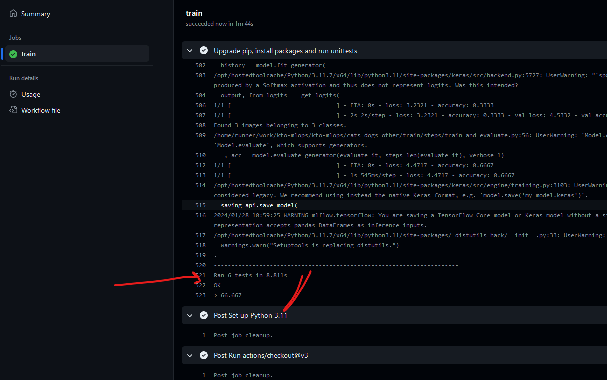

Passons maintenant à la suite, en se concentrant sur la mise en place de mlflow dans votre pipeline !

## Lancer une expérimentation de manière continue

Ici, nous allons directement lancer les entraînements de nos modèles, depuis notre pipeline d'intégration continue.
Nous allons avoir besoin de plusieurs choses et ces éléments vont vous rappeler des souvenirs :
- mlflow : le client mlflow nous permet de créer un run dans une expérience dans un Server Tracking distant
- docker : pour créer et pousser les images d'entraînements
- kubectl : Client Kubernetes utilisé par mlflow pour créer vos jobs d'entraînement dans OpenShift
- toutes les variables d'environnement utilisées précédemment (url/user/mdp de minio, url de mlflow dans kto-mlflow,
url/token du cluster OpenShift, user/mdp du compte robot de Quay) et des nouvelles, 
comme l'url de votre Dailyclean dans votre instance de kto-mlflow.

Commençons d'abord par les variables d'environnement, ce sera fait ;) Vous avez la possibilité de configurer des 
variables d'environnement à destination de vos GitHub Actions directement dans votre repository GitHub. Rendez-vous dans
le menu Settings en haut de la page de votre repository, puis dans Secrets and varaibles, puis Actions :

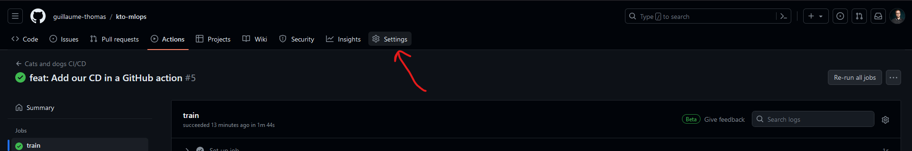
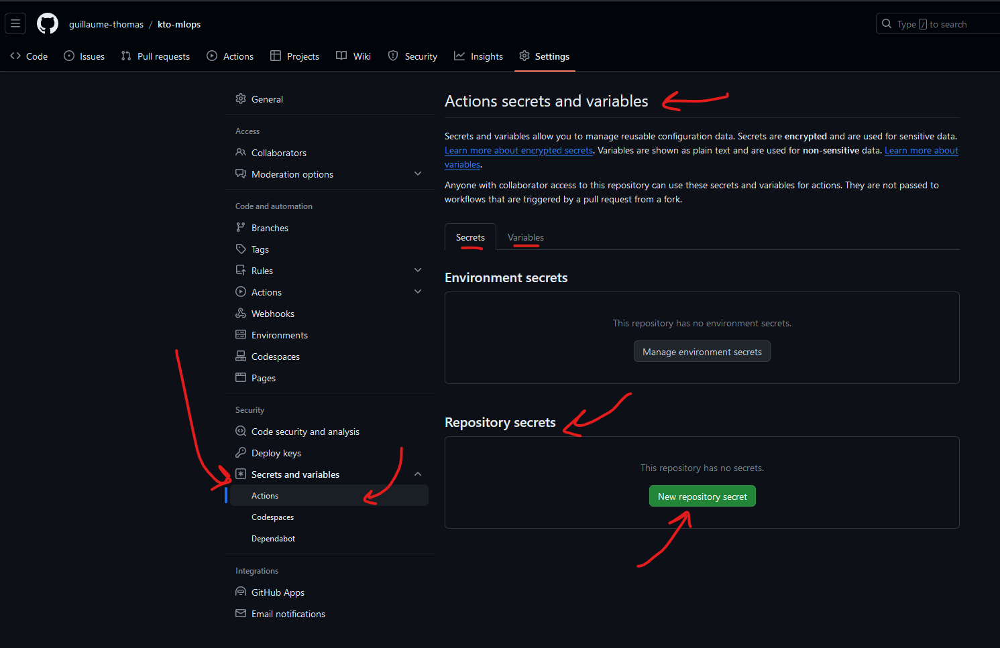

Comme vous pouvez le constater, il y a une section Secrets et une autre Variables. Dans Secrets, nous mettrons les
mots de passe. Cet espace est chiffré et sécurisé. Nous mettrons tout le reste en clair, dans les variables.
Vous avez également deux niveaux d'accessibilité, à l'environnement et au repository. Par mesure de simplification,
nous allons utiliser exclusivement les variables et les secrets de type Repository. Voici ce que vous devriez avoir
au niveau des Secrets :

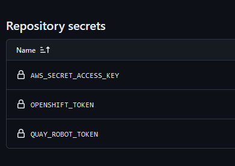

Et voici pour les variables :


Petit rappel, pour récupérer les identifiants du robot quay, rendez-vous sur quay.io et utiliser vos identifiants
RedHat Developer pour vous connecter. Vous trouverez votre compte robot dans le menu Account Settings. Cliquez sur le 
robot et cliquez sur votre compte, cela ouvrira une popup. Sélectionnez Robot Account à gauche de cette fenêtre,
vous trouverez vos identifiants :

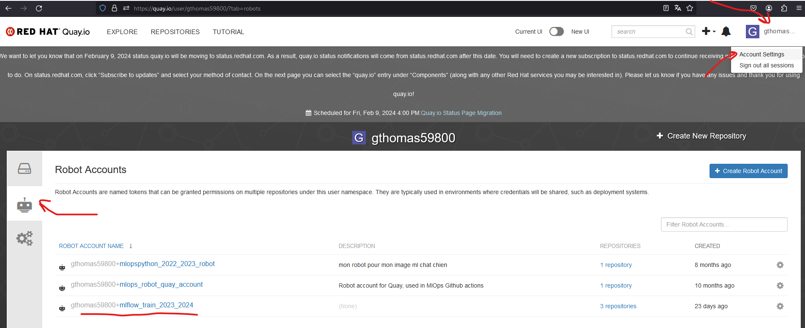
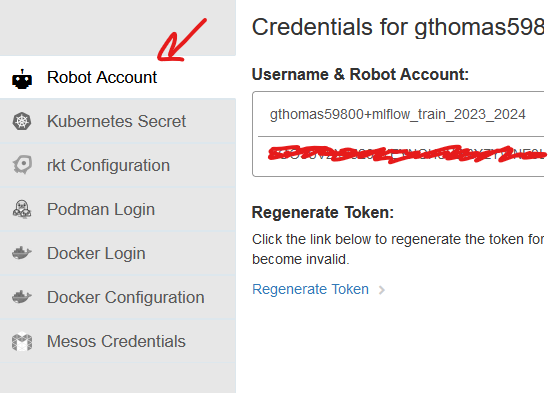

Créez donc le Secret Repository QUAY_ROBOT_TOKEN et renseignez le secret de votre compte et la variable Repository
QUAY_ROBOT_USERNAME avec le user de votre compte.

Poursuivons avec OpenShift. Rendez-vous dans votre [OpenShift Sandbox](https://console.redhat.com/openshift/sandbox), identifiez-vous si besoin
et en haut à droite, lancez votre Openshift avec le bouton Launch, puis sélectionnez en haut à droite Copy login command
en cliquant sur votre user :

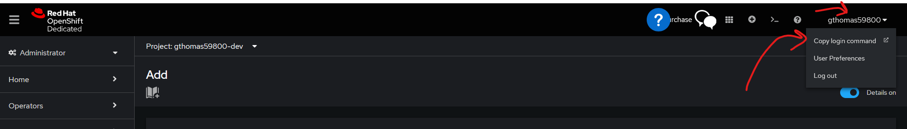

Cliquez sur Display token et récupérez votre token que vous mettrez dans un Repository Secret nommé OPENSHIFT_TOKEN,
récupérez l'adresse du cluster que vous mettrez dans une Repository Variable nommée OPENSHIFT_SERVER. Ajoutez également
votre login (affiché en haut à droite dans l'image ci-dessus) dans une variable OPENSHIFT_USERNAME.

Terminons avec les secrets en créant AWS_SECRET_ACCESS_KEY dont la valeur est "minio123". Profitons-en maintenant
pour ajouter la variable AWS_ACCESS_KEY_ID dont la valeur est minio. Il ne nous reste plus qu'à ajouter nos urls
vers minio, Dailyclean et mlflow. Vous trouverez toutes ces informations dans OpenShift dans le menu Networking => Routes :


Créez les variables repository :
- DAILYCLEAN_ROUTE : copiez/collez la route à la ligne `dailyclean`
- MLFLOW_S3_ENDPOINT_URL : copiez/collez la route à la ligne `minio-api` 
- MLFLOW_TRACKING_URI : copiez/collez la route à la ligne `mlflow`

Et voilà ! Vous avez terminé !

Maintenant, terminons notre github action. Ajoutons d'abord l'installation de mlflow dans notre pipeline :
```yaml
      - name: Install mlflow
        run: |
          pip install mlflow[extras]
```
Maintenant, configurons notre client docker et notre client kubernetes pour qu'ils puissent se connecter sur Quay et 
OpenShift. Notez que docker et kubectl sont déjà installés et prêts à l'emploi dans nos GitHub Actions (et
ça, c'est super cool !) :
```yaml
      - name: Configure Docker (Quay) & Kubectl (Openshift Sandbox)
        run: |
          docker login -u="${{vars.QUAY_ROBOT_USERNAME}}" -p="${{secrets.QUAY_ROBOT_TOKEN}}" quay.io
          kubectl config set-cluster openshift-cluster --server=${{vars.OPENSHIFT_SERVER}}
          kubectl config set-credentials openshift-credentials --token=${{secrets.OPENSHIFT_TOKEN}}
          kubectl config set-context openshift-context --cluster=openshift-cluster --user=openshift-credentials --namespace=${{vars.OPENSHIFT_USERNAME}}-dev
          kubectl config use openshift-context
```
Ces commandes doivent vous rappeler des souvenirs ;) Notez l'usage des secrets et des variables d'environnement.
Réveillons maintenant Dailyclean, patientons un peu pour lui laisser le temps de démarrer, et demandons-lui de réveiller
kto-mlflow !
```yaml
      - name: Wake up dailyclean and kto-mlflow
        run: |
          kubectl scale --replicas=1 deployment/dailyclean-api
          sleep 30
          curl -X POST ${{vars.DAILYCLEAN_ROUTE}}/pods/start
```
Construisons maintenant notre image docker pour le train de notre modèle. Faites attention à bien mettre dans cette commande
votre repository quay à vous !
```yaml
      - name: Build training image
        run: |
          docker build -f cats_dogs_other/train/Dockerfile -t quay.io/VOTREREPO/kto/train/cats-dogs-other-2023-2024:latest --build-arg MLFLOW_S3_ENDPOINT_URL=${{vars.MLFLOW_S3_ENDPOINT_URL}} --build-arg AWS_ACCESS_KEY_ID=${{vars.AWS_ACCESS_KEY_ID}} --build-arg AWS_SECRET_ACCESS_KEY=${{secrets.AWS_SECRET_ACCESS_KEY}} .
      
```
Ajoutez maintenant la partie vous permettant d'exécuter votre entraînement en ligne : 
```yaml
      - name: Launch mlflow training in Openshift
        run: |
          export KUBE_MLFLOW_TRACKING_URI="${{vars.MLFLOW_TRACKING_URI}}"
          export MLFLOW_TRACKING_URI="${{vars.MLFLOW_TRACKING_URI}}"
          export MLFLOW_S3_ENDPOINT_URL="${{vars.MLFLOW_S3_ENDPOINT_URL}}"
          export AWS_ACCESS_KEY_ID="${{vars.AWS_ACCESS_KEY_ID}}" 
          export AWS_SECRET_ACCESS_KEY="${{secrets.AWS_SECRET_ACCESS_KEY}}"
          
          cd cats_dogs_other/train
          mlflow run . --experiment-name cats-dogs-other --backend kubernetes --backend-config kubernetes_config.json
```
Mettez en sommeil kto-mlflow : 
```yaml
      - name: Asleep kto-mlflow with dailyclean
        run: |
          curl -X POST ${{vars.DAILYCLEAN_ROUTE}}/pods/stop
```
Votre fichier complet devrait ressembler à ceci :
```yaml
name: Cats and dogs CI/CD
on: 
  push:
    branches:
      - step**

jobs:
  train:
    runs-on: ubuntu-latest
    steps:
      - uses: actions/checkout@v3
      - name: Set up Python 3.11
        uses: actions/setup-python@v3
        with:
          python-version: 3.11
      - name: Upgrade pip, install packages and run unittests
        run: |
          pip install --upgrade pip
          ./init_packages.sh
          pip install -r ./cats_dogs_other/requirements.txt
          pip install -r ./cats_dogs_other/label/requirements.txt
          python -m unittest
      - name: Install mlflow
        run: |
          pip install mlflow[extras]
      - name: Configure Docker (Quay) & Kubectl (Openshift Sandbox)
        run: |
          docker login -u="${{vars.QUAY_ROBOT_USERNAME}}" -p="${{secrets.QUAY_ROBOT_TOKEN}}" quay.io
          kubectl config set-cluster openshift-cluster --server=${{vars.OPENSHIFT_SERVER}}
          kubectl config set-credentials openshift-credentials --token=${{secrets.OPENSHIFT_TOKEN}}
          kubectl config set-context openshift-context --cluster=openshift-cluster --user=openshift-credentials --namespace=${{vars.OPENSHIFT_USERNAME}}-dev
          kubectl config use openshift-context
      - name: Wake up dailyclean and kto-mlflow
        run: |
          kubectl scale --replicas=1 deployment/dailyclean-api
          sleep 30
          curl -X POST ${{vars.DAILYCLEAN_ROUTE}}/pods/start
      - name: Build training image
        run: |
          docker build -f cats_dogs_other/train/Dockerfile -t quay.io/gthomas59800/kto/train/cats-dogs-other-2023-2024:latest --build-arg MLFLOW_S3_ENDPOINT_URL=${{vars.MLFLOW_S3_ENDPOINT_URL}} --build-arg AWS_ACCESS_KEY_ID=${{vars.AWS_ACCESS_KEY_ID}} --build-arg AWS_SECRET_ACCESS_KEY=${{secrets.AWS_SECRET_ACCESS_KEY}} .
      - name: Launch mlflow training in Openshift
        run: |
          export KUBE_MLFLOW_TRACKING_URI="${{vars.MLFLOW_TRACKING_URI}}"
          export MLFLOW_TRACKING_URI="${{vars.MLFLOW_TRACKING_URI}}"
          export MLFLOW_S3_ENDPOINT_URL="${{vars.MLFLOW_S3_ENDPOINT_URL}}"
          export AWS_ACCESS_KEY_ID="${{vars.AWS_ACCESS_KEY_ID}}" 
          export AWS_SECRET_ACCESS_KEY="${{secrets.AWS_SECRET_ACCESS_KEY}}"
          
          cd cats_dogs_other/train
          mlflow run . --experiment-name cats-dogs-other --backend kubernetes --backend-config kubernetes_config.json
      - name: Asleep kto-mlflow with dailyclean
        run: |
          curl -X POST ${{vars.DAILYCLEAN_ROUTE}}/pods/stop

```
Enregistrez vos modifications avec les commandes suivantes :
```bash
git add .
git commit --amend --no-edit
git push -f
```

Maintenant, rendez-vous dans votre mlflow en ligne, et constatez que votre modèle a bien été entraîné et que le model
est bien stocké en artifact ! Il faudra d'abord redémarrer mlflow avec Dailyclean manuellement.

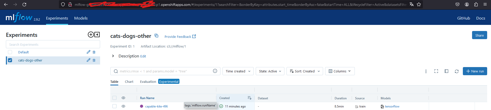

BRAVO ! Vous venez de finir quelque chose d'important ! Désormais, toutes vos modifications donneront lieu au ré-entraînement
automatique de votre modèle et à l'exécution de vos tests en automatique !

**Maintenant, j'aimerais vous demander de trouver le meilleur moyen, selon vous, de changer certains paramètres de votre 
entraînement, comme le batch size et le nombre d'epochs, qui là sont en dur dans votre github action. Ce petit
exercice à faire par vous-même sera noté. Merci de me faire parvenir un mail pour m'expliquer votre solution et me donner
les éléments pour que je puisse aller voir vos modifications par moi-même, dans le code (évaluations).**

**Créez une branche spécifique avec votre nom : `git switch -c votrenom/step04_eval` et poussez votre proposition dessus.
Joignez dans votre mail le nom de votre branche :) Bon courage !**

Maintenant, passons aux parties API, Cloud, Docker et Kubernetes ! Je vais passer un peu plus de temps pour vous expliquer 
tout ça !