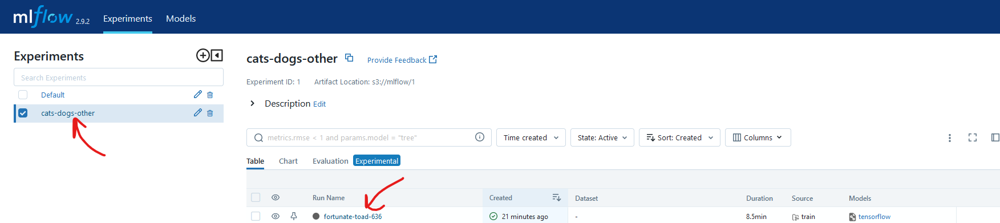
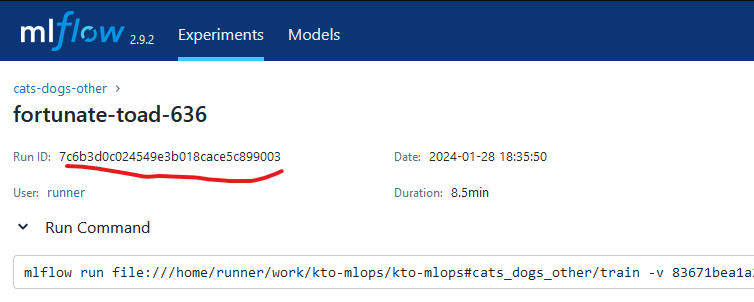

# 9. Docker

Dans ce chapitre, nous allons voir comment déployer votre API sous forme de conteneur Docker. Nous allons expliquer
de quoi il s'agit, comment cela fonctionne.

Avant de commencer, afin que tout le monde parte du même point, vérifiez que vous n'avez aucune modification en
cours sur votre working directory avec `git status`.
Si c'est le cas, vérifiez que vous avez bien sauvegardé votre travail lors de l'étape précédente pour ne pas perdre
votre travail.
Sollicitez le professeur, car il est possible que votre contrôle continue en soit affecté.

Sinon, annulez toutes vos modifications avec `git reset --hard HEAD`. Supprimez potentiellement les fichiers
non indexés.
Changez maintenant de branche avec `git switch step06`.
Créez désormais une branche avec votre nom : `git switch -c votrenom/step06`

## Qu'est##ce que c'est ?
## A quoi ça sert ?
## Comment ça fonctionne ?
## Manipulation de Docker

# Deploy

## Introduction

### Abstract

Why deploy our model in production? Why deploy it on the Cloud?

Deploying our service in production means making our application available to as many people as possible by
ensuring our customers a technical environment that is:

- stable: our webservice responds to our customers in a consistent way, the new versions of our service
  are validated and tested before being deployed on our production environment (updates)
- robust: production must respond as quickly as possible, as best as possible, while supporting the load that we
  imposes on it (ability to respond to as many customers as possible at the same time). Production must be scaled.
- secure

In the lifecycle of a project, our application will be executed on several types of environment:


- local: Your own development environment, your local machine or your Codespace. Allows you to validate your developments directly.
- development: first environment on which you deploy your service. This environment will be updated
  very often and allows you to validate that technically, your new service version runs well on a technical environment
  consistent with your production. This environment is generally less powerful than the production environment
- preproduction (stagging): The final stage before production, this environment is traditionally shaped like production.
  Allows you to validate the good performance of your service in an environment that is near of your production.
  Often used by Q&A or Product Owners to confirm definitively that the service meets its requirements.
- production

These environments allow us to secure, test, validate our application before deploying it and impacting our users

BTW, what is a Cloud? For what purposes?


### In the Cloud, different kinds of platforms

What are the most famous Cloud Providers in the World?

Offers? Services? Pricing?

What kinds of platforms?

- **IaaS**: Infrastructure As A Service
- **PaaS**: Platform As A Service
- **SaaS**: Service As A Service
- **CaaS**: Container As A Service

What do they mean? What are the differences between them?


CaaS means that we will use containers. But what are they?

## 3 - Containers with Docker

### a - What is a container? What are the differences with virtualization?


### b - Why we should use them for ML?


Few arguments:
- They are lighter
- This solution is more scalable
- This solution is more flexible (we choose the python version for example)
- We can install libraries on the host os easily
- You can run your artifact locally as it could run remotely, in the Cloud

### c - What is Docker? How does it work?

Docker is container software. It is one of the most used in the market. Containers runs in the Docker daemon.
A command line interface allows to interact with the Docker daemon.

A container relies on an image. An image is created with a Dockerfile file. This image is like a template.

This is a sum up about the Docker Engine:


An image uses instructions to create the layers of the template.

When you build an image, you can push it to a container registry. There are a lot of different container registries in the market. The most popular
is Docker Hub : https://hub.docker.com/

Now, let's play with docker!

First, we will launch a Debian system onto it. To do so, we search it on google. We can reach a page from Docker Hub: https://hub.docker.com/_/debian

We will use the tag bullseye. You can find all the tags from the Tags section of this page.

```bash
docker run -it debian:bullseye bash
```

This command will pull the image from the docker registry, create a container from this image and launch a bash prompt on it.

As you can see, we are currently root :


As you can see, the container you are currently running is a rudimentary debian. From your prompt if you want to launch the python interpreter. it will not work!


It is because this system does not have python installed on it. Let's try to execute a script in python.

```bash
apt update
apt install python
apt install vim

mkdir /opt/app-root
cd /opt/app-root
touch my_script.py

vim my_script.py
```

In this script, write this code:

```python
import platform 
print("Coucou ! On tourne sur " + platform.platform())
```

Now we can launch this script from the python interpreter:

```bash
python my_script.py
```

Now we quit the command prompt of our container:

```bash
exit
```

By quitting the prompt, the container will shut down. To see it, use this command:

```bash
docker ps -a
```

ps list all the containers the active containers. You can add the option -a to list all of them, including the closed ones.

Now let's clean our workspace by deleting this closed container:

```bash
docker rm <id of the container>
```

Note that the image docker pulled from the registry is still in cache in your local docker engine. To list them, you can use the command:

```bash
docker images
```

To delete properly the image, you can use the command:


```bash
docker rmi <id of the image>
```

As you can see, it can be difficult to create a ready to use runtime environment if we had to launch some linux commands to install python, push our code on it ect.

But we can create our own images !!!

By writing a Dockerfile, we will use some instructions to build our image. Now, let's write our first Dockerfile.

### d - Writing our first Dockerfile

In this section, we will try to make the same thing we have done in the previous playground, but directly from 
a custome Docker image.

First, we have to create this file: Dockerfile

Créez le à la racine de votre projet : 


We will use an official python image from Docker as the base of our image. And we will build some custom layers upon it.

If we navigate in the Docker hub website, we can find this page : https://hub.docker.com/_/python

It gives us all the python image created by the community. One of them is a bullseye image with python already installed on it.

We will begin our construction with this image. To do so, in our Dockerfile, we add this instruction:

```dockerfile
FROM python:3.11.2-bullseye
```

This instruction tells we are constructing our image FROM the python:3.11.2-bullseye as a base.

Okay! That's a good start! Now let's build this image and create a container from it!

```bash
docker build -t mlopspython/first-image .

docker run -it mlopspython/first-image
```

When you launch the docker run command, as you can see, it opens the python interpreter within our container.
It is because the image is constructed like this.

If you look at the end of the Dockerfile of this image 
(https://github.com/docker-library/python/blob/2bcce464bea3a9c7449a2fe217bf4c24e38e0a47/3.11/bullseye/Dockerfile), 
a "python3" command is launched.

To do so, the CMD instruction is used. You can dig on this subject by consulting this 
page : https://medium.com/ci-cd-devops/dockerfile-run-vs-cmd-vs-entrypoint-ae0d32ffe2b4

As you should see, a CMD final instruction can be overriden. So if we launch our container with this command:

```bash
docker run -it mlopspython/first-image bash
```

It will launch the container and gives us a root command prompt like before! Exit first your container with the exit() python instruction and let's give a try!

Ok! Now, we want to create our /opt/app-root directory and our python script.

In our Dockerfile:

```dockerfile
FROM python:3.11.2-bullseye

RUN mkdir /opt/app-root

WORKDIR /opt/app-root

RUN echo "import platform\nprint(\"Coucou ! On tourne sur \" + platform.platform())" > myscript.py
```

Now, let's build our image and run our container again!

```bash
docker build -t mlopspython/first-image .

docker run -it mlopspython/first-image bash
```

As you can see, this time, the python image has not been downloaded again. It is because the image is record in the local Docker cache!


Now, from your container, if you launch this command:

```bash
python /opt/app-root/myscript.py
```

Now, we exit the container and we will try to go further.

```bash
exit
```

But first, clean correctly your dead containers.

Now we want to tell to our image to execute the script by itself and print the result, without running and opening the container by ourself.

To do so, we will use the instruction ENTRYPOINT:

```dockerfile
FROM python:3.11.2-bullseye

RUN mkdir /opt/app-root

WORKDIR /opt/app-root

RUN echo "import platform\nprint(\"Coucou ! On tourne sur \" + platform.platform())" > myscript.py

ENTRYPOINT ["python", "myscript.py"]
```

Now, let's build the image and run it!

```bash
docker build -t mlopspython/first-image .
```

As you can see, when you run this build, the lines which already exists are cached and not ran again!


```bash
docker run mlopspython/first-image
```

Note that this time, we are running the container without the -it option. It is because we do not want to open a prompt in the container, but just let it execute its code.

Normally, you should see somthing like this:


Now, it is time to construct our docker image which will contain and run our API!

### e - The Dockerfile of our WebService

But before writing our Dockerfile, lets focus on some new instructions. You can find these definitions come from the Docker reference documentation : https://docs.docker.com/engine/reference/builder/

- **ENV**: Set an environment variable.
- **WORKDIR**: The WORKDIR instruction sets the working directory for any RUN, CMD, ENTRYPOINT, COPY and ADD instructions that follow it in the Dockerfile.
- **COPY**: The COPY instruction copies new files or directories from <src> and adds them to the filesystem of the container at the path <dest>.
- **EXPOSE**: The EXPOSE instruction informs Docker that the container listens on the specified network ports at runtime.
- **ENTRYPOINT**: An ENTRYPOINT allows you to configure a container that will run as an executable.

Now, let's try to create your Docker image. You can look at the Makefile to know how to build your project with pip.

Do not forget to EXPOSE the port of your Webservice (kindly reminder, we set it to 8080), and to set a final ENTRYPOINT.

N'oubliez pas qu'il faut télécharger le modèle depuis MLflow. Nous aurons donc encore besoin
de MLflow. Pour ne pas polluer l'image finale, nous allons utiliser la fonctionnalité de multi-staging de docker.

Le **multi-stage build** est une fonctionnalité de Docker qui permet de construire des images Docker plus efficaces et plus légères. Il est utile pour quiconque a du mal à optimiser les Dockerfiles tout en les gardant faciles à lire et à maintenir¹.

Avec les **multi-stage builds**, vous utilisez plusieurs instructions `FROM` dans votre Dockerfile. 
Chaque instruction `FROM` peut utiliser une base différente, et chacune d'entre elles commence une nouvelle étape 
de la construction. Vous pouvez copier sélectivement des artefacts d'une étape à une autre, en laissant derrière 
vous tout ce que vous ne voulez pas dans l'image finale (le dernier FROM).


Voici une proposition :

```dockerfile
ARG MLFLOW_RUN_ID
ARG MLFLOW_TRACKING_URI
ARG MLFLOW_S3_ENDPOINT_URL
ARG AWS_ACCESS_KEY_ID
ARG AWS_SECRET_ACCESS_KEY

FROM python:3.11.2-bullseye as mlflow

ARG MLFLOW_RUN_ID
ARG MLFLOW_TRACKING_URI
ARG MLFLOW_S3_ENDPOINT_URL
ARG AWS_ACCESS_KEY_ID
ARG AWS_SECRET_ACCESS_KEY

ENV MLFLOW_TRACKING_URI=${MLFLOW_TRACKING_URI}
ENV MLFLOW_S3_ENDPOINT_URL=${MLFLOW_S3_ENDPOINT_URL}
ENV AWS_ACCESS_KEY_ID=${AWS_ACCESS_KEY_ID}
ENV AWS_SECRET_ACCESS_KEY=${AWS_SECRET_ACCESS_KEY}

ENV APP_ROOT=/opt/app-root

WORKDIR ${APP_ROOT}

COPY --chown=${USER} cats_dogs_other/api ./cats_dogs_other/api

RUN pip install mlflow[extras]

RUN mlflow artifacts download -u runs:/${MLFLOW_RUN_ID}/model/data/model.keras -d ./cats_dogs_other/api/resources
RUN mv ./cats_dogs_other/api/resources/model.keras ./cats_dogs_other/api/resources/final_model.keras 

FROM python:3.11.2-bullseye as runtime

ENV APP_ROOT=/opt/app-root

WORKDIR ${APP_ROOT}

COPY --chown=${USER} boot.py ./boot.py
COPY --chown=${USER} packages ./packages
COPY --chown=${USER} init_packages.sh ./init_packages.sh
COPY --chown=${USER} --from=mlflow ${APP_ROOT}/cats_dogs_other/api ./cats_dogs_other/api

RUN chmod 777 ./init_packages.sh
RUN ./init_packages.sh
RUN pip install -r ./cats_dogs_other/api/requirements.txt

EXPOSE 8080

ENTRYPOINT ["python3", "boot.py"]
```

Now, we build and run our image.

N'oubliez pas d'exporter vos variables d'environnement :
- $MLFLOW_RUN_ID : Prenez le run id d'un de vos run, le plus à jour :-)




- $MLFLOW_TRACKING_URI : L'url de votre MLflow
- $MLFLOW_S3_ENDPOINT_URL : L'url de votre minio
- $AWS_ACCESS_KEY_ID : minio
- $AWS_SECRET_ACCESS_KEY : minio123

Maintenant, jouez les commandes suivantes :
```bash
docker build -t local/mlops_python_2023_2024 --build-arg MLFLOW_RUN_ID=$MLFLOW_RUN_ID --build-arg MLFLOW_TRACKING_URI=$MLFLOW_TRACKING_URI --build-arg MLFLOW_S3_ENDPOINT_URL=$MLFLOW_S3_ENDPOINT_URL --build-arg AWS_ACCESS_KEY_ID=$AWS_ACCESS_KEY_ID --build-arg AWS_SECRET_ACCESS_KEY=$AWS_SECRET_ACCESS_KEY .

docker run -d -p 8080:8080 -e OAUTH2_ISSUER="your issuer" -e OAUTH2_AUDIENCE="your audience" -e OAUTH2_JWKS_URI="the uri" local/mlops_python_2023_2024
```

Note the option -d in our docker run command. It is for "detached". It will run the container in detached mode.

-p option allows us to bind the 8080 port of the container to the 8080 port of the host.

-e Allows you to add some environment variables. They are used here to configure your oAuth2 token validator.

This is a complete example :

```bash
docker run -d -p 8080:8080 -e OAUTH2_ISSUER="https://dev-ujjk4qhv7rn48y6w.eu.auth0.com/" -e OAUTH2_AUDIENCE="https://gthomas-cats-dogs.com" -e OAUTH2_JWKS_URI=".well-known/jwks.json" mlops_python_2022_2023:1.0.0
```

Now, let's try our Service from Postman!

Do not forget to change the visibility of the 8080 port from Codespace to Public.

Generate an oAuth2 token from Auth0.

And now you can test your API :


To finish this chapter, we need to publish our image to a registry.

### f - Push the image to registry

As registry, we will use Quay, from RedHat. First, we need to create an account on the website https://developers.redhat.com/.

Then, we have to create a Public repository on Quay to push our image on it. To do so, log yourself on quay.io and click to Repositories and on Create New Repository:


Now we create a new public repository named kto/mlops_python_2023_2024 :


As you can see, it creates an empty repository named quay.io/yourid/kto/mlops_python_2023_2024 :


Now we will push our image to this new repository.

Réutilisez le compte robot que vous avez déjà créé. Attention, vous devez lui donner les droits d'admin à votre
nouveau repository !!!

We have to create new tags of our image :

```bash
docker tag <id of your image> quay.io/yourquayaccount/kto/mlops_python_2023_2024:latest
```

And now, we push !

```bash
docker push quay.io/gthomas59800/kto/mlops_python_2023_2024:latest
```

You should see these tags in your repository:


But it is not finished. We will not push our images with our hands ! You asked for them, we will use github actions!!!! Hurray !

N'oubliez pas d'éteindre votre conteneur docker et de supprimer les images de votre codespace : 
```bash
docker rm -vf $(docker ps -aq)
docker rmi -f $(docker images -aq)
docker image prune -f
```

### g - Build automatically with github actions

We will create a github action to go build and push automatically our new images!

Vous devez ajouter à votre fichier `.github/workflows/cats-dogs-others.yaml`, de quoi builder votre nouvelle image.

Attention, il y a une petite complexité ici. En effet, si l'on veut télécharger le dernier modèle généré, il faut que l'on
soit en mesure de récupérer le dernier run depuis votre kto-mlflow.

Je vous propose d'utiliser un script Python pour faire cette recherche. En effet, MLflow dispose d'une API de recherche
qui permet de récupérer certaines informations. Donc un identifiant de run.

Dans `.github/workflows`, ajoutez un script `search_mlflow.py` :
```python
import mlflow


def search_last_run_by_experiment_name(experiment_name: str):
    current_experiment = dict(mlflow.get_experiment_by_name(experiment_name))
    experiment_id = current_experiment['experiment_id']
    df = mlflow.search_runs([experiment_id],
                            filter_string="attributes.status = 'FINISHED'",
                            max_results=1,
                            order_by=["attributes.end_time DESC"])
    return df.loc[0, 'run_id']

```

Ce script permet de récupérer l'identifiant du dernier run d'une expérience donnée. Nous allons donc l'utiliser pour
ajouter le run id en argument de la construction de notre image docker. Dans l'étape de lancement du train, ajoutez les lignes
suivantes :
```yaml
          echo "Get last finished mlflow run"
          cd ../../.github/workflows
          export MLFLOW_RUN_ID=$(python -c 'import search_mlflow; print(search_mlflow.search_last_run_by_experiment_name("cats-dogs-other"))') 
          echo "MLFLOW_RUN_ID=$MLFLOW_RUN_ID" >> "$GITHUB_ENV"
```

Cela donne donc le fichier suivant : 
```yaml
name: Cats and dogs CI/CD
on: 
  push:
    branches:
      - step**

jobs:
  train:
    runs-on: ubuntu-latest
    steps:
      - uses: actions/checkout@v3
      - name: Set up Python 3.11
        uses: actions/setup-python@v3
        with:
          python-version: 3.11
      - name: Upgrade pip, install packages and run unittests
        run: |
          pip install --upgrade pip
          ./init_packages.sh
          pip install -r ./cats_dogs_other/requirements.txt
          pip install -r ./cats_dogs_other/label/requirements.txt
          pip install -r ./cats_dogs_other/api/requirements.txt
          # For tests purposes, we copy an existing .keras file in the folder api/resources
          # We will delete it just after the tests
          cp ./cats_dogs_other/train/steps/tests/test/input/model/final_model.keras ./cats_dogs_other/api/resources/final_model.keras 
          python -m unittest
          rm ./cats_dogs_other/api/resources/final_model.keras
      - name: Install mlflow
        run: |
          pip install mlflow[extras]
      - name: Configure Docker (Quay) & Kubectl (Openshift Sandbox)
        run: |
          docker login -u="${{vars.QUAY_ROBOT_USERNAME}}" -p="${{secrets.QUAY_ROBOT_TOKEN}}" quay.io
          kubectl config set-cluster openshift-cluster --server=${{vars.OPENSHIFT_SERVER}}
          kubectl config set-credentials openshift-credentials --token=${{secrets.OPENSHIFT_TOKEN}}
          kubectl config set-context openshift-context --cluster=openshift-cluster --user=openshift-credentials --namespace=${{vars.OPENSHIFT_USERNAME}}-dev
          kubectl config use openshift-context
      - name: Wake up dailyclean and kto-mlflow
        run: |
          kubectl scale --replicas=1 deployment/dailyclean-api
          sleep 30
          curl -X POST ${{vars.DAILYCLEAN_ROUTE}}/pods/start
      - name: Build training image
        run: |
          docker build -f cats_dogs_other/train/Dockerfile -t quay.io/gthomas59800/kto/train/cats-dogs-other-2023-2024:latest --build-arg MLFLOW_S3_ENDPOINT_URL=${{vars.MLFLOW_S3_ENDPOINT_URL}} --build-arg AWS_ACCESS_KEY_ID=${{vars.AWS_ACCESS_KEY_ID}} --build-arg AWS_SECRET_ACCESS_KEY=${{secrets.AWS_SECRET_ACCESS_KEY}} .
      - name: Launch mlflow training in Openshift
        run: |
          export KUBE_MLFLOW_TRACKING_URI="${{vars.MLFLOW_TRACKING_URI}}"
          export MLFLOW_TRACKING_URI="${{vars.MLFLOW_TRACKING_URI}}"
          export MLFLOW_S3_ENDPOINT_URL="${{vars.MLFLOW_S3_ENDPOINT_URL}}"
          export AWS_ACCESS_KEY_ID="${{vars.AWS_ACCESS_KEY_ID}}" 
          export AWS_SECRET_ACCESS_KEY="${{secrets.AWS_SECRET_ACCESS_KEY}}"
          
          cd cats_dogs_other/train
          mlflow run . --experiment-name cats-dogs-other --backend kubernetes --backend-config kubernetes_config.json

          echo "Get last finished mlflow run"
          cd ../../.github/workflows
          export MLFLOW_RUN_ID=$(python -c 'import search_mlflow; print(search_mlflow.search_last_run_by_experiment_name("cats-dogs-other"))') 
          echo "MLFLOW_RUN_ID=$MLFLOW_RUN_ID" >> "$GITHUB_ENV"
      - name: Asleep kto-mlflow with dailyclean
        run: |
          curl -X POST ${{vars.DAILYCLEAN_ROUTE}}/pods/stop
```

Maintenant, ajoutez de quoi builder et pousser sur Quay votre image : 
```yaml
      - name: Build and push API Docker image
        run: |
          docker build -t quay.io/gthomas59800/kto/mlops_python_2023_2024:latest --build-arg MLFLOW_RUN_ID=$MLFLOW_RUN_ID --build-arg MLFLOW_TRACKING_URI=${{vars.MLFLOW_TRACKING_URI}} --build-arg MLFLOW_S3_ENDPOINT_URL=${{vars.MLFLOW_S3_ENDPOINT_URL}} --build-arg AWS_ACCESS_KEY_ID=${{vars.AWS_ACCESS_KEY_ID}} --build-arg AWS_SECRET_ACCESS_KEY=${{secrets.AWS_SECRET_ACCESS_KEY}} .
          docker push quay.io/gthomas59800/kto/mlops_python_2023_2024:latest
```

Mettez ce bloc, juste avant l'extinction de kto-mlflow : 
```yaml
name: Cats and dogs CI/CD
on: 
  push:
    branches:
      - step**

jobs:
  train:
    runs-on: ubuntu-latest
    steps:
      - uses: actions/checkout@v3
      - name: Set up Python 3.11
        uses: actions/setup-python@v3
        with:
          python-version: 3.11
      - name: Upgrade pip, install packages and run unittests
        run: |
          pip install --upgrade pip
          ./init_packages.sh
          pip install -r ./cats_dogs_other/requirements.txt
          pip install -r ./cats_dogs_other/label/requirements.txt
          pip install -r ./cats_dogs_other/api/requirements.txt
          # For tests purposes, we copy an existing .keras file in the folder api/resources
          # We will delete it just after the tests
          cp ./cats_dogs_other/train/steps/tests/test/input/model/final_model.keras ./cats_dogs_other/api/resources/final_model.keras 
          python -m unittest
          rm ./cats_dogs_other/api/resources/final_model.keras
      - name: Install mlflow
        run: |
          pip install mlflow[extras]
      - name: Configure Docker (Quay) & Kubectl (Openshift Sandbox)
        run: |
          docker login -u="${{vars.QUAY_ROBOT_USERNAME}}" -p="${{secrets.QUAY_ROBOT_TOKEN}}" quay.io
          kubectl config set-cluster openshift-cluster --server=${{vars.OPENSHIFT_SERVER}}
          kubectl config set-credentials openshift-credentials --token=${{secrets.OPENSHIFT_TOKEN}}
          kubectl config set-context openshift-context --cluster=openshift-cluster --user=openshift-credentials --namespace=${{vars.OPENSHIFT_USERNAME}}-dev
          kubectl config use openshift-context
      - name: Wake up dailyclean and kto-mlflow
        run: |
          kubectl scale --replicas=1 deployment/dailyclean-api
          sleep 30
          curl -X POST ${{vars.DAILYCLEAN_ROUTE}}/pods/start
      - name: Build training image
        run: |
          docker build -f cats_dogs_other/train/Dockerfile -t quay.io/gthomas59800/kto/train/cats-dogs-other-2023-2024:latest --build-arg MLFLOW_S3_ENDPOINT_URL=${{vars.MLFLOW_S3_ENDPOINT_URL}} --build-arg AWS_ACCESS_KEY_ID=${{vars.AWS_ACCESS_KEY_ID}} --build-arg AWS_SECRET_ACCESS_KEY=${{secrets.AWS_SECRET_ACCESS_KEY}} .
      - name: Launch mlflow training in Openshift
        run: |
          export KUBE_MLFLOW_TRACKING_URI="${{vars.MLFLOW_TRACKING_URI}}"
          export MLFLOW_TRACKING_URI="${{vars.MLFLOW_TRACKING_URI}}"
          export MLFLOW_S3_ENDPOINT_URL="${{vars.MLFLOW_S3_ENDPOINT_URL}}"
          export AWS_ACCESS_KEY_ID="${{vars.AWS_ACCESS_KEY_ID}}" 
          export AWS_SECRET_ACCESS_KEY="${{secrets.AWS_SECRET_ACCESS_KEY}}"
          
          cd cats_dogs_other/train
          mlflow run . --experiment-name cats-dogs-other --backend kubernetes --backend-config kubernetes_config.json

          echo "Get last finished mlflow run"
          cd ../../.github/workflows
          export MLFLOW_RUN_ID=$(python -c 'import search_mlflow; print(search_mlflow.search_last_run_by_experiment_name("cats-dogs-other"))') 
          echo "MLFLOW_RUN_ID=$MLFLOW_RUN_ID" >> "$GITHUB_ENV"
      - name: Build and push API Docker image
        run: |
          docker build -t quay.io/gthomas59800/kto/mlops_python_2023_2024:latest --build-arg MLFLOW_RUN_ID=$MLFLOW_RUN_ID --build-arg MLFLOW_TRACKING_URI=${{vars.MLFLOW_TRACKING_URI}} --build-arg MLFLOW_S3_ENDPOINT_URL=${{vars.MLFLOW_S3_ENDPOINT_URL}} --build-arg AWS_ACCESS_KEY_ID=${{vars.AWS_ACCESS_KEY_ID}} --build-arg AWS_SECRET_ACCESS_KEY=${{secrets.AWS_SECRET_ACCESS_KEY}} .
          docker push quay.io/gthomas59800/kto/mlops_python_2023_2024:latest
      - name: Asleep kto-mlflow with dailyclean
        run: |
          curl -X POST ${{vars.DAILYCLEAN_ROUTE}}/pods/stop

```

This chapter comes to its end! Now we will deploy this image in the Cloud!!!

**Bravo ! Vous avez terminé cette partie. Veuillez me communiquer le lien vers votre image dans Quay.io par mail. (évaluations)**