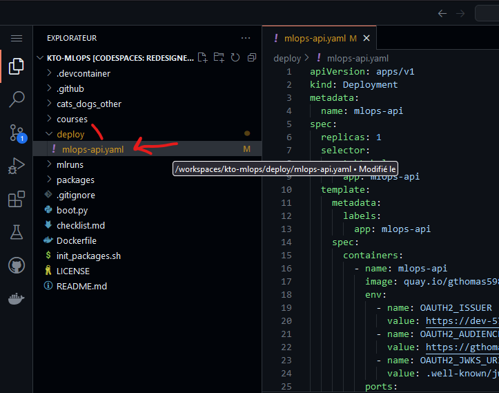

# 10. Kubernetes

Dans ce chapitre, nous allons voir comment déployer votre API sous forme de conteneur Docker, directement dans openshift.

Avant de commencer, afin que tout le monde parte du même point, vérifiez que vous n'avez aucune modification en
cours sur votre working directory avec `git status`.
Si c'est le cas, vérifiez que vous avez bien sauvegardé votre travail lors de l'étape précédente pour ne pas perdre
votre travail.
Sollicitez le professeur, car il est possible que votre contrôle continue en soit affecté.

Sinon, annulez toutes vos modifications avec `git reset --hard HEAD`. Supprimez potentiellement les fichiers
non indexés.
Changez maintenant de branche avec `git switch step07`.
Créez désormais une branche avec votre nom : `git switch -c votrenom/step07`

## Qu'est##ce que c'est ?
## A quoi ça sert ?
## Comment ça fonctionne ?
## Manipulation sur OpenShift
## Cloud act, cloud souverain et reversibilité


## 4 - Orchestrate our containers with Kubernetes

Why we should orchestrate our containers?

You can see documentation here: https://www.redhat.com/en/topics/containers/what-is-container-orchestration

To orchestrate our containers, we can use Kubernetes. This tool is major on the market. Kubernetes was firstly created
by Google, develop in Go. Kubernetes is open sourced. In this course, we will use Openshift, which is a Kubernetes with
more features. Openshift is open sourced too and developed by RedHat.

Documentation about Kubernetes here : https://www.redhat.com/en/topics/containers/what-is-kubernetes

Your containers runtime is named as Pod in Kubernetes.
Kubernetes is a cluster. Replication of Pods on several nodes is possible.

To deploy your Pods, you can use a Kubernetes asset named Deployment. In this object, you can tell the images of the containers
which compose your Pod, the resources for each of them, volumes, replicas, environment variables ...

Replicas allows you to scale up your pods count in order to treat more requests at the same time.

To make your service available on the network, you have to create another Kubernetes asset which is named Service. With
it, you can tell that your service will be requested in http, you can bind the port of your webservices ect...

Finally, you can create a Route (Openshift specific) in order to create a proper URL for your webservice.

To create these assets, we can describe them in manifests. To do so, we will create a yaml file, `mlops-api.yaml`, in a new folder,
`deploy`. Deploy doit être à la racine du projet.



This is a proposal of a manifest. Let's discuss on it :

```yaml
apiVersion: apps/v1
kind: Deployment
metadata:
  name: mlops-api
spec:
  replicas: 1
  selector:
    matchLabels:
      app: mlops-api
  template:
    metadata:
      labels:
        app: mlops-api
    spec:
      containers:
        - name: mlops-api
          image: quay.io/gthomas59800/kto/mlops_python_2023_2024
          env:
            - name: OAUTH2_ISSUER
              value: https://dev-57n2oiz6kv1zyfh6.eu.auth0.com/
            - name: OAUTH2_AUDIENCE
              value: https://gthomas-cats-dogs.com
            - name: OAUTH2_JWKS_URI
              value: .well-known/jwks.json
          ports:
            - containerPort: 8080
          resources:
            limits:
              memory: "1000Mi"
              cpu: "200m"
            requests:
              memory: "500Mi"
              cpu: "200m"
---
apiVersion: v1
kind: Service
metadata:
  name: mlops-api-service
spec:
  selector:
    app: mlops-api
  ports:
    - port: 8080
      name: http-port
      targetPort: 8080
---
kind: Route
apiVersion: route.openshift.io/v1
metadata:
  name: mlops-api
spec:
  to:
    kind: Service
    name: mlops-api-service
    weight: 100
  port:
    targetPort: http-port
  tls:
    termination: edge
    insecureEdgeTerminationPolicy: None
  wildcardPolicy: None
```

Now, we will use our manifest in order to deploy our application in The Cloud. To do so, we need a Kubernetes available in the Cloud.

RedHat gives to all developers a free OpenShift development Sandbox, available in the Cloud. This Sandbox is available 30 days and is deleted automatically.

You can recreate a new Sandbox freely after this deletion. So now, let's create our Sandbox !

Using your redhat developer account to create an Red Hat Developer Sandbox. You have to log yourself in : https://developers.redhat.com/

Now, click on the menu Developer Sandbox and on the button Explore the free Developer Sandbox.


Then, click on the button Start your sandbox for free


You can verify your account with Phone Validation if you have restricted access to your mails


Installer le client openshift dans notre Codespace (found elements here https://docs.okd.io/4.10/cli_reference/openshift_cli/getting-started-cli.html):

```bash
mkdir oc
cd oc
curl https://mirror.openshift.com/pub/openshift-v4/clients/oc/latest/linux/oc.tar.gz --output oc.tar.gz
tar xvf oc.tar.gz
pwd
PATH=$PATH:/workspaces/MLOpsPython/oc
cd ../production/kubernetes
oc apply -f mlops-api.yaml
```

Now ! Let's test our application in the Cloud from Postman !

**Bravo, votre application fonctionne ! Veuillez me communiquer par mail la route vers votre service, ainsi qu'un jeton oAuth2, 
que je puisse le tester (évaluations).**

Do not forget to delete your project from openshift

```bash
oc delete -f mlops-api.yaml
```